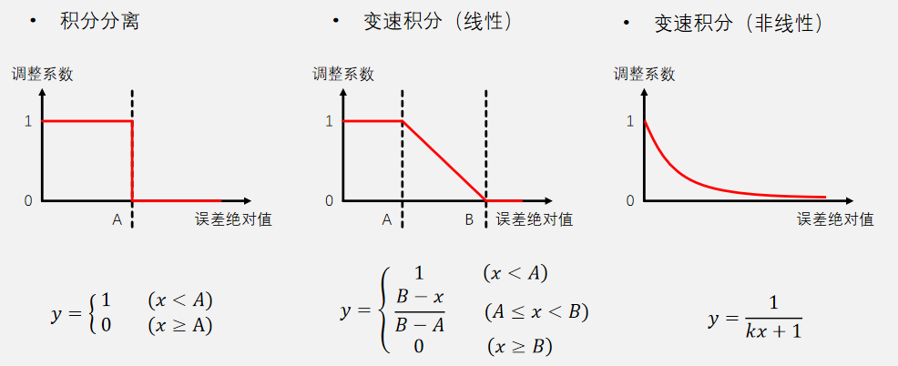
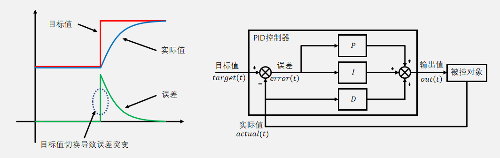
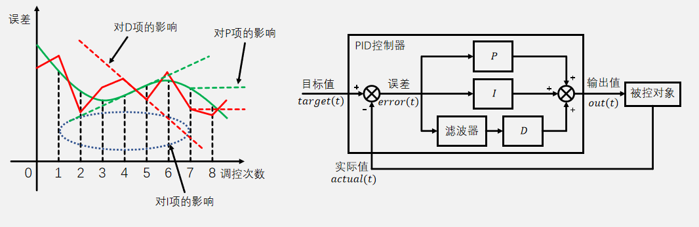

## PID算法改进方法

- **积分限幅** ：限制积分的幅度，防止积分深度饱和
- **积分分离** ：误差小于一个限度才开始积分，反之则去掉积分部分
- **变速积分** ：根据误差的大小调整积分的速度
- **微分先行** ：将对误差的微分替换为对实际值的微分
- **不完全微分** ：给微分项加入一阶惯性单元（低通滤波器）
- **输出偏移** ：在非0输出时，给输出值加一个固定偏移
- **输入死区** ：误差小于一个限度时不进行调控

## 积分限幅
- 要解决的问题：如果执行器因为卡住、断电、损坏等原因不能消除误差，则误差积分会无限制加大，进而达到深度饱和状态，此时PID控制器会持续输出最大的调控力，即使后续执行器恢复正常，PID控制器在短时间内也会维持最大的调控力，直到误差积分从深度饱和状态退出
- 积分限幅实现思路：对误差积分或积分项输出进行判断，如果幅值超过指定阈值，则进行限制

**积分限幅实现思路**

1. 单独对误差积分进行限幅
```cpp
    /*获取实际值*/
    Actual = 读取传感器();

    /*获取本次误差和上次误差*/
    Error1 = Error0;
    Error0 = Target - Actual;
    
    /*误差积分（累加）*/
    ErrorInt += Error0;
    
    /*积分限幅*/
    if(ErrorInt > 误差积分上限)  {ErrorInt = 误差积分上限;}
    if(ErrorInt < 误差积分下限)  {ErrorInt = 误差积分下限;}

    /*PID计算*/
    Out = Kp * Error0 + Ki * ErrorInt + Kd * (Error0 - Error1);
    
    /*输出限幅*/
    if(Out > 上限)  {Out = 上限;}
    if(Out < 下限)  {Out = 下限;}
    
    /*执行控制*/
    输出至被控对象(Out);
```

2. 对整个积分项输出进行限幅（IntOut替换原来的ErrorInt）
```cpp
    /*获取实际值*/
    Actual = 读取传感器();

    /*获取本次误差和上次误差*/
    Error1 = Error0;
    Error0 = Target - Actual;

    /*误差积分（累加）*/
    IntOut += Ki * Error0;

    /*积分项输出限幅*/
    if(IntOut > 积分项输出上限)  {IntOut = 积分项输出上限;}
    if(IntOut < 积分项输出下限)  {IntOut = 积分项输出下限;}

    /*PID计算*/
    Out = Kp * Error0 + IntOut + Kd * (Error0 - Error1);

    /*输出限幅*/
    if(Out > 上限)  {Out = 上限;}
    if(Out < 下限)  {Out = 下限;}

    /*执行控制*/
    输出至被控对象(Out);
```

## 积分分离

- 要解决的问题：积分项作用一般位于调控后期，用来消除持续的误差，调控前期一般误差较大且不需要积分项作用，如果此时仍然进行积分，则调控进行到后期时，积分项可能已经累积了过大的调控力，这会导致超调
- 积分分离实现思路：对误差大小进行判断，如果误差绝对值小于指定阈值，则加入积分项作用，反之，则直接将误差积分清零或不加入积分项作用

**积分分离程序实现**

1. 判断误差决定是否直接给积分清零

```cpp
    /*获取实际值*/
    Actual = 读取传感器();

    /*获取本次误差和上次误差*/
    Error1 = Error0;
    Error0 = Target - Actual;

    /*误差积分 + 积分分离*/
    if(fabs(Error0) < 积分分离阈值)
    {
        ErrorInt += Error0;
    }
    else
    {
        ErrorInt = 0;
    }

    /*PID计算*/
    Out = Kp * Error0 + Ki * ErrorInt + Kd * (Error0 - Error1);

    /*输出限幅*/
    if(Out > 上限)  {Out = 上限;}
    if(Out < 下限)  {Out = 下限;}

    /*执行控制*/
    输出至被控对象(Out);
```

2. 判断误差决定是否加入积分作用（另外定义变量C）

```cpp
    /*获取实际值*/
    Actual = 读取传感器();

    /*获取本次误差和上次误差*/
    Error1 = Error0;
    Error0 = Target - Actual;

    /*误差积分*/
    IntOut += Error0;

    /*误差积分 + 积分分离*/
    if(fabs(Error0) < 积分分离阈值)
    {
        C = 1;
    }
    else
    {
        C = 0;
    }

    /*PID计算*/
    Out = Kp * Error0 + C * Ki * ErrorInt + Kd * (Error0 - Error1);

    /*输出限幅*/
    if(Out > 上限)  {Out = 上限;}
    if(Out < 下限)  {Out = 下限;}

    /*执行控制*/
    输出至被控对象(Out);
```

## 变速积分

- 要解决的问题：如果积分分离阈值没有设定好，被控对象正好在阈值之外停下来，则此时控制器完全没有积分作用，误差不能消除
- 变速积分实现思路：变速积分是积分分离的升级版，变速积分需要设计一个函数值随误差绝对值增大而减小的函数，函数值作为调整系数，用于调整误差积分的速度或积分项作用的强度  



**变速积分程序实现**

1. 变速积分调整误差积分的速度（另外定义变量C，k设置变速衰减速度）
```cpp
    /*获取实际值*/
    Actual = 读取传感器();

    /*获取本次误差和上次误差*/
    Error1 = Error0;
    Error0 = Target - Actual;

    /*变速积分*/
    C = 1 / (k * fabs(Error0) + 1);

    /*误差积分*/
    ErrorInt += C * Error0;

    /*PID计算*/
    Out = Kp * Error0 + Ki * ErrorInt + Kd * (Error0 - Error1);

    /*输出限幅*/
    if(Out > 上限)  {Out = 上限;}
    if(Out < 下限)  {Out = 下限;}

    /*执行控制*/
    输出至被控对象(Out);
```

2. 变速积分调整积分项作用的强度（另外定义变量C，k设置变速衰减速度）

```cpp
    /*获取实际值*/
    Actual = 读取传感器();

    /*获取本次误差和上次误差*/
    Error1 = Error0;
    Error0 = Target - Actual;

    /*变速积分*/
    C = 1 / (k * fabs(Error0) + 1);

    /*误差积分*/
    ErrorInt += Error0;

    /*PID计算*/
    Out = Kp * Error0 + C * Ki * ErrorInt + Kd * (Error0 - Error1);

    /*输出限幅*/
    if(Out > 上限)  {Out = 上限;}
    if(Out < 下限)  {Out = 下限;}

    /*执行控制*/
    输出至被控对象(Out);
```

## 微分先行

- 要解决的问题：普通PID的微分项对误差进行微分，当目标值大幅度跳变时，误差也会瞬间大幅度跳变，这会导致微分项突然输出一个很大的调控力，如果系统的目标值频繁大幅度切换，则此时的微分项不利于系统稳定
- 微分先行实现思路：将对误差的微分替换为对实际值的微分
- 普通PID的微分项输出：  
  ${ dout(k) = {K}_ {d}\ast (error(k) - error(k-1)) }$ 
- 微分先行PID的微分项输出：  
  ${ dout(k) = {-K}_ {d}\ast (actual(k) - actual(k-1)) }$ 

**微分先行示意图**  



**微分先行程序实现**

1. （另外定义变量DifOut和Actual1）
```cpp
    /*获取实际值*/
    Actual1 = Actual;
    Actual = 读取传感器();

    /*获取本次误差和上次误差*/
    Error1 = Error0;
    Error0 = Target - Actual;

    /*误差积分*/
    ErrorInt += Error0;

    /*微分先行*/
    DifOut = - Kd * (Actual - Actual1);

    /*PID计算*/
    Out = Kp * Error0 + Ki * ErrorInt + DifOut;

    /*输出限幅*/
    if(Out > 输出上限)  {Out = 输出上限;}
    if(Out < 输出下限)  {Out = 输出下限;}

    /*执行控制*/
    输出至被控对象(Out);
```

## 不完全微分

- 要解决的问题：传感器获取的实际值经常会受到噪声干扰，而PID控制器中的微分项对噪声最为敏感，这些噪声干扰可能会导致微分项输出抖动，进而影响系统性能
- 不完全微分实现思路：给微分项加入一阶惯性单元（低通滤波器）
- 普通PID的微分项输出：  
  ${ dout(k) = {K}_ {d}\ast (error(k) - error(k-1)) }$ 
- 不完全微分PID的微分项输出：  
  ${ dout(k) = (1 - \alpha) \ast {K}_ {d}\ast (error(k) - error(k-1)) + \alpha * dout(k - 1)}$ 

**不完全微分示意图**



**不完全微分程序实现**
1. （另外定义变量DifOut，α设置滤波强度）
```cpp
    /*获取实际值*/
    Actual = 读取传感器();

    /*获取本次误差和上次误差*/
    Error1 = Error0;
    Error0 = Target - Actual;

    /*误差积分*/
    ErrorInt += Error0;

    /*不完全微分*/
    DifOut = (1 - a) * Kd * (Error0 - Error1) + a * DifOut;

    /*PID计算*/
    Out = Kp * Error0 + C * Ki * ErrorInt + DifOut;

    /*输出限幅*/
    if(Out > 输出上限)  {Out = 输出上限;}
    if(Out < 输出下限)  {Out = 输出下限;}

    /*执行控制*/
    输出至被控对象(Out);
```

## 输出偏移
- 要解决的问题：对于一些启动需要一定力度的执行器，若输出值较小，执行器可能完全无动作，这可能会引起调控误差，同时会降低系统响应速度
- 输出偏移实现思路：若输出值为0，则正常输出0，不进行调控；若输出值非0，则给输出值加一个固定偏移，跳过执行器无动作的阶段
- 输出偏移的PID输出值：  
$$
out(k) = 
\begin{cases}
0                   &(out(k) = 0)\\
out(k) + offset     &(out(k) > 0)\\
out(k) - offset     &(out(k) < 0)
\end{cases}
$$

**输出偏移程序实现**
```cpp
    /*获取实际值*/
    Actual = 读取传感器();

    /*获取本次误差和上次误差*/
    Error1 = Error0;
    Error0 = Target - Actual;

    /*误差积分*/
    ErrorInt += Error0;

    /*PID计算*/
    Out = Kp * Error0 + Ki * ErrorInt + Kd * (Error0 - Error1);

    /*输出偏移*/
    if(Out > 0)
    {
        Out += 偏移值;
    }
    else if(Out < 0)
    {
        Out -= 偏移值;
    }
    else
    {
        Out = 0;
    }

    /*输出限幅*/
    if(Out > 输出上限)  {Out = 输出上限;}
    if(Out < 输出下限)  {Out = 输出下限;}

    /*执行控制*/
    输出至被控对象(Out);
```

## 输入死区
- 要解决的问题：在某些系统中，输入的目标值或实际值有微小的噪声波动，或者系统有一定的滞后，这些情况可能会导致执行器在误差很小时频繁调控，不能最终稳定下来
- 输入死区实现思路：若误差绝对值小于一个限度，则固定输出0，不进行调控
- 输入死区的PID输出值：  
$$
out(k) = 
\begin{cases}
0          &(\lvert error(k) \rvert < A)\\
out(k)     &(\lvert error(k) \rvert \ge A)
\end{cases}
$$

**输入死区程序实现**
```cpp
    /*获取实际值*/
    Actual = 读取传感器();

    /*获取本次误差和上次误差*/
    Error1 = Error0;
    Error0 = Target - Actual;

    /*输入死区*/
    if(fabs(Error0 < 死区阈值))
    {
        Out = 0;
    }
    else
    {
        /*误差积分*/
        ErrorInt += Error0;

        /*PID计算*/
        Out = Kp * Error0 + Ki * ErrorInt + Kd * (Error0 - Error1);
    }

    /*输出限幅*/
    if(Out > 输出上限)  {Out = 输出上限;}
    if(Out < 输出下限)  {Out = 输出下限;}

    /*执行控制*/
    输出至被控对象(Out);
```