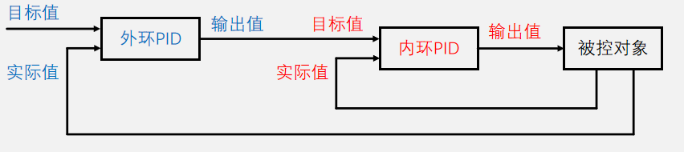

## 多环串级PID
- 单环PID只能对被控对象的一个物理量进行闭环控制，而当用户需要对被控对象的多个维度物理量（例如：速度、位置、角度等）进行控制时，则需要多个PID控制环路，即多环PID，多个PID串级连接，因此也称作串级PID
- 多环PID相较于单环PID，功能上，可以实现对更多物理量的控制，性能上，可以使系统拥有更高的准确性、稳定性和响应速度



## 定位置控制单环与双环比较


## 双环PID程序实现

```cpp
/*定义内环变量*/
float InnerTarget, InnerActual, InnerOut;
float InnerKp = 值, InnerKi = 值, InnerKd = 值;
Float InnerError0, InnerError1, InnerErrorInt;

/*定义外环变量*/
float OuterTarget, OuterActual, OuterOut;
float OuterKp = 值, OuterKi = 值, OuterKd = 值;
Float OuterError0, OuterError1, OuterErrorInt;

int main(void)
{
    Timer_Init();

    while(1)
    {
        /*用户在此处根据需求写入外环PID控制器的目标值*/
        OuterTarget = 用户指定的一个值;
    }
}

void TIM2_IRQHandler(void)
{
    static uint16_t Count1, Count2;
    if(TIM_GetITStatus(TIM2, TIM_IT_Update) == SET)
    {
        if(Count1 >= 内环调控时间)
        {
            Count1 = 0;
            /*内环每隔时间T1, 程序执行到这里一次*/

            /***********执行内环PID调控**********/
            InnerActual = 读取内环实际值();

            InnerError1 = InnerError0;
            InnerError0 = InnerTarget - InnerActual;

            InnerErrorInt += InnerError0;

            InnerOut = InnerKp * InnerError0
            + InnerKi * InnerErrorInt
            + InnerKd * (InnerError0 - InnerError1);

            if(InnerOut > 上限)  {InnerOut = 上限;}
            if(InnerOut < 下限)  {InnerOut = 下限;}

            输出至被控对象(InnerOut);
        }

        Count2++;
        if(Count2 >= 内环调控时间)
        {
            Count2 = 0;
            /*外环每隔时间T2, 程序执行到这里一次*/

            /***********执行外环PID调控**********/
            OuterActual = 读取外环实际值();

            OuterError1 = OuterError0;
            OuterError0 = OuterTarget - OuterActual;

            OuterErrorInt += OuterError0;

            OuterOut = OuterKp * OuterError0
            + OuterKi * OuterErrorInt
            + OuterKd * (OuterError0 - OuterError1);

            if(OuterOut > 上限)  {OuterOut = 上限;}
            if(OuterOut < 下限)  {OuterOut = 下限;}

            输出至被控对象(OuterOut);
        }

        TIM_ClearITPendingBit(TIM2, TIM_IT_Update);
    }
}
```