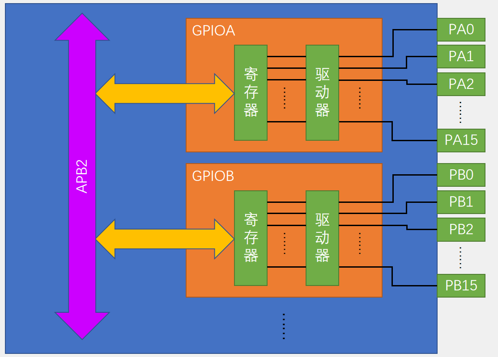
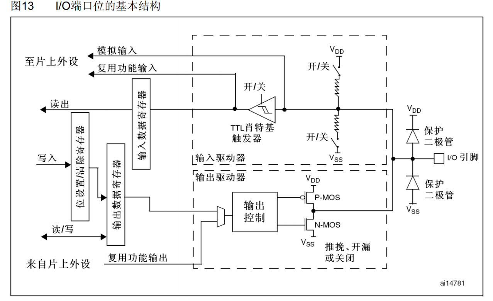
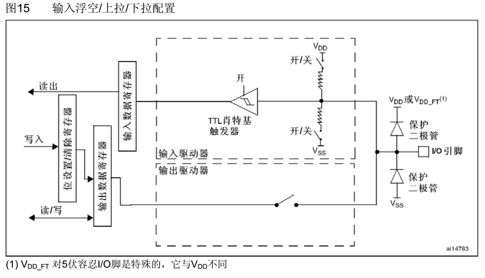
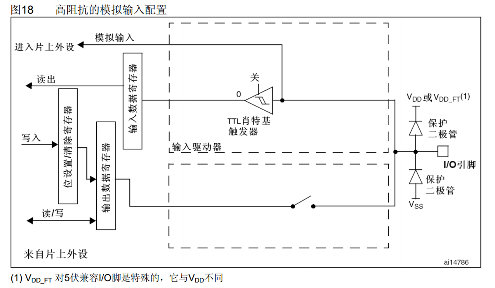
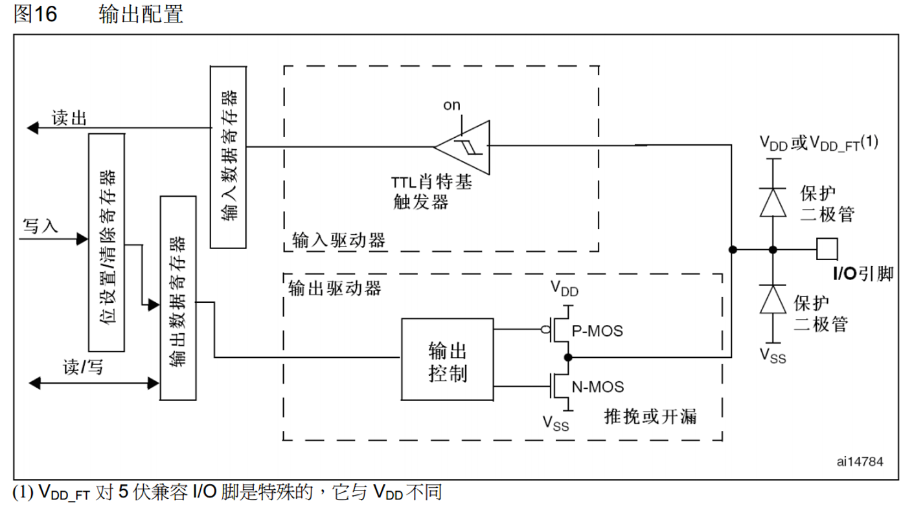
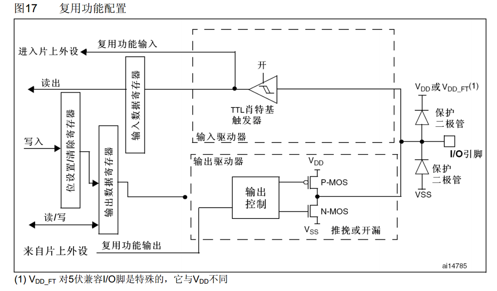

## GPIO简介
- GPIO（General Purpose Input Output）通用输入输出口
- 可配置为8种输入输出模式
- 引脚电平：0V~3.3V，部分引脚可容忍5V
- 输出模式下可控制端口输出高低电平，用以驱动LED、控制蜂鸣器、模拟通信协议输出时序等
- 输入模式下可读取端口的高低电平或电压，用于读取按键输入、外接模块电平信号输入、ADC电压采集、模拟通信协议接收数据等

## GPIO基本结构

## GPIO位结构

## GPIO模式

通过配置GPIO的端口配置寄存器，端口可以配置成以下8种模式:  

|    模式名称   |    性质   |                       特征                        |
|--------------|-----------|--------------------------------------------------|
|浮空输入       |数字输入   |可读取引脚电平，若引脚悬空，则电平不确定              |
|上拉输入       |数字输入   |可读取引脚电平，内部连接上拉电阻，悬空时默认高电平     |
|下拉输入       |数字输入   |可读取引脚电平，内部连接下拉电阻，悬空时默认低电平     |
|模拟输入       |模拟输入   |GPIO无效，引脚直接接入内部ADC                       |
|开漏输出       |数字输出   |可输出引脚电平，高电平为高阻态，低电平接VSS           |
|推挽输出       |数字输出   |可输出引脚电平，高电平接VDD，低电平接VSS             |
|复用开漏输出   |数字输出   |由片上外设控制，高电平为高阻态，低电平接VSS           |
|复用推挽输出   |数字输出   |由片上外设控制，高电平接VDD，低电平接VSS              |

## 浮空/上拉/下拉输入

## 模拟输入

## 开漏/推挽输出

## 复用开漏/推挽输出

