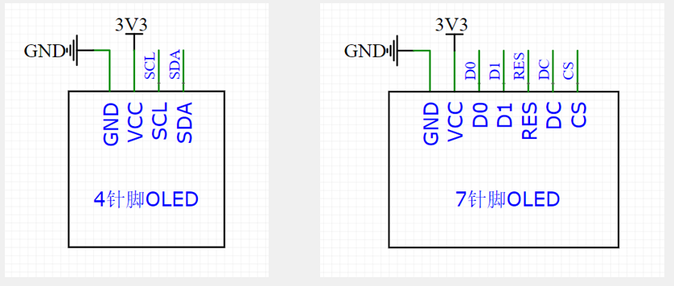
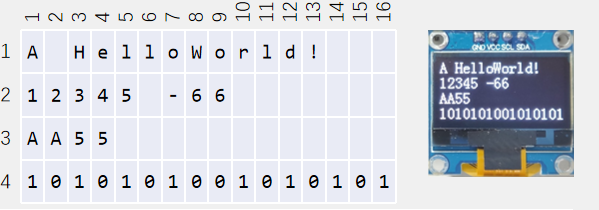

# 1. 调试方式

- 串口调试：通过串口通信，将调试信息发送到电脑端，电脑使用串口助手显示调试信息

- 显示屏调试：直接将显示屏连接到单片机，将调试信息打印在显示屏上

- Keil调试模式：借助Keil软件的调试模式，可使用单步运行、设置断点、查看寄存器及变量等功能

# 2. OLED简介

- OLED（Organic Light Emitting Diode）：有机发光二极管
- OLED显示屏：性能优异的新型显示屏，具有功耗低、相应速度快、宽视角、轻薄柔韧等特点
- 0.96寸OLED模块：小巧玲珑、占用接口少、简单易用，是电子设计中非常常见的显示屏模块
- 供电：3~5.5V，通信协议：I2C/SPI，分辨率：128*64

# 3. OLED硬件电路及显示方式

# 4. OLED驱动函数

|                函数                   |         作用       |
|---------------------------------------|-------------------|
|OLED_Init();                           |初始化              |
|OLED_Clear();                          |清屏                |
|OLED_ShowChar(1, 1, 'A');              |显示一个字符         |
|OLED_ShowString(1, 3, "HelloWorld!");  |显示字符串           |
|OLED_ShowNum(2, 1, 12345, 5);          |显示十进制数字       |
|OLED_ShowSignedNum(2, 7, -66, 2);      |显示有符号十进制数字  |
|OLED_ShowHexNum(3, 1, 0xAA55, 4);      |显示十六进制数字     |
|OLED_ShowBinNum(4, 1, 0xAA55, 16);     |显示二进制数字       |