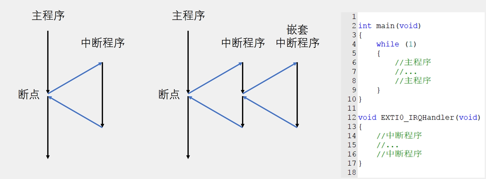
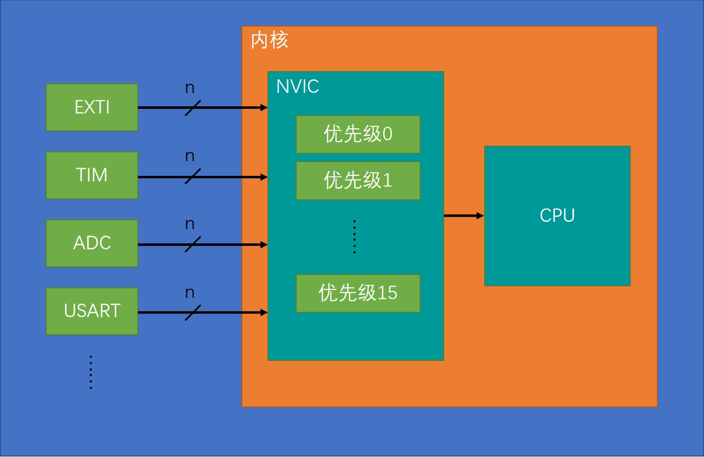
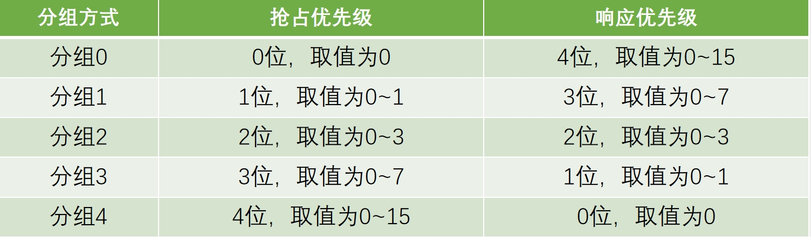
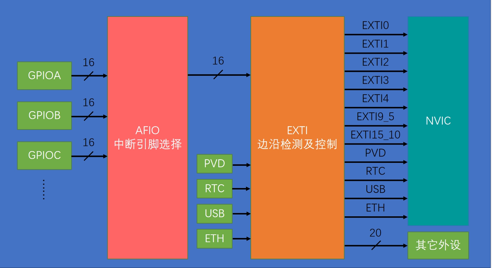

## 1 中断系统简介
- 中断：在主程序运行过程中，出现了特定的中断触发条件（中断源），使得CPU暂停当前正在运行的程序，转而去处理中断程序，处理完成后又返回原来被暂停的位置继续运行

- 中断优先级：当有多个中断源同时申请中断时，CPU会根据中断源的轻重缓急进行裁决，优先响应更加紧急的中断源

- 中断嵌套：当一个中断程序正在运行时，又有新的更高优先级的中断源申请中断，CPU再次暂停当前中断程序，转而去处理新的中断程序，处理完成后依次进行返回

## 2 中断执行流程
 

 

>中断函数不需要被调用，当中断函数触发时，硬件自动调用中断函数。  

## 3 stm32中断
- 68个可屏蔽中断通道，包含EXTI、TIM、ADC、USART、SPI、I2C、RTC等多个外设

- 使用NVIC统一管理中断，每个中断通道都拥有16个可编程的优先等级，可对优先级进行分组，进一步设置抢占优先级和响应优先级

## 4 NVIC(嵌套向量中断控制器)
### 4.1 NVIC基本结构
 

 

>NVIC统一管理所有外设的中断，NVIC接收所有外设的所有通道的中断，并将处理之后当前应该执行的中断告诉CPU。

### 4.2 NVIC优先级分组
- NVIC的中断优先级由优先级寄存器的4位（0~15）决定，这4位可以进行切分，分为高n位的抢占优先级和低4-n位的响应优先级
- 抢占优先级高的可以中断嵌套，响应优先级高的可以优先排队，抢占优先级和响应优先级均相同的按中断号排队
>响应优先级可以插队，但不能打断目前正在执行的中断。  
>抢占优先级高的可以打断目前正在执行的中断。  
 

 

## 5 EXTI(外部中断)
### 5.1 EXTI简介
- EXTI可以监测指定GPIO口的电平信号，当其指定的GPIO口产生电平变化时，EXTI将立即向NVIC发出中断申请，经过NVIC裁决后即可中断CPU主程序，使CPU执行EXTI对应的中断程序
- 支持的触发方式：上升沿/下降沿/双边沿/软件触发
- 支持的GPIO口：所有GPIO口，但相同的Pin不能同时触发中断
>相同的pin例如PA0、PB0  
- 通道数：16个GPIO_Pin，外加PVD输出、RTC闹钟、USB唤醒、以太网唤醒
- 触发响应方式：中断响应/事件响应
> 事件响应不会触发中断，而是触发别的外设操作，属于外设之间的联合工作

### 5.2 EXTI基本结构
 

 

>AFIO中断引脚选择从GPIO外设最多选择16条通道通向EXTI,EXTI根据触发响应方式选择通向NVIC还是其他外设。
