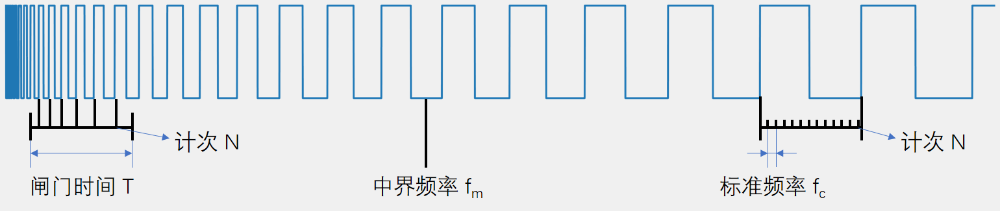
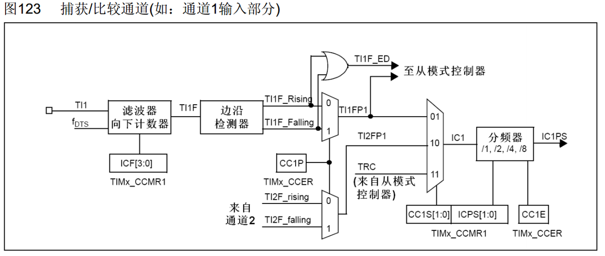
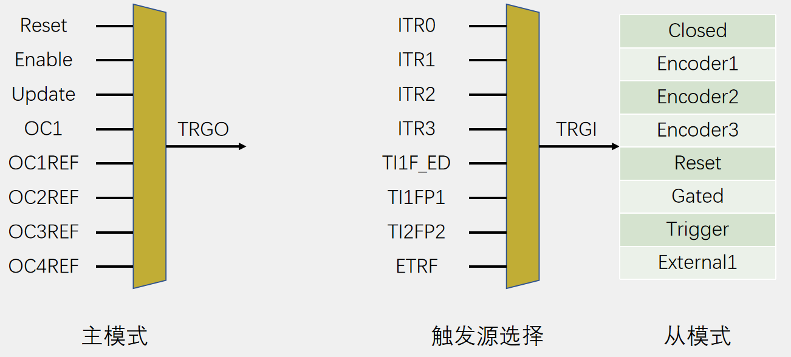
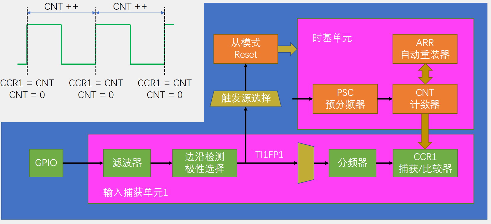
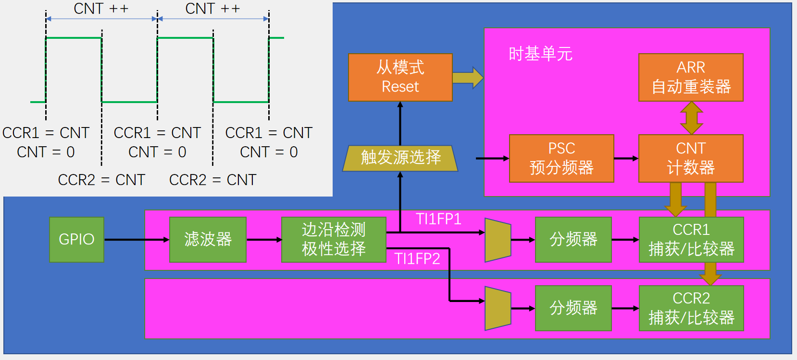

## 输入捕获简介
- IC（Input Capture）输入捕获
- 输入捕获模式下，当通道输入引脚出现指定电平跳变时，当前CNT的值将被锁存到CCR中，可用于测量PWM波形的频率、占空比、脉冲间隔、电平持续时间等参数
- 每个高级定时器和通用定时器都拥有4个输入捕获通道
- 可配置为PWMI模式，同时测量频率和占空比
- 可配合主从触发模式，实现硬件全自动测量

## 频率测量



- 测频法：在闸门时间 ${T}$ 内，对上升沿计次，得到 ${N}$ ，则频率
${{f}_ {x} = N/T }$
- 测周法：两个上升沿内，以标准频率 ${f_c}$ 计次，得到 ${N}$ ，则频率
${ {f}_ {x} = {f}_{c}/N }$
- 中界频率：测频法与测周法误差相等的频率点
${ {f}_ {m} = \sqrt {{f}_ {c}/T} }$

## 输入捕获通道



## 主从触发模式(博主自己起的名)



>- 主模式可以将定时器内部的信号，映射到TRGO输出，用于触发别的外设。
>- 从模式可以接收其他外设或者自身外设的一些信号，用于控制自身定时器的运行。
>- 触发源选择就是选择从模式的触发信号源的。可以认为是从模式的一部分。

## 输入捕获基本结构



>- 可以看出输入捕获的基本结构包含一个**时基单元**和一个**输入捕获单元**。
>- 当TI1FP1选择上升沿触发时，每当出现一个上升沿，CNT的值就会被转运到CCR1寄存器中。
>- 当从模式选择复位时，在CNT的值被转运到CCR1之后，CNT的值就会被清零。

## PWMI基本结构



>- PWMI模式可以同时捕获一个硬件的两个通道，实现同时测量频率和占空比。
>- TI1FP1选则上升沿触发，TI1FP2选择下降沿触发且不清零CNT，这样当出现上升沿时，CCR1的值就是一个周期的计数值，CCR2就是一个周期中高电平期间的计数值，CCR2/CCR1就是占空比。且保持为最新的计数值。

## PWMI模式测频率占空比代码

**main.c**

```cpp
#include "stm32f10x.h"                  // Device header
#include "Delay.h"
#include "OLED.h"
#include "PWM.h"
#include "IC.h"

int main(void)
{
    /*模块初始化*/
    OLED_Init();        //OLED初始化
    PWM_Init();            //PWM初始化
    IC_Init();            //输入捕获初始化
    
    /*显示静态字符串*/
    OLED_ShowString(1, 1, "Freq:00000Hz");        //1行1列显示字符串Freq:00000Hz
    OLED_ShowString(2, 1, "Duty:00%");            //2行1列显示字符串Duty:00%
    
    /*使用PWM模块提供输入捕获的测试信号*/
    PWM_SetPrescaler(720 - 1);                    //PWM频率Freq = 72M / (PSC + 1) / 100
    PWM_SetCompare1(50);                        //PWM占空比Duty = CCR / 100
    
    while (1)
    {
        OLED_ShowNum(1, 6, IC_GetFreq(), 5);    //不断刷新显示输入捕获测得的频率
        OLED_ShowNum(2, 6, IC_GetDuty(), 2);    //不断刷新显示输入捕获测得的占空比
    }
}


```

**IC.h**

```cpp
#ifndef __IC_H
#define __IC_H

void IC_Init(void);
uint32_t IC_GetFreq(void);
uint32_t IC_GetDuty(void);

#endif

```

**IC.c**

```cpp
#include "stm32f10x.h"                  // Device header

/**
  * 函    数：输入捕获初始化
  * 参    数：无
  * 返 回 值：无
  */
void IC_Init(void)
{
    /*开启时钟*/
    RCC_APB1PeriphClockCmd(RCC_APB1Periph_TIM3, ENABLE);            //开启TIM3的时钟
    RCC_APB2PeriphClockCmd(RCC_APB2Periph_GPIOA, ENABLE);            //开启GPIOA的时钟
    
    /*GPIO初始化*/
    GPIO_InitTypeDef GPIO_InitStructure;
    GPIO_InitStructure.GPIO_Mode = GPIO_Mode_IPU;
    GPIO_InitStructure.GPIO_Pin = GPIO_Pin_6;
    GPIO_InitStructure.GPIO_Speed = GPIO_Speed_50MHz;
    GPIO_Init(GPIOA, &GPIO_InitStructure);                            //将PA6引脚初始化为上拉输入
    
    /*配置时钟源*/
    TIM_InternalClockConfig(TIM3);        //选择TIM3为内部时钟，若不调用此函数，TIM默认也为内部时钟
    
    /*时基单元初始化*/
    TIM_TimeBaseInitTypeDef TIM_TimeBaseInitStructure;                //定义结构体变量
    TIM_TimeBaseInitStructure.TIM_ClockDivision = TIM_CKD_DIV1;     //时钟分频，选择不分频，此参数用于配置滤波器时钟，不影响时基单元功能
    TIM_TimeBaseInitStructure.TIM_CounterMode = TIM_CounterMode_Up; //计数器模式，选择向上计数
    TIM_TimeBaseInitStructure.TIM_Period = 65536 - 1;               //计数周期，即ARR的值
    TIM_TimeBaseInitStructure.TIM_Prescaler = 72 - 1;               //预分频器，即PSC的值
    TIM_TimeBaseInitStructure.TIM_RepetitionCounter = 0;            //重复计数器，高级定时器才会用到
    TIM_TimeBaseInit(TIM3, &TIM_TimeBaseInitStructure);             //将结构体变量交给TIM_TimeBaseInit，配置TIM3的时基单元
    
    /*PWMI模式初始化*/
    TIM_ICInitTypeDef TIM_ICInitStructure;                            //定义结构体变量
    TIM_ICInitStructure.TIM_Channel = TIM_Channel_1;                //选择配置定时器通道1
    TIM_ICInitStructure.TIM_ICFilter = 0xF;                            //输入滤波器参数，可以过滤信号抖动
    TIM_ICInitStructure.TIM_ICPolarity = TIM_ICPolarity_Rising;        //极性，选择为上升沿触发捕获
    TIM_ICInitStructure.TIM_ICPrescaler = TIM_ICPSC_DIV1;            //捕获预分频，选择不分频，每次信号都触发捕获
    TIM_ICInitStructure.TIM_ICSelection = TIM_ICSelection_DirectTI;    //输入信号交叉，选择直通，不交叉
    TIM_PWMIConfig(TIM3, &TIM_ICInitStructure);                        //将结构体变量交给TIM_PWMIConfig，配置TIM3的输入捕获通道
                                                                    //此函数同时会把另一个通道配置为相反的配置，实现PWMI模式

    /*选择触发源及从模式*/
    TIM_SelectInputTrigger(TIM3, TIM_TS_TI1FP1);                    //触发源选择TI1FP1
    TIM_SelectSlaveMode(TIM3, TIM_SlaveMode_Reset);                    //从模式选择复位
                                                                    //即TI1产生上升沿时，会触发CNT归零
    
    /*TIM使能*/
    TIM_Cmd(TIM3, ENABLE);            //使能TIM3，定时器开始运行
}

/**
  * 函    数：获取输入捕获的频率
  * 参    数：无
  * 返 回 值：捕获得到的频率
  */
uint32_t IC_GetFreq(void)
{
    return 1000000 / (TIM_GetCapture1(TIM3) + 1);        //测周法得到频率fx = fc / N，这里不执行+1的操作也可
}

/**
  * 函    数：获取输入捕获的占空比
  * 参    数：无
  * 返 回 值：捕获得到的占空比
  */
uint32_t IC_GetDuty(void)
{
    return (TIM_GetCapture2(TIM3) + 1) * 100 / (TIM_GetCapture1(TIM3) + 1);    //占空比Duty = CCR2 / CCR1 * 100，这里不执行+1的操作也可
}


```