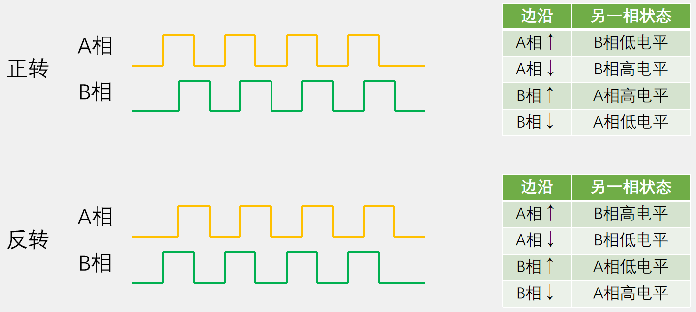
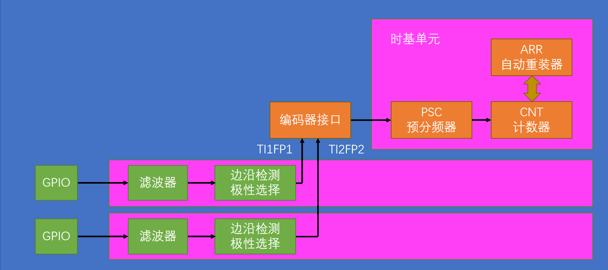
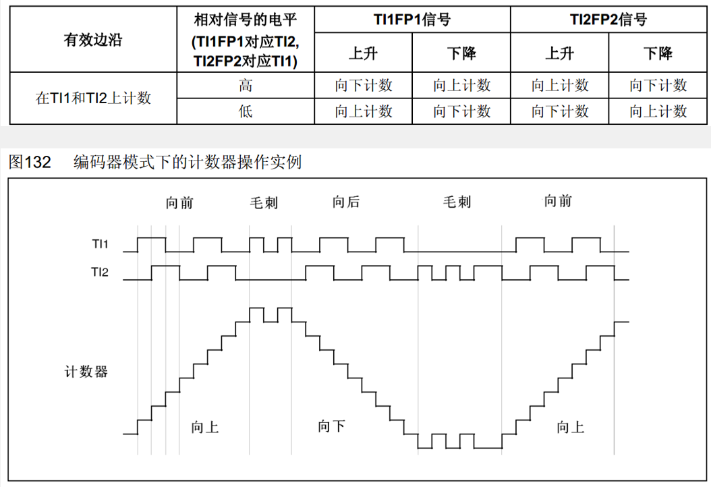
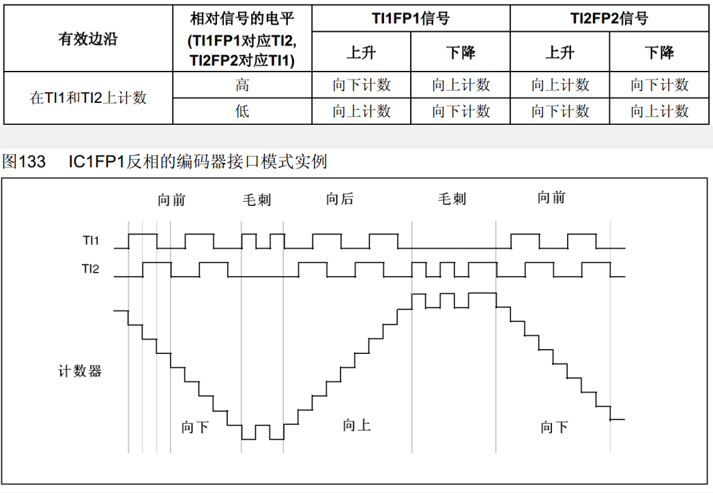

## 编码器接口简介

- Encoder Interface 编码器接口
- 编码器接口可接收增量（正交）编码器的信号，根据编码器旋转产生的正交信号脉冲，自动控制CNT自增或自减，从而指示编码器的位置、旋转方向和旋转速度
- 每个高级定时器和通用定时器都拥有1个编码器接口
- 两个输入引脚借用了输入捕获的通道1和通道2

## 正交编码器



## 编码器接口基本结构



>- TI1FP1和TI2FP2分别读取编码器的A相和B相，编码器接口可以通过编码器的旋转方向增减CNT计数器。
>- 这里ARR寄存器也会有用，一般设置为最大值65535，这样利用补码的特性很容易得到负数（signed int 类型下，65535（0xFFFF）表示-1）

## 工作模式


>- 工作模式可以配置为**仅在TI1(上升沿)计数、 仅在TI2（下降沿）计数或者在TI1和TI2（上升沿和下降沿）都计数**

**实例（均不反相）**



>- 当TI1为上升沿且TI2为低电平时，向上计数
>- 当TI1为下降沿且TI2为高电平时，向上计数
>- 当TI1为上升沿且TI2为高电平时，向下计数
>- 当TI1为下降沿且TI2为低电平时，向下计数
>- TI2的判断同理
>- 当一路信号出现噪声时，由于计数特性，会使计数值上下跳变，由此实现去除噪声的效果。

**实例（TI1反相）**



**编码器接口测速代码**

**main.c**
```cpp
#include "stm32f10x.h"                  // Device header
#include "Delay.h"
#include "OLED.h"
#include "Timer.h"
#include "Encoder.h"

int16_t Speed;            //定义速度变量

int main(void)
{
    /*模块初始化*/
    OLED_Init();        //OLED初始化
    Timer_Init();        //定时器初始化
    Encoder_Init();        //编码器初始化
    
    /*显示静态字符串*/
    OLED_ShowString(1, 1, "Speed:");        //1行1列显示字符串Speed:
    
    while (1)
    {
        OLED_ShowSignedNum(1, 7, Speed, 5);    //不断刷新显示编码器测得的最新速度
    }
}

/**
  * 函    数：TIM2中断函数
  * 参    数：无
  * 返 回 值：无
  * 注意事项：此函数为中断函数，无需调用，中断触发后自动执行
  *           函数名为预留的指定名称，可以从启动文件复制
  *           请确保函数名正确，不能有任何差异，否则中断函数将不能进入
  */
void TIM2_IRQHandler(void)
{
    if (TIM_GetITStatus(TIM2, TIM_IT_Update) == SET)        //判断是否是TIM2的更新事件触发的中断
    {
        Speed = Encoder_Get();                                //每隔固定时间段读取一次编码器计数增量值，即为速度值
        TIM_ClearITPendingBit(TIM2, TIM_IT_Update);            //清除TIM2更新事件的中断标志位
                                                            //中断标志位必须清除
                                                            //否则中断将连续不断地触发，导致主程序卡死
    }
}

```

**Encoder.h**

```cpp
#ifndef __ENCODER_H
#define __ENCODER_H

void Encoder_Init(void);
int16_t Encoder_Get(void);

#endif

```

**Encoder.c**

```cpp
#include "stm32f10x.h"                  // Device header

/**
  * 函    数：编码器初始化
  * 参    数：无
  * 返 回 值：无
  */
void Encoder_Init(void)
{
    /*开启时钟*/
    RCC_APB1PeriphClockCmd(RCC_APB1Periph_TIM3, ENABLE);            //开启TIM3的时钟
    RCC_APB2PeriphClockCmd(RCC_APB2Periph_GPIOA, ENABLE);            //开启GPIOA的时钟
    
    /*GPIO初始化*/
    GPIO_InitTypeDef GPIO_InitStructure;
    GPIO_InitStructure.GPIO_Mode = GPIO_Mode_IPU;
    GPIO_InitStructure.GPIO_Pin = GPIO_Pin_6 | GPIO_Pin_7;
    GPIO_InitStructure.GPIO_Speed = GPIO_Speed_50MHz;
    GPIO_Init(GPIOA, &GPIO_InitStructure);                            //将PA6和PA7引脚初始化为上拉输入
    
    /*时基单元初始化*/
    TIM_TimeBaseInitTypeDef TIM_TimeBaseInitStructure;                //定义结构体变量
    TIM_TimeBaseInitStructure.TIM_ClockDivision = TIM_CKD_DIV1;     //时钟分频，选择不分频，此参数用于配置滤波器时钟，不影响时基单元功能
    TIM_TimeBaseInitStructure.TIM_CounterMode = TIM_CounterMode_Up; //计数器模式，选择向上计数
    TIM_TimeBaseInitStructure.TIM_Period = 65536 - 1;               //计数周期，即ARR的值
    TIM_TimeBaseInitStructure.TIM_Prescaler = 1 - 1;                //预分频器，即PSC的值
    TIM_TimeBaseInitStructure.TIM_RepetitionCounter = 0;            //重复计数器，高级定时器才会用到
    TIM_TimeBaseInit(TIM3, &TIM_TimeBaseInitStructure);             //将结构体变量交给TIM_TimeBaseInit，配置TIM3的时基单元
    
    /*输入捕获初始化*/
    TIM_ICInitTypeDef TIM_ICInitStructure;                            //定义结构体变量
    TIM_ICStructInit(&TIM_ICInitStructure);                            //结构体初始化，若结构体没有完整赋值
                                                                    //则最好执行此函数，给结构体所有成员都赋一个默认值
                                                                    //避免结构体初值不确定的问题
    TIM_ICInitStructure.TIM_Channel = TIM_Channel_1;                //选择配置定时器通道1
    TIM_ICInitStructure.TIM_ICFilter = 0xF;                            //输入滤波器参数，可以过滤信号抖动
    TIM_ICInit(TIM3, &TIM_ICInitStructure);                            //将结构体变量交给TIM_ICInit，配置TIM3的输入捕获通道
    TIM_ICInitStructure.TIM_Channel = TIM_Channel_2;                //选择配置定时器通道2
    TIM_ICInitStructure.TIM_ICFilter = 0xF;                            //输入滤波器参数，可以过滤信号抖动
    TIM_ICInit(TIM3, &TIM_ICInitStructure);                            //将结构体变量交给TIM_ICInit，配置TIM3的输入捕获通道
    
    /*编码器接口配置*/
    TIM_EncoderInterfaceConfig(TIM3, TIM_EncoderMode_TI12, TIM_ICPolarity_Rising, TIM_ICPolarity_Rising);
                                                                    //配置编码器模式以及两个输入通道是否反相
                                                                    //注意此时参数的Rising和Falling已经不代表上升沿和下降沿了，而是代表是否反相
                                                                    //此函数必须在输入捕获初始化之后进行，否则输入捕获的配置会覆盖此函数的部分配置
    
    /*TIM使能*/
    TIM_Cmd(TIM3, ENABLE);            //使能TIM3，定时器开始运行
}

/**
  * 函    数：获取编码器的增量值
  * 参    数：无
  * 返 回 值：自上此调用此函数后，编码器的增量值
  */
int16_t Encoder_Get(void)
{
    /*使用Temp变量作为中继，目的是返回CNT后将其清零*/
    int16_t Temp;
    Temp = TIM_GetCounter(TIM3);
    TIM_SetCounter(TIM3, 0);
    return Temp;
}

```