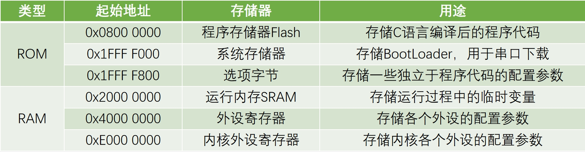
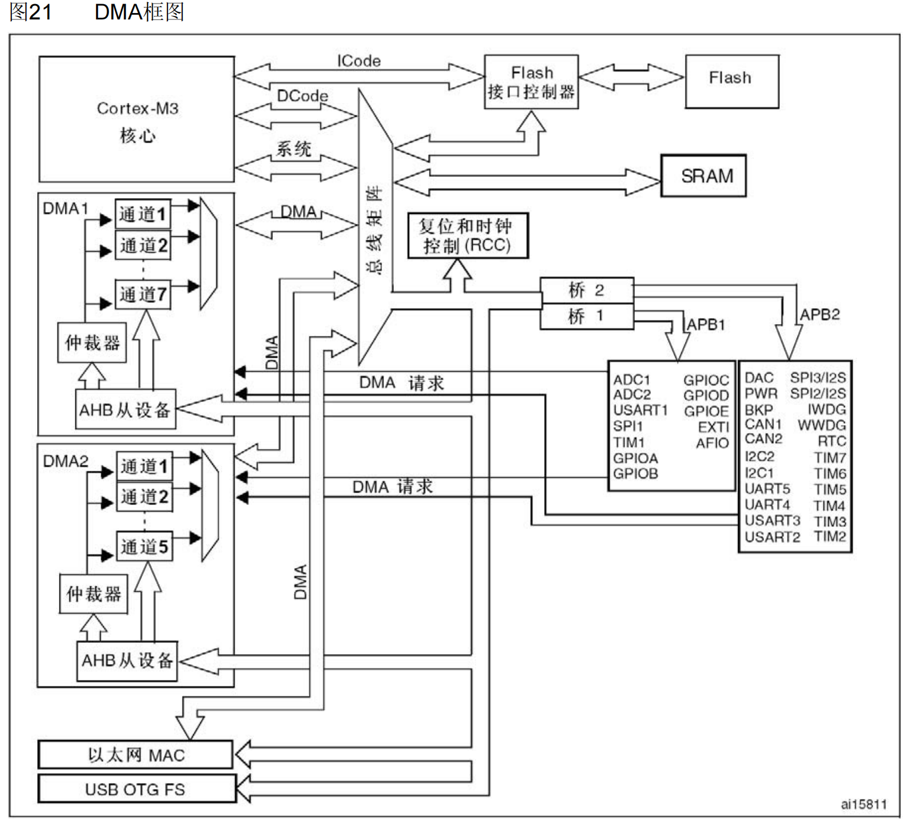
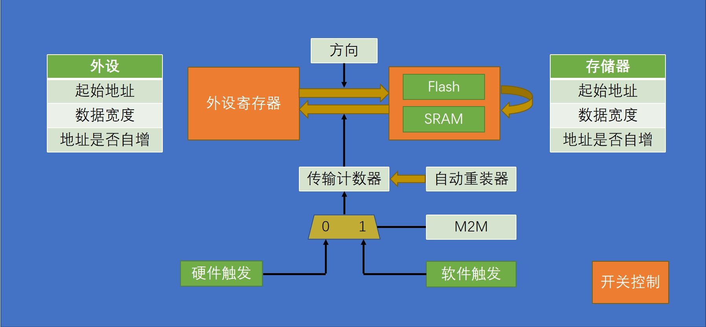
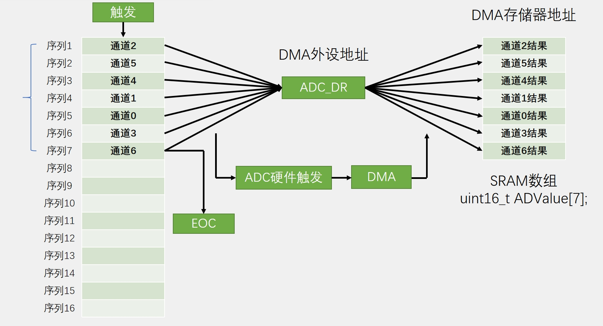

### 6.1 DMA简介
- DMA（Direct Memory Access）直接存储器存取  
- DMA可以提供外设和存储器或者存储器和存储器之间的高速数据传输，无须CPU干预，节省了CPU的资源  
- 12个独立可配置的通道： DMA1（7个通道）， DMA2（5个通道）  
- 每个通道都支持软件触发和特定的硬件触发  

>STM32F103C8T6 DMA资源：DMA1（7个通道）  

### 6.2 存储器映像
<div></div>

### 6.3 DMA框图
<div></div>

### 6.4 DMA基本结构 
<div></div>

<br/>

- 传输计数器指定需要传输多少个数据，它是一个自减计数器，减到0则DMA完成一轮数据传输。  
- 自动重装器可以指定，当DMA传输计数器减到0时，是否复位到初始值。配置自动重装器可以实现循环传输数据。  
- M2M位可以控制DMA的触发源：硬件触发还是软件触发。外设和存储器用硬件触发，存储器到存储器用软件触发。  

### 6.5 ADC扫描+DMA
<div></div>

### 6.6 ADC扫描+DMA软件配置
结合ADC和DMA的基本结构，ADC扫描+DMA的软件配置如下：  
1. 开启时钟  
2. 配置GPIO端口
3. 配置通道扫描序列
4. 配置ADC外设
5. 配置DMA外设
6. 使能ADC、DMA，使能ADC触发DMA
7. 校准
8. 开启ADC软件触发转换
### 6.7 ADC扫描+DMA代码
main.c
```cpp
#include "stm32f10x.h"                  // Device header
#include "Delay.h"
#include "OLED.h"
#include "AD.h"

int main(void)
{
    OLED_Init();
    AD_Init();
    
    OLED_ShowString(1, 1, "AD0:");
    OLED_ShowString(2, 1, "AD1:");
    OLED_ShowString(3, 1, "AD2:");
    OLED_ShowString(4, 1, "AD3:");
    
    while (1)
    {
        OLED_ShowNum(1, 5, AD_Value[0], 4);
        OLED_ShowNum(2, 5, AD_Value[1], 4);
        OLED_ShowNum(3, 5, AD_Value[2], 4);
        OLED_ShowNum(4, 5, AD_Value[3], 4);
        
        Delay_ms(100);
    }
}

```
AD.h
```cpp
#ifndef __AD_H
#define __AD_H

extern uint16_t AD_Value[4];

void AD_Init(void);

#endif

```
AD.c
```cpp
#include "stm32f10x.h"                  // Device header

uint16_t AD_Value[4];

void AD_Init(void)
{
    /*1.开启时钟*/
    RCC_APB2PeriphClockCmd(RCC_APB2Periph_ADC1, ENABLE);
    RCC_APB2PeriphClockCmd(RCC_APB2Periph_GPIOA, ENABLE);
    RCC_AHBPeriphClockCmd(RCC_AHBPeriph_DMA1, ENABLE);
    
    RCC_ADCCLKConfig(RCC_PCLK2_Div6);

    /*2.配置GPIO端口*/
    GPIO_InitTypeDef GPIO_InitStructure;
    GPIO_InitStructure.GPIO_Mode = GPIO_Mode_AIN;
    GPIO_InitStructure.GPIO_Pin = GPIO_Pin_0 | GPIO_Pin_1 | GPIO_Pin_2 | GPIO_Pin_3;
    GPIO_InitStructure.GPIO_Speed = GPIO_Speed_50MHz;
    GPIO_Init(GPIOA, &GPIO_InitStructure);

    /*3.配置通道扫描序列*/
    ADC_RegularChannelConfig(ADC1, ADC_Channel_0, 1, ADC_SampleTime_55Cycles5);
    ADC_RegularChannelConfig(ADC1, ADC_Channel_1, 2, ADC_SampleTime_55Cycles5);
    ADC_RegularChannelConfig(ADC1, ADC_Channel_2, 3, ADC_SampleTime_55Cycles5);
    ADC_RegularChannelConfig(ADC1, ADC_Channel_3, 4, ADC_SampleTime_55Cycles5);

    /*4.配置ADC外设*/
    ADC_InitTypeDef ADC_InitStructure;
    ADC_InitStructure.ADC_Mode = ADC_Mode_Independent;
    ADC_InitStructure.ADC_DataAlign = ADC_DataAlign_Right;
    ADC_InitStructure.ADC_ExternalTrigConv = ADC_ExternalTrigConv_None;
    ADC_InitStructure.ADC_ContinuousConvMode = ENABLE;
    ADC_InitStructure.ADC_ScanConvMode = ENABLE;
    ADC_InitStructure.ADC_NbrOfChannel = 4;
    ADC_Init(ADC1, &ADC_InitStructure);

    /*5.配置DMA外设*/
    DMA_InitTypeDef DMA_InitStructure;
    DMA_InitStructure.DMA_PeripheralBaseAddr = (uint32_t)&ADC1->DR;
    DMA_InitStructure.DMA_PeripheralDataSize = DMA_PeripheralDataSize_HalfWord;
    DMA_InitStructure.DMA_PeripheralInc = DMA_PeripheralInc_Disable;
    DMA_InitStructure.DMA_MemoryBaseAddr = (uint32_t)AD_Value;
    DMA_InitStructure.DMA_MemoryDataSize = DMA_MemoryDataSize_HalfWord;
    DMA_InitStructure.DMA_MemoryInc = DMA_MemoryInc_Enable;
    DMA_InitStructure.DMA_DIR = DMA_DIR_PeripheralSRC;
    DMA_InitStructure.DMA_BufferSize = 4;
    DMA_InitStructure.DMA_Mode = DMA_Mode_Circular;
    DMA_InitStructure.DMA_M2M = DMA_M2M_Disable;
    DMA_InitStructure.DMA_Priority = DMA_Priority_Medium;
    DMA_Init(DMA1_Channel1, &DMA_InitStructure);

    /*6.使能ADC、DMA，使能ADC触发DMA*/
    DMA_Cmd(DMA1_Channel1, ENABLE);
    ADC_DMACmd(ADC1, ENABLE);
    ADC_Cmd(ADC1, ENABLE);

    /*7.校准*/
    ADC_ResetCalibration(ADC1);
    while (ADC_GetResetCalibrationStatus(ADC1) == SET);
    ADC_StartCalibration(ADC1);
    while (ADC_GetCalibrationStatus(ADC1) == SET);

    /*8.开启ADC软件触发转换*/
    ADC_SoftwareStartConvCmd(ADC1, ENABLE);
}

```
