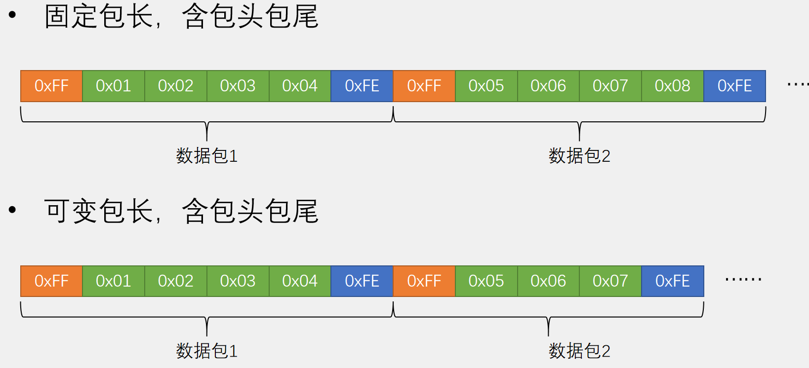
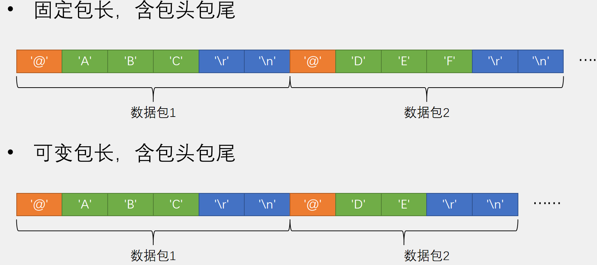
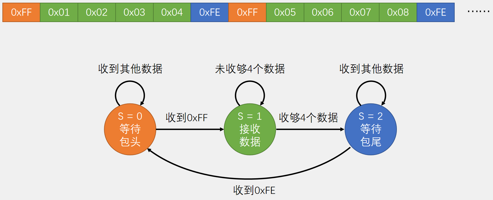
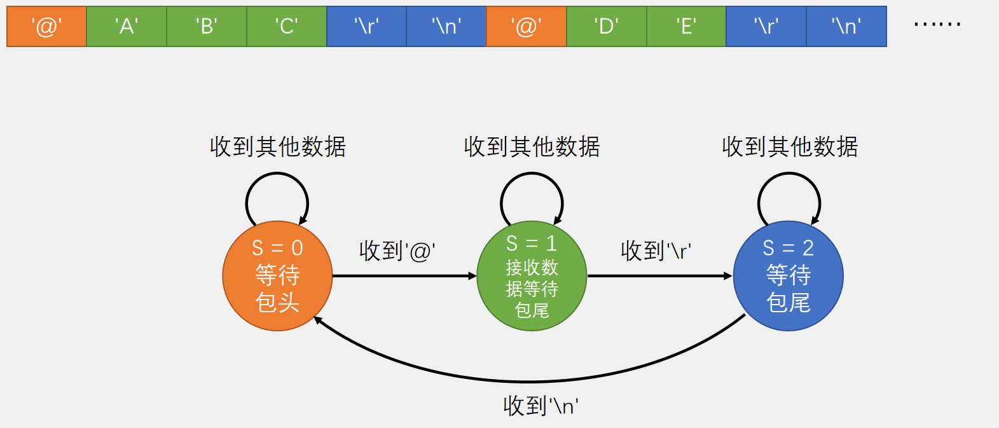

在数据流收发中，为使接收方能准确判断一包数据的开始和结束位置，可用约定的数据作为一包数据的起始和结束标志。
# 1.数据包通信
**HEX数据包**


**文本数据包**


**HEX数据包接收**


**文本数据包接收**


# 2.代码实现
## 2.1 串口收发HEX数据包
main.c
```cpp
#include "stm32f10x.h"                  // Device header
#include "Delay.h"
#include "OLED.h"
#include "Serial.h"
#include "Key.h"

uint8_t KeyNum;            //定义用于接收按键键码的变量

int main(void)
{
    /*模块初始化*/
    OLED_Init();        //OLED初始化
    Key_Init();            //按键初始化
    Serial_Init();        //串口初始化
    
    /*显示静态字符串*/
    OLED_ShowString(1, 1, "TxPacket");
    OLED_ShowString(3, 1, "RxPacket");
    
    /*设置发送数据包数组的初始值，用于测试*/
    Serial_TxPacket[0] = 0x01;
    Serial_TxPacket[1] = 0x02;
    Serial_TxPacket[2] = 0x03;
    Serial_TxPacket[3] = 0x04;
    
    while (1)
    {
        KeyNum = Key_GetNum();            //获取按键键码
        if (KeyNum == 1)                //按键1按下
        {
            Serial_TxPacket[0] ++;        //测试数据自增
            Serial_TxPacket[1] ++;
            Serial_TxPacket[2] ++;
            Serial_TxPacket[3] ++;
            
            Serial_SendPacket();        //串口发送数据包Serial_TxPacket
            
            OLED_ShowHexNum(2, 1, Serial_TxPacket[0], 2);    //显示发送的数据包
            OLED_ShowHexNum(2, 4, Serial_TxPacket[1], 2);
            OLED_ShowHexNum(2, 7, Serial_TxPacket[2], 2);
            OLED_ShowHexNum(2, 10, Serial_TxPacket[3], 2);
        }
        
        if (Serial_GetRxFlag() == 1)    //如果接收到数据包
        {
            OLED_ShowHexNum(4, 1, Serial_RxPacket[0], 2);    //显示接收的数据包
            OLED_ShowHexNum(4, 4, Serial_RxPacket[1], 2);
            OLED_ShowHexNum(4, 7, Serial_RxPacket[2], 2);
            OLED_ShowHexNum(4, 10, Serial_RxPacket[3], 2);
        }
    }
}

```
Serial.h
```cpp
#ifndef __SERIAL_H
#define __SERIAL_H

#include <stdio.h>

extern uint8_t Serial_TxPacket[];
extern uint8_t Serial_RxPacket[];

void Serial_Init(void);
void Serial_SendByte(uint8_t Byte);
void Serial_SendArray(uint8_t *Array, uint16_t Length);
void Serial_SendString(char *String);
void Serial_SendNumber(uint32_t Number, uint8_t Length);
void Serial_Printf(char *format, ...);

void Serial_SendPacket(void);
uint8_t Serial_GetRxFlag(void);

#endif

```
Serial.c
```cpp
#include "stm32f10x.h"                  // Device header
#include <stdio.h>
#include <stdarg.h>

uint8_t Serial_TxPacket[4];                //定义发送数据包数组，数据包格式：FF 01 02 03 04 FE
uint8_t Serial_RxPacket[4];                //定义接收数据包数组
uint8_t Serial_RxFlag;                    //定义接收数据包标志位

/**
  * 函    数：串口初始化
  * 参    数：无
  * 返 回 值：无
  */
void Serial_Init(void)
{
    /*开启时钟*/
    RCC_APB2PeriphClockCmd(RCC_APB2Periph_USART1, ENABLE);    //开启USART1的时钟
    RCC_APB2PeriphClockCmd(RCC_APB2Periph_GPIOA, ENABLE);    //开启GPIOA的时钟
    
    /*GPIO初始化*/
    GPIO_InitTypeDef GPIO_InitStructure;
    GPIO_InitStructure.GPIO_Mode = GPIO_Mode_AF_PP;
    GPIO_InitStructure.GPIO_Pin = GPIO_Pin_9;
    GPIO_InitStructure.GPIO_Speed = GPIO_Speed_50MHz;
    GPIO_Init(GPIOA, &GPIO_InitStructure);                    //将PA9引脚初始化为复用推挽输出
    
    GPIO_InitStructure.GPIO_Mode = GPIO_Mode_IPU;
    GPIO_InitStructure.GPIO_Pin = GPIO_Pin_10;
    GPIO_InitStructure.GPIO_Speed = GPIO_Speed_50MHz;
    GPIO_Init(GPIOA, &GPIO_InitStructure);                    //将PA10引脚初始化为上拉输入
    
    /*USART初始化*/
    USART_InitTypeDef USART_InitStructure;                    //定义结构体变量
    USART_InitStructure.USART_BaudRate = 9600;                //波特率
    USART_InitStructure.USART_HardwareFlowControl = USART_HardwareFlowControl_None;    //硬件流控制，不需要
    USART_InitStructure.USART_Mode = USART_Mode_Tx | USART_Mode_Rx;    //模式，发送模式和接收模式均选择
    USART_InitStructure.USART_Parity = USART_Parity_No;        //奇偶校验，不需要
    USART_InitStructure.USART_StopBits = USART_StopBits_1;    //停止位，选择1位
    USART_InitStructure.USART_WordLength = USART_WordLength_8b;        //字长，选择8位
    USART_Init(USART1, &USART_InitStructure);                //将结构体变量交给USART_Init，配置USART1
    
    /*中断输出配置*/
    USART_ITConfig(USART1, USART_IT_RXNE, ENABLE);            //开启串口接收数据的中断
    
    /*NVIC中断分组*/
    NVIC_PriorityGroupConfig(NVIC_PriorityGroup_2);            //配置NVIC为分组2
    
    /*NVIC配置*/
    NVIC_InitTypeDef NVIC_InitStructure;                    //定义结构体变量
    NVIC_InitStructure.NVIC_IRQChannel = USART1_IRQn;        //选择配置NVIC的USART1线
    NVIC_InitStructure.NVIC_IRQChannelCmd = ENABLE;            //指定NVIC线路使能
    NVIC_InitStructure.NVIC_IRQChannelPreemptionPriority = 1;        //指定NVIC线路的抢占优先级为1
    NVIC_InitStructure.NVIC_IRQChannelSubPriority = 1;        //指定NVIC线路的响应优先级为1
    NVIC_Init(&NVIC_InitStructure);                            //将结构体变量交给NVIC_Init，配置NVIC外设
    
    /*USART使能*/
    USART_Cmd(USART1, ENABLE);                                //使能USART1，串口开始运行
}

/**
  * 函    数：串口发送一个字节
  * 参    数：Byte 要发送的一个字节
  * 返 回 值：无
  */
void Serial_SendByte(uint8_t Byte)
{
    USART_SendData(USART1, Byte);        //将字节数据写入数据寄存器，写入后USART自动生成时序波形
    while (USART_GetFlagStatus(USART1, USART_FLAG_TXE) == RESET);    //等待发送完成
    /*下次写入数据寄存器会自动清除发送完成标志位，故此循环后，无需清除标志位*/
}

/**
  * 函    数：串口发送一个数组
  * 参    数：Array 要发送数组的首地址
  * 参    数：Length 要发送数组的长度
  * 返 回 值：无
  */
void Serial_SendArray(uint8_t *Array, uint16_t Length)
{
    uint16_t i;
    for (i = 0; i < Length; i ++)        //遍历数组
    {
        Serial_SendByte(Array[i]);        //依次调用Serial_SendByte发送每个字节数据
    }
}

/**
  * 函    数：串口发送一个字符串
  * 参    数：String 要发送字符串的首地址
  * 返 回 值：无
  */
void Serial_SendString(char *String)
{
    uint8_t i;
    for (i = 0; String[i] != '\0'; i ++)//遍历字符数组（字符串），遇到字符串结束标志位后停止
    {
        Serial_SendByte(String[i]);        //依次调用Serial_SendByte发送每个字节数据
    }
}

/**
  * 函    数：次方函数（内部使用）
  * 返 回 值：返回值等于X的Y次方
  */
uint32_t Serial_Pow(uint32_t X, uint32_t Y)
{
    uint32_t Result = 1;    //设置结果初值为1
    while (Y --)            //执行Y次
    {
        Result *= X;        //将X累乘到结果
    }
    return Result;
}

/**
  * 函    数：串口发送数字
  * 参    数：Number 要发送的数字，范围：0~4294967295
  * 参    数：Length 要发送数字的长度，范围：0~10
  * 返 回 值：无
  */
void Serial_SendNumber(uint32_t Number, uint8_t Length)
{
    uint8_t i;
    for (i = 0; i < Length; i ++)        //根据数字长度遍历数字的每一位
    {
        Serial_SendByte(Number / Serial_Pow(10, Length - i - 1) % 10 + '0');    //依次调用Serial_SendByte发送每位数字
    }
}

/**
  * 函    数：使用printf需要重定向的底层函数
  * 参    数：保持原始格式即可，无需变动
  * 返 回 值：保持原始格式即可，无需变动
  */
int fputc(int ch, FILE *f)
{
    Serial_SendByte(ch);            //将printf的底层重定向到自己的发送字节函数
    return ch;
}

/**
  * 函    数：自己封装的prinf函数
  * 参    数：format 格式化字符串
  * 参    数：... 可变的参数列表
  * 返 回 值：无
  */
void Serial_Printf(char *format, ...)
{
    char String[100];                //定义字符数组
    va_list arg;                    //定义可变参数列表数据类型的变量arg
    va_start(arg, format);            //从format开始，接收参数列表到arg变量
    vsprintf(String, format, arg);    //使用vsprintf打印格式化字符串和参数列表到字符数组中
    va_end(arg);                    //结束变量arg
    Serial_SendString(String);        //串口发送字符数组（字符串）
}

/**
  * 函    数：串口发送数据包
  * 参    数：无
  * 返 回 值：无
  * 说    明：调用此函数后，Serial_TxPacket数组的内容将加上包头（FF）包尾（FE）后，作为数据包发送出去
  */
void Serial_SendPacket(void)
{
    Serial_SendByte(0xFF);
    Serial_SendArray(Serial_TxPacket, 4);
    Serial_SendByte(0xFE);
}

/**
  * 函    数：获取串口接收数据包标志位
  * 参    数：无
  * 返 回 值：串口接收数据包标志位，范围：0~1，接收到数据包后，标志位置1，读取后标志位自动清零
  */
uint8_t Serial_GetRxFlag(void)
{
    if (Serial_RxFlag == 1)            //如果标志位为1
    {
        Serial_RxFlag = 0;
        return 1;                    //则返回1，并自动清零标志位
    }
    return 0;                        //如果标志位为0，则返回0
}

/**
  * 函    数：USART1中断函数
  * 参    数：无
  * 返 回 值：无
  * 注意事项：此函数为中断函数，无需调用，中断触发后自动执行
  *           函数名为预留的指定名称，可以从启动文件复制
  *           请确保函数名正确，不能有任何差异，否则中断函数将不能进入
  */
void USART1_IRQHandler(void)
{
    static uint8_t RxState = 0;        //定义表示当前状态机状态的静态变量
    static uint8_t pRxPacket = 0;    //定义表示当前接收数据位置的静态变量
    if (USART_GetITStatus(USART1, USART_IT_RXNE) == SET)        //判断是否是USART1的接收事件触发的中断
    {
        uint8_t RxData = USART_ReceiveData(USART1);                //读取数据寄存器，存放在接收的数据变量
        
        /*使用状态机的思路，依次处理数据包的不同部分*/
        
        /*当前状态为0，接收数据包包头*/
        if (RxState == 0)
        {
            if (RxData == 0xFF)            //如果数据确实是包头
            {
                RxState = 1;            //置下一个状态
                pRxPacket = 0;            //数据包的位置归零
            }
        }
        /*当前状态为1，接收数据包数据*/
        else if (RxState == 1)
        {
            Serial_RxPacket[pRxPacket] = RxData;    //将数据存入数据包数组的指定位置
            pRxPacket ++;                //数据包的位置自增
            if (pRxPacket >= 4)            //如果收够4个数据
            {
                RxState = 2;            //置下一个状态
            }
        }
        /*当前状态为2，接收数据包包尾*/
        else if (RxState == 2)
        {
            if (RxData == 0xFE)            //如果数据确实是包尾部
            {
                RxState = 0;            //状态归0
                Serial_RxFlag = 1;        //接收数据包标志位置1，成功接收一个数据包
            }
        }
        
        USART_ClearITPendingBit(USART1, USART_IT_RXNE);        //清除标志位
    }
}

```
## 2.2 串口收发文本数据包
main.c
```cpp
#include "stm32f10x.h"                  // Device header
#include "Delay.h"
#include "OLED.h"
#include "Serial.h"
#include "LED.h"
#include "string.h"

int main(void)
{
    /*模块初始化*/
    OLED_Init();        //OLED初始化
    LED_Init();            //LED初始化
    Serial_Init();        //串口初始化
    
    /*显示静态字符串*/
    OLED_ShowString(1, 1, "TxPacket");
    OLED_ShowString(3, 1, "RxPacket");
    
    while (1)
    {
        if (Serial_RxFlag == 1)        //如果接收到数据包
        {
            OLED_ShowString(4, 1, "                ");
            OLED_ShowString(4, 1, Serial_RxPacket);                //OLED清除指定位置，并显示接收到的数据包
            
            /*将收到的数据包与预设的指令对比，以此决定将要执行的操作*/
            if (strcmp(Serial_RxPacket, "LED_ON") == 0)            //如果收到LED_ON指令
            {
                LED1_ON();                                        //点亮LED
                Serial_SendString("LED_ON_OK\r\n");                //串口回传一个字符串LED_ON_OK
                OLED_ShowString(2, 1, "                ");
                OLED_ShowString(2, 1, "LED_ON_OK");                //OLED清除指定位置，并显示LED_ON_OK
            }
            else if (strcmp(Serial_RxPacket, "LED_OFF") == 0)    //如果收到LED_OFF指令
            {
                LED1_OFF();                                        //熄灭LED
                Serial_SendString("LED_OFF_OK\r\n");            //串口回传一个字符串LED_OFF_OK
                OLED_ShowString(2, 1, "                ");
                OLED_ShowString(2, 1, "LED_OFF_OK");            //OLED清除指定位置，并显示LED_OFF_OK
            }
            else                        //上述所有条件均不满足，即收到了未知指令
            {
                Serial_SendString("ERROR_COMMAND\r\n");            //串口回传一个字符串ERROR_COMMAND
                OLED_ShowString(2, 1, "                ");
                OLED_ShowString(2, 1, "ERROR_COMMAND");            //OLED清除指定位置，并显示ERROR_COMMAND
            }
            
            Serial_RxFlag = 0;            //处理完成后，需要将接收数据包标志位清零，否则将无法接收后续数据包
        }
    }
}

```
Serial.h
```cpp
#ifndef __SERIAL_H
#define __SERIAL_H

#include <stdio.h>

extern char Serial_RxPacket[];
extern uint8_t Serial_RxFlag;

void Serial_Init(void);
void Serial_SendByte(uint8_t Byte);
void Serial_SendArray(uint8_t *Array, uint16_t Length);
void Serial_SendString(char *String);
void Serial_SendNumber(uint32_t Number, uint8_t Length);
void Serial_Printf(char *format, ...);

#endif

```
Serial.c
```cpp
#include "stm32f10x.h"                  // Device header
#include <stdio.h>
#include <stdarg.h>

char Serial_RxPacket[100];                //定义接收数据包数组，数据包格式"@MSG\r\n"
uint8_t Serial_RxFlag;                    //定义接收数据包标志位

/**
  * 函    数：串口初始化
  * 参    数：无
  * 返 回 值：无
  */
void Serial_Init(void)
{
    /*开启时钟*/
    RCC_APB2PeriphClockCmd(RCC_APB2Periph_USART1, ENABLE);    //开启USART1的时钟
    RCC_APB2PeriphClockCmd(RCC_APB2Periph_GPIOA, ENABLE);    //开启GPIOA的时钟
    
    /*GPIO初始化*/
    GPIO_InitTypeDef GPIO_InitStructure;
    GPIO_InitStructure.GPIO_Mode = GPIO_Mode_AF_PP;
    GPIO_InitStructure.GPIO_Pin = GPIO_Pin_9;
    GPIO_InitStructure.GPIO_Speed = GPIO_Speed_50MHz;
    GPIO_Init(GPIOA, &GPIO_InitStructure);                    //将PA9引脚初始化为复用推挽输出
    
    GPIO_InitStructure.GPIO_Mode = GPIO_Mode_IPU;
    GPIO_InitStructure.GPIO_Pin = GPIO_Pin_10;
    GPIO_InitStructure.GPIO_Speed = GPIO_Speed_50MHz;
    GPIO_Init(GPIOA, &GPIO_InitStructure);                    //将PA10引脚初始化为上拉输入
    
    /*USART初始化*/
    USART_InitTypeDef USART_InitStructure;                    //定义结构体变量
    USART_InitStructure.USART_BaudRate = 9600;                //波特率
    USART_InitStructure.USART_HardwareFlowControl = USART_HardwareFlowControl_None;    //硬件流控制，不需要
    USART_InitStructure.USART_Mode = USART_Mode_Tx | USART_Mode_Rx;    //模式，发送模式和接收模式均选择
    USART_InitStructure.USART_Parity = USART_Parity_No;        //奇偶校验，不需要
    USART_InitStructure.USART_StopBits = USART_StopBits_1;    //停止位，选择1位
    USART_InitStructure.USART_WordLength = USART_WordLength_8b;        //字长，选择8位
    USART_Init(USART1, &USART_InitStructure);                //将结构体变量交给USART_Init，配置USART1
    
    /*中断输出配置*/
    USART_ITConfig(USART1, USART_IT_RXNE, ENABLE);            //开启串口接收数据的中断
    
    /*NVIC中断分组*/
    NVIC_PriorityGroupConfig(NVIC_PriorityGroup_2);            //配置NVIC为分组2
    
    /*NVIC配置*/
    NVIC_InitTypeDef NVIC_InitStructure;                    //定义结构体变量
    NVIC_InitStructure.NVIC_IRQChannel = USART1_IRQn;        //选择配置NVIC的USART1线
    NVIC_InitStructure.NVIC_IRQChannelCmd = ENABLE;            //指定NVIC线路使能
    NVIC_InitStructure.NVIC_IRQChannelPreemptionPriority = 1;        //指定NVIC线路的抢占优先级为1
    NVIC_InitStructure.NVIC_IRQChannelSubPriority = 1;        //指定NVIC线路的响应优先级为1
    NVIC_Init(&NVIC_InitStructure);                            //将结构体变量交给NVIC_Init，配置NVIC外设
    
    /*USART使能*/
    USART_Cmd(USART1, ENABLE);                                //使能USART1，串口开始运行
}

/**
  * 函    数：串口发送一个字节
  * 参    数：Byte 要发送的一个字节
  * 返 回 值：无
  */
void Serial_SendByte(uint8_t Byte)
{
    USART_SendData(USART1, Byte);        //将字节数据写入数据寄存器，写入后USART自动生成时序波形
    while (USART_GetFlagStatus(USART1, USART_FLAG_TXE) == RESET);    //等待发送完成
    /*下次写入数据寄存器会自动清除发送完成标志位，故此循环后，无需清除标志位*/
}

/**
  * 函    数：串口发送一个数组
  * 参    数：Array 要发送数组的首地址
  * 参    数：Length 要发送数组的长度
  * 返 回 值：无
  */
void Serial_SendArray(uint8_t *Array, uint16_t Length)
{
    uint16_t i;
    for (i = 0; i < Length; i ++)        //遍历数组
    {
        Serial_SendByte(Array[i]);        //依次调用Serial_SendByte发送每个字节数据
    }
}

/**
  * 函    数：串口发送一个字符串
  * 参    数：String 要发送字符串的首地址
  * 返 回 值：无
  */
void Serial_SendString(char *String)
{
    uint8_t i;
    for (i = 0; String[i] != '\0'; i ++)//遍历字符数组（字符串），遇到字符串结束标志位后停止
    {
        Serial_SendByte(String[i]);        //依次调用Serial_SendByte发送每个字节数据
    }
}

/**
  * 函    数：次方函数（内部使用）
  * 返 回 值：返回值等于X的Y次方
  */
uint32_t Serial_Pow(uint32_t X, uint32_t Y)
{
    uint32_t Result = 1;    //设置结果初值为1
    while (Y --)            //执行Y次
    {
        Result *= X;        //将X累乘到结果
    }
    return Result;
}

/**
  * 函    数：串口发送数字
  * 参    数：Number 要发送的数字，范围：0~4294967295
  * 参    数：Length 要发送数字的长度，范围：0~10
  * 返 回 值：无
  */
void Serial_SendNumber(uint32_t Number, uint8_t Length)
{
    uint8_t i;
    for (i = 0; i < Length; i ++)        //根据数字长度遍历数字的每一位
    {
        Serial_SendByte(Number / Serial_Pow(10, Length - i - 1) % 10 + '0');    //依次调用Serial_SendByte发送每位数字
    }
}

/**
  * 函    数：使用printf需要重定向的底层函数
  * 参    数：保持原始格式即可，无需变动
  * 返 回 值：保持原始格式即可，无需变动
  */
int fputc(int ch, FILE *f)
{
    Serial_SendByte(ch);            //将printf的底层重定向到自己的发送字节函数
    return ch;
}

/**
  * 函    数：自己封装的prinf函数
  * 参    数：format 格式化字符串
  * 参    数：... 可变的参数列表
  * 返 回 值：无
  */
void Serial_Printf(char *format, ...)
{
    char String[100];                //定义字符数组
    va_list arg;                    //定义可变参数列表数据类型的变量arg
    va_start(arg, format);            //从format开始，接收参数列表到arg变量
    vsprintf(String, format, arg);    //使用vsprintf打印格式化字符串和参数列表到字符数组中
    va_end(arg);                    //结束变量arg
    Serial_SendString(String);        //串口发送字符数组（字符串）
}

/**
  * 函    数：USART1中断函数
  * 参    数：无
  * 返 回 值：无
  * 注意事项：此函数为中断函数，无需调用，中断触发后自动执行
  *           函数名为预留的指定名称，可以从启动文件复制
  *           请确保函数名正确，不能有任何差异，否则中断函数将不能进入
  */
void USART1_IRQHandler(void)
{
    static uint8_t RxState = 0;        //定义表示当前状态机状态的静态变量
    static uint8_t pRxPacket = 0;    //定义表示当前接收数据位置的静态变量
    if (USART_GetITStatus(USART1, USART_IT_RXNE) == SET)    //判断是否是USART1的接收事件触发的中断
    {
        uint8_t RxData = USART_ReceiveData(USART1);            //读取数据寄存器，存放在接收的数据变量
        
        /*使用状态机的思路，依次处理数据包的不同部分*/
        
        /*当前状态为0，接收数据包包头*/
        if (RxState == 0)
        {
            if (RxData == '@' && Serial_RxFlag == 0)        //如果数据确实是包头，并且上一个数据包已处理完毕
            {
                RxState = 1;            //置下一个状态
                pRxPacket = 0;            //数据包的位置归零
            }
        }
        /*当前状态为1，接收数据包数据，同时判断是否接收到了第一个包尾*/
        else if (RxState == 1)
        {
            if (RxData == '\r')            //如果收到第一个包尾
            {
                RxState = 2;            //置下一个状态
            }
            else                        //接收到了正常的数据
            {
                Serial_RxPacket[pRxPacket] = RxData;        //将数据存入数据包数组的指定位置
                pRxPacket ++;            //数据包的位置自增
            }
        }
        /*当前状态为2，接收数据包第二个包尾*/
        else if (RxState == 2)
        {
            if (RxData == '\n')            //如果收到第二个包尾
            {
                RxState = 0;            //状态归0
                Serial_RxPacket[pRxPacket] = '\0';            //将收到的字符数据包添加一个字符串结束标志
                Serial_RxFlag = 1;        //接收数据包标志位置1，成功接收一个数据包
            }
        }
        
        USART_ClearITPendingBit(USART1, USART_IT_RXNE);        //清除标志位
    }
}

```
