## 1 I2C简介
- I2C（Inter IC Bus）是由Philips公司开发的一种通用数据总线
- 两根通信线：SCL（Serial Clock）、SDA（Serial Data）
- 同步，半双工
- 带数据应答
- 支持总线挂载多设备（一主多从、多主多从）

## 2 硬件电路
<table border="0" margin-left: auto margin-right: auto>
  <tr>
     <td>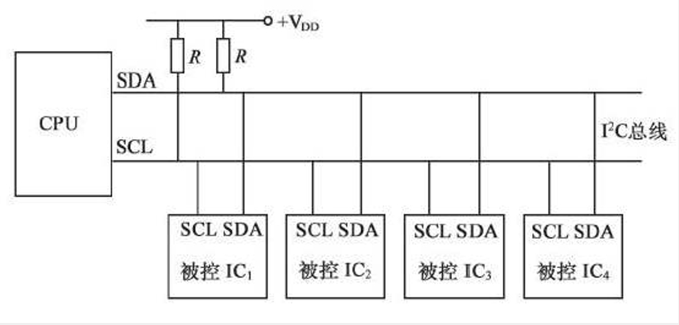 </img></td>
     <td>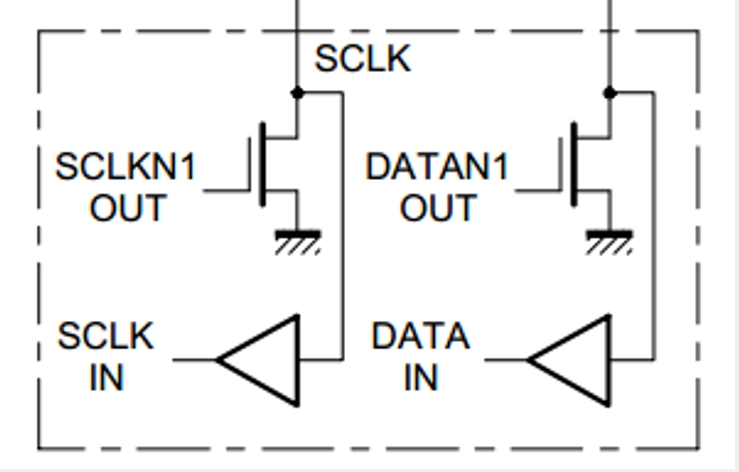 </img></td>
  </tr>
</table>

- 所有I2C设备的SCL连在一起，SDA连在一起
- 设备的SCL和SDA均要配置成开漏输出模式
- SCL和SDA各添加一个上拉电阻，阻值一般为4.7KΩ左右
- 对于SCL线，主机(CPU)有绝对的控制权，从机不允许控制，在任何时候都只能被动地读取
- 对于SDA线，除从机应答、主机读取从机时有控制权，其余时候只能被动读取
>- 主机和从机的SDA会在输入和输出之间切换，为防止主机和从机同时一方输出高电平、一方输出低电平造成短路，IIC禁止所有设备输出强上拉的高电平，采用外置弱上拉加开漏输出的方式避免出现短路，且可实现输入和输出，避免了输入和输出的频繁切换。<br/>
>- 输出：拉低为输出低电平，释放为输出高电平。<br/>
>- 输入：直接读取SDA线电平。<br/>
## 3 I2C时序基本单元
### 3.1 起始和终止
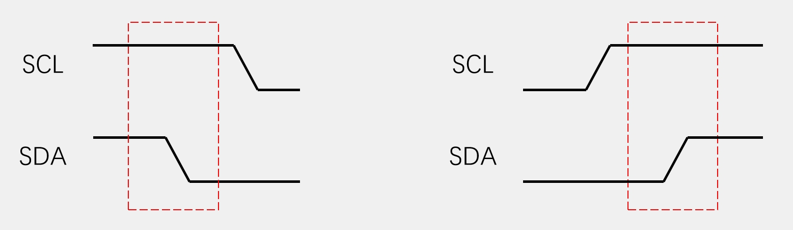

- 起始条件：SCL高电平期间，SDA从高电平切换到低电平
- 终止条件：SCL高电平期间，SDA从低电平切换到高电平
- 一个完整的数据帧，总是以起始条件开始，以终止条件结束，起始和终止条件只能由主机产生
- 在通信过程中，每个时序单元的SCL都是以低电平开始，低电平结束
### 3.2 发送
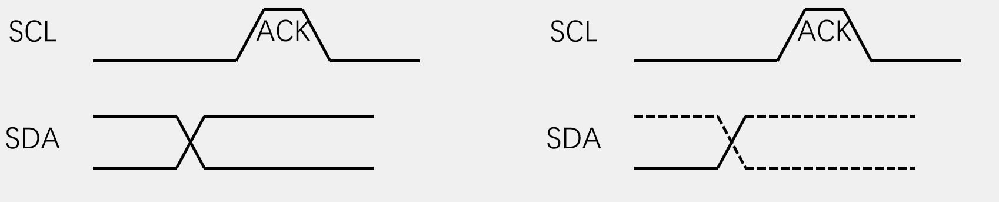

- 发送一个字节：SCL低电平期间，主机将数据位依次放到SDA线上（高位先行），然后释放SCL，从机将在SCL高电平期间读取数据位，
所以SCL高电平期间SDA不允许有数据变化，依次循环上述过程8次，即可发送一个字节

### 3.3 接收
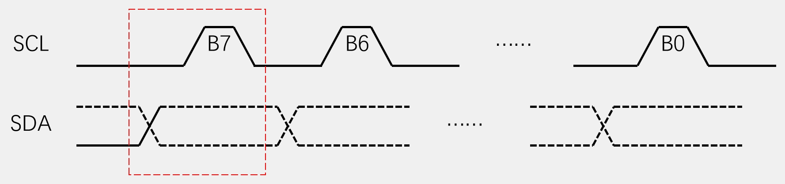

- 接收一个字节：SCL低电平期间，从机将数据位依次放到SDA线上（高位先行），然后释放SCL，主机将在SCL高电平期间读取数据位，
所以SCL高电平期间SDA不允许有数据变化，依次循环上述过程8次，即可接收一个字节（主机在接收之前，需要释放SDA）

### 3.4 应答
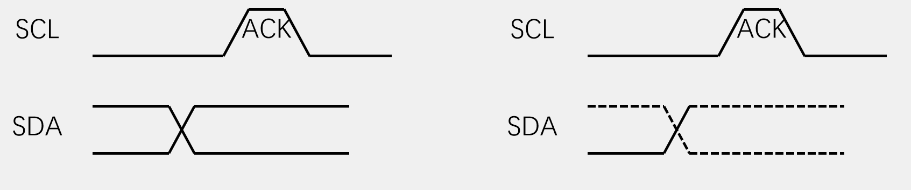

- 发送应答：主机在接收完一个字节之后，在下一个时钟发送一位数据，数据0表示应答，数据1表示非应答
- 接收应答：主机在发送完一个字节之后，在下一个时钟接收一位数据，判断从机是否应答，数据0表示应答，数据1表示非应答（主机在接收之前，需要释放SDA）

## 4 I2C时序
### 4.1 指定地址写
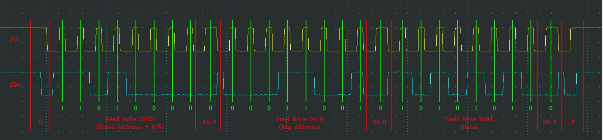

- 对于指定设备（Slave Address），在指定地址（Reg Address）下，写入指定数据（Data）
- 上面示例表示，主机往从机 **1101 000** 的地址 **0001 1001** 下 **写入** 
(紧跟在设备ID后的一位，0:写，1:读)数据 **10101010** ，  
每个字节后跟一应答位 **RA** (0:有应答，1:无应答)
-  **S** 表示起始条件， **P** 表示结束条件

### 4.2 当前地址读
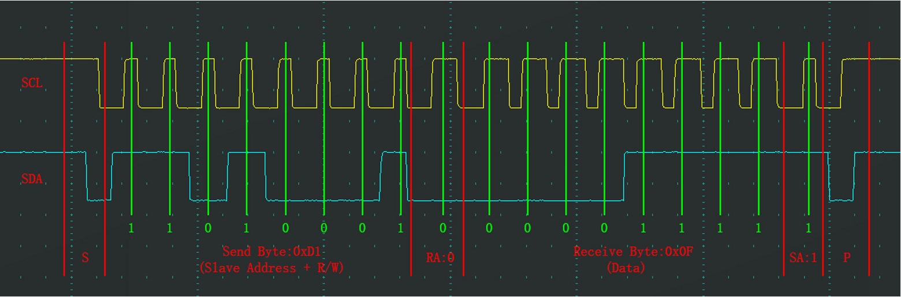

- 对于指定设备（Slave Address），在当前地址指针指示的地址下，读取从机数据（Data）
- 上面示例表示，主机往从机 **1101 000** 当前地址 **读取** 
(紧跟在设备ID后的一位，0:写，1:读)数据 **0000 1111** ，  
每个字节后跟一应答位 **RA** (0:有应答，1:无应答)
- 由于不能指定地址，从机返回的是其当前地址指针指向的数据

### 4.2 指定地址读
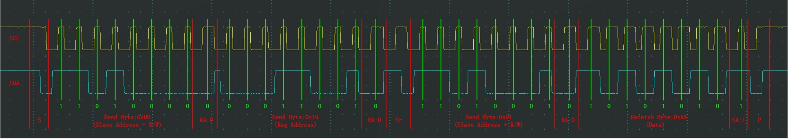

- 对于指定设备（Slave Address），在指定地址（Reg Address）下，读取从机数据（Data）
- 将指定地址写的时序舍弃掉写的数据，结合当前地址读的时序，就是指定地址读时序
- 将指定地址写的时序舍弃掉写入的数据，就是将地址指针指向指定地址
- 上面示例表示，主机往从机 **1101 000** 的地址 **0001 1001** 下 **读取** 
(紧跟在设备ID后的一位，0:写，1:读)数据 **10101010** ，  
每个字节后跟一应答位 **RA** (0:有应答，1:无应答)

>- 如果想读取或写入多个字节，将读取数据部分或发送数据部分时序重复若干次即可，注意由于地址指针会自增1，则会读取或写入若干个连续的寄存器地址  
>- 主机可以通过给从机发非应答，表示读取结束  

## 5 MPU6050
### 5.1 MPU6050简介
- MPU6050是一个6轴姿态传感器，可以测量芯片自身X、Y、Z轴的加速度、角速度参数，通过数据融合，可进一步得到姿态角，常应用于平衡车、飞行器等需要检测自身姿态的场景
- 3轴加速度计（Accelerometer）：测量X、Y、Z轴的加速度
- 3轴陀螺仪传感器（Gyroscope）：测量X、Y、Z轴的角速度

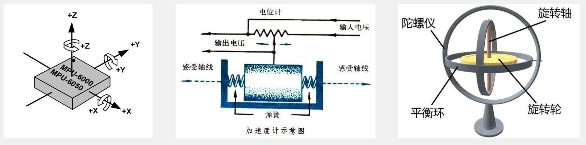

>图二加速度计原理：
>当向左或向右产生加速度(受力)时，小铁块向相反方向移动，改变上面电位计的值。所以测输出的电压值即可判断加速度的方向、大小(即受力的方向、大小)。

### 5.2 MPU6050参数
- 6位ADC采集传感器的模拟信号，量化范围：-32768~32767
- 加速度计满量程选择：±2、±4、±8、±16（g）
- 陀螺仪满量程选择： ±250、±500、±1000、±2000（°/sec）
- 可配置的数字低通滤波器
- 可配置的时钟源
- 可配置的采样分频
- I2C从机地址：1101000(AD0 = 0)， 1101001(AD0 = 1)  

### 5.3 MPU6050硬件电路
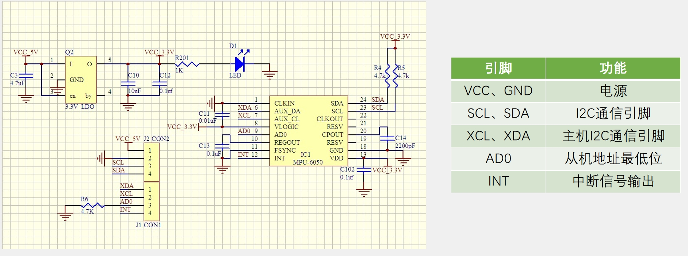

### 5.3 MPU6050框图
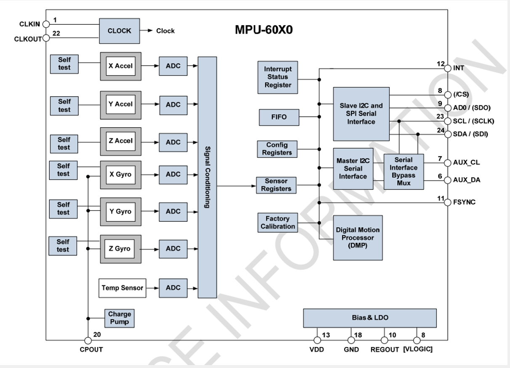

## 6 软件模拟I2C通信
**main.c**  
```cpp
#include "stm32f10x.h"                  // Device header
#include "Delay.h"
#include "OLED.h"
#include "MPU6050.h"

uint8_t ID;
int16_t AX, AY, AZ, GX, GY, GZ;

int main(void)
{
    OLED_Init();
    MPU6050_Init();
    
    OLED_ShowString(1, 1, "ID:");
    ID = MPU6050_GetID();
    OLED_ShowHexNum(1, 4, ID, 2);
    
    while (1)
    {
        MPU6050_GetData(&AX, &AY, &AZ, &GX, &GY, &GZ);
        OLED_ShowSignedNum(2, 1, AX, 5);
        OLED_ShowSignedNum(3, 1, AY, 5);
        OLED_ShowSignedNum(4, 1, AZ, 5);
        OLED_ShowSignedNum(2, 8, GX, 5);
        OLED_ShowSignedNum(3, 8, GY, 5);
        OLED_ShowSignedNum(4, 8, GZ, 5);
    }
}
```
**MyI2C.h**
```cpp
#ifndef __MYI2C_H
#define __MYI2C_H

void MyI2C_Init(void);
void MyI2C_Start(void);
void MyI2C_Stop(void);
void MyI2C_SendByte(uint8_t Byte);
uint8_t MyI2C_ReceiveByte(void);
void MyI2C_SendAck(uint8_t AckBit);
uint8_t MyI2C_ReceiveAck(void);

#endif
```
**MyI2C.c**
```cpp
#include "stm32f10x.h"                  // Device header
#include "Delay.h"

/*写SCL信号线*/
void MyI2C_W_SCL(uint8_t BitValue)
{
    GPIO_WriteBit(GPIOB, GPIO_Pin_10, (BitAction)BitValue);
    Delay_us(10);
}

/*写SDA信号线*/
void MyI2C_W_SDA(uint8_t BitValue)
{
    GPIO_WriteBit(GPIOB, GPIO_Pin_11, (BitAction)BitValue);
    Delay_us(10);
}

/*读SDA信号线*/
uint8_t MyI2C_R_SDA(void)
{
    uint8_t BitValue;
    BitValue = GPIO_ReadInputDataBit(GPIOB, GPIO_Pin_11);
    Delay_us(10);
    return BitValue;
}

/*I2C初始化，将相应IO口初始化为开漏输出*/
void MyI2C_Init(void)
{
    RCC_APB2PeriphClockCmd(RCC_APB2Periph_GPIOB, ENABLE);
    
    GPIO_InitTypeDef GPIO_InitStructure;
    GPIO_InitStructure.GPIO_Mode = GPIO_Mode_Out_OD;
    GPIO_InitStructure.GPIO_Pin = GPIO_Pin_10 | GPIO_Pin_11;
    GPIO_InitStructure.GPIO_Speed = GPIO_Speed_50MHz;
    GPIO_Init(GPIOB, &GPIO_InitStructure);
    
    GPIO_SetBits(GPIOB, GPIO_Pin_10 | GPIO_Pin_11);
}

/*启动I2C:
* 先释放SCL和SDA,然后先拉低SDA,再拉低SCL
*/
void MyI2C_Start(void)
{
    MyI2C_W_SDA(1);
    MyI2C_W_SCL(1);
    MyI2C_W_SDA(0);
    MyI2C_W_SCL(0);
}

/*停止I2C:
* 先拉低SDA,然后先拉高SCL,再拉高SDA
*/
void MyI2C_Stop(void)
{
    MyI2C_W_SDA(0);
    MyI2C_W_SCL(1);
    MyI2C_W_SDA(1);
}

/*发送一个字节:
* 由高位到低位，循环执行：将bit放到SDA,拉高SCL,再拉低SCL
*/
void MyI2C_SendByte(uint8_t Byte)
{
    uint8_t i;
    for (i = 0; i < 8; i ++)
    {
        MyI2C_W_SDA(Byte & (0x80 >> i));
        MyI2C_W_SCL(1);
        MyI2C_W_SCL(0);
    }
}

/*接收一个字节:
* 主机先先释放SDA,然后循环8次：拉高SCL,读取一位，拉低SCL
*/
uint8_t MyI2C_ReceiveByte(void)
{
    uint8_t i, Byte = 0x00;
    MyI2C_W_SDA(1);
    for (i = 0; i < 8; i ++)
    {
        MyI2C_W_SCL(1);
        if (MyI2C_R_SDA() == 1){Byte |= (0x80 >> i);}
        MyI2C_W_SCL(0);
    }
    return Byte;
}

/*发送应答:
* 将应答位写SDA,然后拉高SCL,再拉低SCL
*/
void MyI2C_SendAck(uint8_t AckBit)
{
    MyI2C_W_SDA(AckBit);
    MyI2C_W_SCL(1);
    MyI2C_W_SCL(0);
}

/*接收应答:
* 主机先先释放SDA,再拉高SCL,读一位，拉低SCL
*/
uint8_t MyI2C_ReceiveAck(void)
{
    uint8_t AckBit;
    MyI2C_W_SDA(1);
    MyI2C_W_SCL(1);
    AckBit = MyI2C_R_SDA();
    MyI2C_W_SCL(0);
    return AckBit;
}

```
**MPU6050.h**  
```cpp
#ifndef __MPU6050_H
#define __MPU6050_H

void MPU6050_WriteReg(uint8_t RegAddress, uint8_t Data);
uint8_t MPU6050_ReadReg(uint8_t RegAddress);

void MPU6050_Init(void);
uint8_t MPU6050_GetID(void);
void MPU6050_GetData(int16_t *AccX, int16_t *AccY, int16_t *AccZ, 
                        int16_t *GyroX, int16_t *GyroY, int16_t *GyroZ);

#endif
```
**MPU6050.c**
```cpp
#include "stm32f10x.h"                  // Device header
#include "MyI2C.h"
#include "MPU6050_Reg.h"

#define MPU6050_ADDRESS        0xD0

/*写MPU6050寄存器*/
void MPU6050_WriteReg(uint8_t RegAddress, uint8_t Data)
{
    /*启动I2C*/
    MyI2C_Start();

    /*发送设备ID号+写标志位，接收应答*/
    MyI2C_SendByte(MPU6050_ADDRESS);
    MyI2C_ReceiveAck();

    /*发送寄存器地址，接收应答*/
    MyI2C_SendByte(RegAddress);
    MyI2C_ReceiveAck();

    /*发送数据，接收应答*/
    MyI2C_SendByte(Data);
    MyI2C_ReceiveAck();

    /*停止I2C*/
    MyI2C_Stop();
}

/*读MPU6050寄存器*/
uint8_t MPU6050_ReadReg(uint8_t RegAddress)
{
    uint8_t Data;

    /*启动I2C*/
    MyI2C_Start();

   /*发送设备ID号+读写标志位，接收应答*/
    MyI2C_SendByte(MPU6050_ADDRESS);
    MyI2C_ReceiveAck();

     /*发送寄存器地址，接收应答*/
    MyI2C_SendByte(RegAddress);
    MyI2C_ReceiveAck();

    /*启动I2C*/
    MyI2C_Start();

    /*发送设备ID号+读标志位，接收应答*/
    MyI2C_SendByte(MPU6050_ADDRESS | 0x01);
    MyI2C_ReceiveAck();

    /*接收数据，发送非应答*/
    Data = MyI2C_ReceiveByte();
    MyI2C_SendAck(1);

    /*停止I2C*/
    MyI2C_Stop();
    
    return Data;
}

/*MPU6050初始化*/
void MPU6050_Init(void)
{
    MyI2C_Init();
    MPU6050_WriteReg(MPU6050_PWR_MGMT_1, 0x01);    /*解除睡眠，选择陀螺仪时钟*/
    MPU6050_WriteReg(MPU6050_PWR_MGMT_2, 0x00);    /*6个轴均不待机*/
    MPU6050_WriteReg(MPU6050_SMPLRT_DIV, 0x09);    /*采样分频为10*/
    MPU6050_WriteReg(MPU6050_CONFIG, 0x06);        /*滤波参数最大*/
    MPU6050_WriteReg(MPU6050_GYRO_CONFIG, 0x18);    /*陀螺仪最大量程*/
    MPU6050_WriteReg(MPU6050_ACCEL_CONFIG, 0x18);    /*加速度计最大量程*/
}

/*获取设备ID号*/
uint8_t MPU6050_GetID(void)
{
    return MPU6050_ReadReg(MPU6050_WHO_AM_I);
}

/*读取X、Y、Z轴加速度,X、Y、Z轴角速度,每个值都为16位
* 由于这六个寄存器地址连续，因此可用一条指令完成
*/
void MPU6050_GetData(int16_t *AccX, int16_t *AccY, int16_t *AccZ, 
                        int16_t *GyroX, int16_t *GyroY, int16_t *GyroZ)
{
    uint8_t DataH, DataL;
    
    DataH = MPU6050_ReadReg(MPU6050_ACCEL_XOUT_H);
    DataL = MPU6050_ReadReg(MPU6050_ACCEL_XOUT_L);
    *AccX = (DataH << 8) | DataL;
    
    DataH = MPU6050_ReadReg(MPU6050_ACCEL_YOUT_H);
    DataL = MPU6050_ReadReg(MPU6050_ACCEL_YOUT_L);
    *AccY = (DataH << 8) | DataL;
    
    DataH = MPU6050_ReadReg(MPU6050_ACCEL_ZOUT_H);
    DataL = MPU6050_ReadReg(MPU6050_ACCEL_ZOUT_L);
    *AccZ = (DataH << 8) | DataL;
    
    DataH = MPU6050_ReadReg(MPU6050_GYRO_XOUT_H);
    DataL = MPU6050_ReadReg(MPU6050_GYRO_XOUT_L);
    *GyroX = (DataH << 8) | DataL;
    
    DataH = MPU6050_ReadReg(MPU6050_GYRO_YOUT_H);
    DataL = MPU6050_ReadReg(MPU6050_GYRO_YOUT_L);
    *GyroY = (DataH << 8) | DataL;
    
    DataH = MPU6050_ReadReg(MPU6050_GYRO_ZOUT_H);
    DataL = MPU6050_ReadReg(MPU6050_GYRO_ZOUT_L);
    *GyroZ = (DataH << 8) | DataL;
}

```
