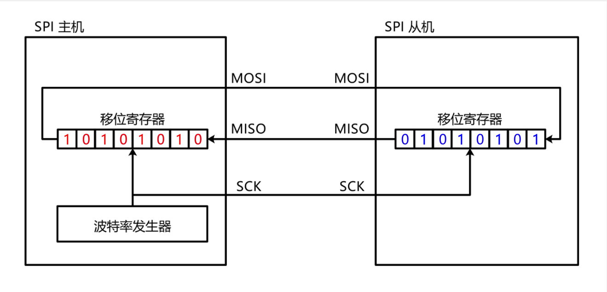
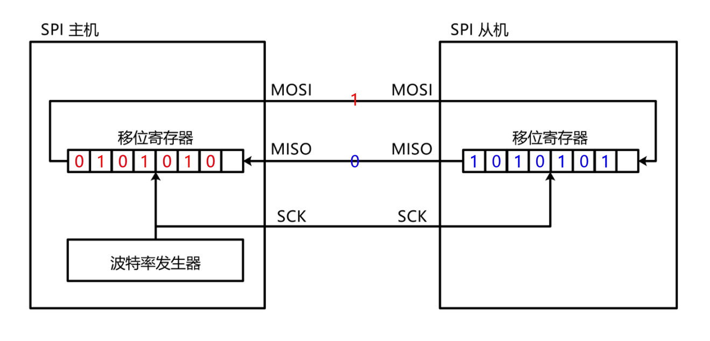
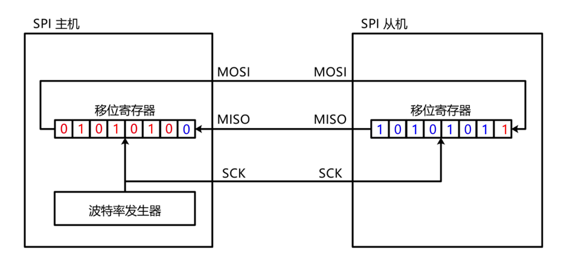
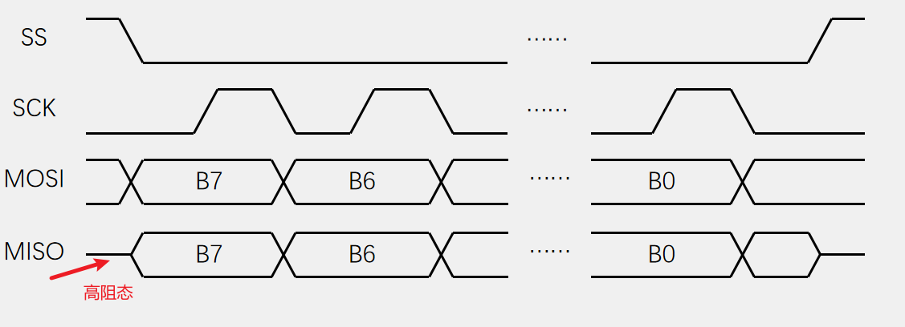
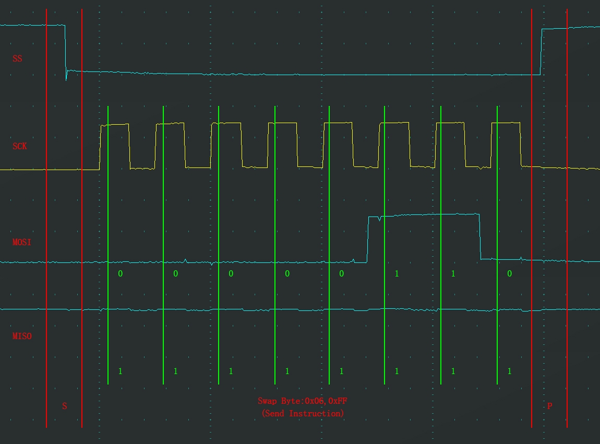

# 1.SPI（Serial Peripheral Interface）通信
## 1.1.SPI简介
- SPI是由Motorola公司开发的一种通用数据总线
- 四根通信线：SCK（Serial Clock）、MOSI（Master Output Slave Input）、MISO（Master Input Slave Output）、SS（Slave Select）
- 同步，全双工
- 支持总线挂载多设备（一主多从）

## 1.2.SPI硬件电路
- 所有SPI设备的SCK、MOSI、MISO分别连在一起
- 主机另外引出多条SS控制线，分别接到各从机的SS引脚
- 输出引脚配置为 **推挽输出** ，输入引脚配置为 **浮空或上拉输入** 

>当从机未被选中时(SS片选信号线为高电平)，从机的MISO引脚需配置为 **高阻态(引脚断开)** ，防止多个从机同时输出导致的电平冲突。只有在被选中时，才可切换为推挽输出。这些切换是在从机内部完成的，主机程序不需要关注。

## 1.3.SPI通信过程
SPI主机和从机的数据通信都是基于双方的移位寄存器的字节交换完成的。如下图所示：

在时钟上升沿，双方的移位寄存器都将其最高位移到通信线上（下面的模式1），如下所示：

在时钟下降沿，通信线上的数据被移到对方移位寄存器的最低位（下面的模式1），如下所示：

在经过8个时钟信号之后，双方的移位寄存器完成数据交换，如图所示：

## 1.4.SPI时序
### 1.4.1.SPI时序图
- 起始条件：SS从高电平切换到低电平  
- 终止条件：SS从低电平切换到高电平  

交换一个字节（模式0）  
- CPOL=0：空闲状态时，SCK为低电平  
- CPHA=0：SCK第一个边沿移入数据（采样），第二个边沿移出数据  

>数据需要先移出再移入，所以需要在第一个时钟边沿到来之前就移出数据。

交换一个字节（模式1）  
- CPOL=0：空闲状态时，SCK为低电平
- CPHA=1：SCK第一个边沿移出数据，第二个边沿移入数据

交换一个字节（模式2）  
- CPOL=1：空闲状态时，SCK为高电平
- CPHA=0：SCK第一个边沿移入数据，第二个边沿移出数据

交换一个字节（模式3）  
- CPOL=1：空闲状态时，SCK为高电平
- CPHA=1：SCK第一个边沿移出数据，第二个边沿移入数据

   

**CPOL指定 **空闲时的SCK的默认电平** ，0为低电平，1为高电平**  
**CPHA指定 **数据发送和采样的时机** ，0为第一个边沿采样，1为第二个边沿采样。**  

### 1.4.2.SPI时序举例
1. 发送指令  
向SS指定的设备，发送指令（0x06）（在W25Q64中，代表写使能）  
>SPI通信中，通常是 **指令+读写数据** 的模型。从机内部定义有指令集，主机通过发送相应的指令及数据指导从机进行相应的操作。

2. 指定地址写  
向SS指定的设备，发送写指令（0x02），随后在指定地址（Address[23:0]）下，写入指定数据（Data）  

>- 上面的时序为：发送写指令，然后在地址0x123656写入数据0x55。  
>- SPI内部也有和I2C一样的地址指针，每写入一个数据，地址指针加一。所以要写入多个数据的话，会在指定地址下的连续内存空间依次写入多个数据。

3. 指定地址读  
向SS指定的设备，发送读指令（0x03），随后在指定地址（Address[23:0]）下，读取从机数据（Data）  

>上面的时序为：发送读指令，读取地址0x123456下的数据，读到的数据为0x55。注意此时的数据在MISO线上。  
