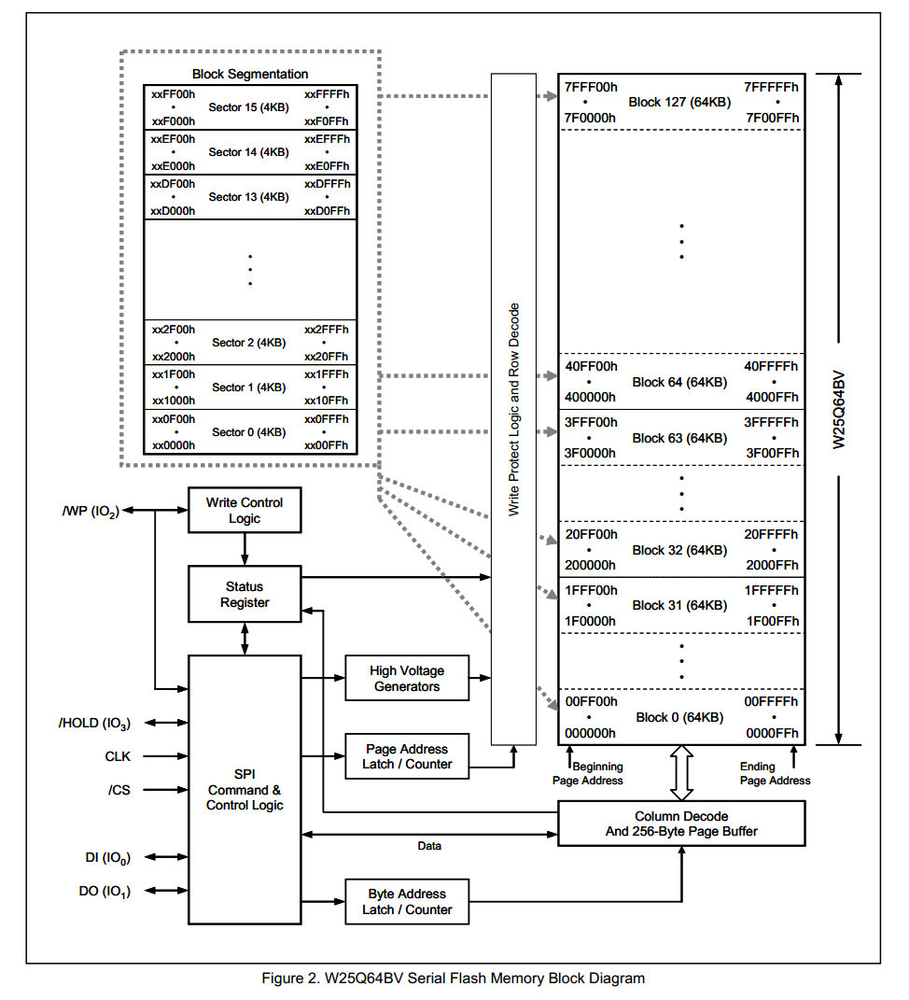

# 1.W25Q64介绍
## 1.1.W25Q64介绍简介
- W25Qxx系列是一种低成本、小型化、使用简单的非易失性存储器，常应用于数据存储、字库存储、固件程序存储等场景
- 存储介质：Nor Flash（闪存）
- 时钟频率：80MHz / 160MHz (Dual SPI) / 320MHz (Quad SPI)
- 存储容量（24位地址）：  
	W25Q40：	  4Mbit / 512KByte  
	W25Q80：	  8Mbit / 1MByte  
	W25Q16：	  16Mbit / 2MByte  
	W25Q32：	  32Mbit / 4MByte  
	W25Q64：	  64Mbit / 8MByte  
	W25Q128：  128Mbit / 16MByte  
	W25Q256：  256Mbit / 32MByte  
>双重SPI (Dual SPI) ,MISO和MOSI都可以进行数据的收发  
>四重SPI (Quad SPI) ,使用四根线作为通信线，都可以进行数据收发  
# 1.2.硬件电路
<div></div> 

>左斜杠表示低电平有效

# 1.3.W25Q64框图
<div></div> 

>- 8MB的地址空间，每64KB划分为一个块（Block）,共分为128块。
>- 每一块又划分为16个扇区（Sector）,每个扇区4KB。  
>- 每一扇区，又划分为16页，每页256Byte。

# 1.4.Flash操作注意事项
**写入操作时：**  
- 写入操作前，必须先进行写使能  
- 每个数据位只能由1改写为0，不能由0改写为1  
- 写入数据前必须先擦除，擦除后，所有数据位变为1  
- 擦除必须按最小擦除单元进行(W25Q64芯片为一个扇区（4KB）)  
- 连续写入多字节时，最多写入一页的数据，超过页尾位置的数据，会回到页首覆盖写入
>因为W25Q64的缓存区只有256Byte  
- 写入操作结束后，芯片进入忙状态，不响应新的读写操作  
>此时芯片在把缓存区的数据写入flash里

**读取操作时：**  
- 直接调用读取时序，无需使能，无需额外操作，没有页的限制，读取操作结束后不会进入忙状态，但不能在忙状态时读取  

# 2.软件模拟SPI
## main.c
```cpp
#include "stm32f10x.h"                  // Device header
#include "Delay.h"
#include "OLED.h"
#include "W25Q64.h"

uint8_t MID;                            //定义用于存放MID号的变量
uint16_t DID;                            //定义用于存放DID号的变量

uint8_t ArrayWrite[] = {0x01, 0x02, 0x03, 0x04};    //定义要写入数据的测试数组
uint8_t ArrayRead[4];                                //定义要读取数据的测试数组

int main(void)
{
    /*模块初始化*/
    OLED_Init();                        //OLED初始化
    W25Q64_Init();                        //W25Q64初始化
    
    /*显示静态字符串*/
    OLED_ShowString(1, 1, "MID:   DID:");
    OLED_ShowString(2, 1, "W:");
    OLED_ShowString(3, 1, "R:");
    
    /*显示ID号*/
    W25Q64_ReadID(&MID, &DID);            //获取W25Q64的ID号
    OLED_ShowHexNum(1, 5, MID, 2);        //显示MID
    OLED_ShowHexNum(1, 12, DID, 4);        //显示DID
    
    /*W25Q64功能函数测试*/
    W25Q64_SectorErase(0x000000);                    //扇区擦除
    W25Q64_PageProgram(0x000000, ArrayWrite, 4);    //将写入数据的测试数组写入到W25Q64中
    
    W25Q64_ReadData(0x000000, ArrayRead, 4);        //读取刚写入的测试数据到读取数据的测试数组中
    
    /*显示数据*/
    OLED_ShowHexNum(2, 3, ArrayWrite[0], 2);        //显示写入数据的测试数组
    OLED_ShowHexNum(2, 6, ArrayWrite[1], 2);
    OLED_ShowHexNum(2, 9, ArrayWrite[2], 2);
    OLED_ShowHexNum(2, 12, ArrayWrite[3], 2);
    
    OLED_ShowHexNum(3, 3, ArrayRead[0], 2);            //显示读取数据的测试数组
    OLED_ShowHexNum(3, 6, ArrayRead[1], 2);
    OLED_ShowHexNum(3, 9, ArrayRead[2], 2);
    OLED_ShowHexNum(3, 12, ArrayRead[3], 2);
    
    while (1)
    {
        
    }
}

```
## W25Q64_Ins.h
```cpp
#ifndef __W25Q64_INS_H
#define __W25Q64_INS_H

#define W25Q64_WRITE_ENABLE                         0x06
#define W25Q64_WRITE_DISABLE                        0x04
#define W25Q64_READ_STATUS_REGISTER_1               0x05
#define W25Q64_READ_STATUS_REGISTER_2               0x35
#define W25Q64_WRITE_STATUS_REGISTER                0x01
#define W25Q64_PAGE_PROGRAM                         0x02
#define W25Q64_QUAD_PAGE_PROGRAM                    0x32
#define W25Q64_BLOCK_ERASE_64KB                     0xD8
#define W25Q64_BLOCK_ERASE_32KB                     0x52
#define W25Q64_SECTOR_ERASE_4KB                     0x20
#define W25Q64_CHIP_ERASE                           0xC7
#define W25Q64_ERASE_SUSPEND                        0x75
#define W25Q64_ERASE_RESUME                         0x7A
#define W25Q64_POWER_DOWN                           0xB9
#define W25Q64_HIGH_PERFORMANCE_MODE                0xA3
#define W25Q64_CONTINUOUS_READ_MODE_RESET           0xFF
#define W25Q64_RELEASE_POWER_DOWN_HPM_DEVICE_ID     0xAB
#define W25Q64_MANUFACTURER_DEVICE_ID               0x90
#define W25Q64_READ_UNIQUE_ID                       0x4B
#define W25Q64_JEDEC_ID                             0x9F
#define W25Q64_READ_DATA                            0x03
#define W25Q64_FAST_READ                            0x0B
#define W25Q64_FAST_READ_DUAL_OUTPUT                0x3B
#define W25Q64_FAST_READ_DUAL_IO                    0xBB
#define W25Q64_FAST_READ_QUAD_OUTPUT                0x6B
#define W25Q64_FAST_READ_QUAD_IO                    0xEB
#define W25Q64_OCTAL_WORD_READ_QUAD_IO              0xE3

#define W25Q64_DUMMY_BYTE                           0xFF

#endif

```

## W25Q64.h
```cpp
#ifndef __W25Q64_H
#define __W25Q64_H

void W25Q64_Init(void);
void W25Q64_ReadID(uint8_t *MID, uint16_t *DID);
void W25Q64_PageProgram(uint32_t Address, uint8_t *DataArray, uint16_t Count);
void W25Q64_SectorErase(uint32_t Address);
void W25Q64_ReadData(uint32_t Address, uint8_t *DataArray, uint32_t Count);

#endif
```
## W25Q64.c
```cpp
#include "stm32f10x.h"                  // Device header
#include "MySPI.h"
#include "W25Q64_Ins.h"

/**
  * 函    数：W25Q64初始化
  * 参    数：无
  * 返 回 值：无
  */
void W25Q64_Init(void)
{
    MySPI_Init();                    //先初始化底层的SPI
}

/**
  * 函    数：MPU6050读取ID号
  * 参    数：MID 工厂ID，使用输出参数的形式返回
  * 参    数：DID 设备ID，使用输出参数的形式返回
  * 返 回 值：无
  */
void W25Q64_ReadID(uint8_t *MID, uint16_t *DID)
{
    MySPI_Start();                                //SPI起始
    MySPI_SwapByte(W25Q64_JEDEC_ID);            //交换发送读取ID的指令
    *MID = MySPI_SwapByte(W25Q64_DUMMY_BYTE);    //交换接收MID，通过输出参数返回
    *DID = MySPI_SwapByte(W25Q64_DUMMY_BYTE);    //交换接收DID高8位
    *DID <<= 8;                                    //高8位移到高位
    *DID |= MySPI_SwapByte(W25Q64_DUMMY_BYTE);    //或上交换接收DID的低8位，通过输出参数返回
    MySPI_Stop();                                //SPI终止
}

/**
  * 函    数：W25Q64写使能
  * 参    数：无
  * 返 回 值：无
  */
void W25Q64_WriteEnable(void)
{
    MySPI_Start();                                //SPI起始
    MySPI_SwapByte(W25Q64_WRITE_ENABLE);        //交换发送写使能的指令
    MySPI_Stop();                                //SPI终止
}

/**
  * 函    数：W25Q64等待忙
  * 参    数：无
  * 返 回 值：无
  */
void W25Q64_WaitBusy(void)
{
    uint32_t Timeout;
    MySPI_Start();                                //SPI起始
    MySPI_SwapByte(W25Q64_READ_STATUS_REGISTER_1);                //交换发送读状态寄存器1的指令
    Timeout = 100000;                            //给定超时计数时间
    while ((MySPI_SwapByte(W25Q64_DUMMY_BYTE) & 0x01) == 0x01)    //循环等待忙标志位
    {
        Timeout --;                                //等待时，计数值自减
        if (Timeout == 0)                        //自减到0后，等待超时
        {
            /*超时的错误处理代码，可以添加到此处*/
            break;                                //跳出等待，不等了
        }
    }
    MySPI_Stop();                                //SPI终止
}

/**
  * 函    数：W25Q64页编程
  * 参    数：Address 页编程的起始地址，范围：0x000000~0x7FFFFF
  * 参    数：DataArray    用于写入数据的数组
  * 参    数：Count 要写入数据的数量，范围：0~256
  * 返 回 值：无
  * 注意事项：写入的地址范围不能跨页
  */
void W25Q64_PageProgram(uint32_t Address, uint8_t *DataArray, uint16_t Count)
{
    uint16_t i;
    
    W25Q64_WriteEnable();                        //写使能
    
    MySPI_Start();                                //SPI起始
    MySPI_SwapByte(W25Q64_PAGE_PROGRAM);        //交换发送页编程的指令
    MySPI_SwapByte(Address >> 16);                //交换发送地址23~16位
    MySPI_SwapByte(Address >> 8);                //交换发送地址15~8位
    MySPI_SwapByte(Address);                    //交换发送地址7~0位
    for (i = 0; i < Count; i ++)                //循环Count次
    {
        MySPI_SwapByte(DataArray[i]);            //依次在起始地址后写入数据
    }
    MySPI_Stop();                                //SPI终止
    
    W25Q64_WaitBusy();                            //等待忙
}

/**
  * 函    数：W25Q64扇区擦除（4KB）
  * 参    数：Address 指定扇区的地址，范围：0x000000~0x7FFFFF
  * 返 回 值：无
  */
void W25Q64_SectorErase(uint32_t Address)
{
    W25Q64_WriteEnable();                        //写使能
    
    MySPI_Start();                                //SPI起始
    MySPI_SwapByte(W25Q64_SECTOR_ERASE_4KB);    //交换发送扇区擦除的指令
    MySPI_SwapByte(Address >> 16);                //交换发送地址23~16位
    MySPI_SwapByte(Address >> 8);                //交换发送地址15~8位
    MySPI_SwapByte(Address);                    //交换发送地址7~0位
    MySPI_Stop();                                //SPI终止
    
    W25Q64_WaitBusy();                            //等待忙
}

/**
  * 函    数：W25Q64读取数据
  * 参    数：Address 读取数据的起始地址，范围：0x000000~0x7FFFFF
  * 参    数：DataArray 用于接收读取数据的数组，通过输出参数返回
  * 参    数：Count 要读取数据的数量，范围：0~0x800000
  * 返 回 值：无
  */
void W25Q64_ReadData(uint32_t Address, uint8_t *DataArray, uint32_t Count)
{
    uint32_t i;
    MySPI_Start();                                //SPI起始
    MySPI_SwapByte(W25Q64_READ_DATA);            //交换发送读取数据的指令
    MySPI_SwapByte(Address >> 16);                //交换发送地址23~16位
    MySPI_SwapByte(Address >> 8);                //交换发送地址15~8位
    MySPI_SwapByte(Address);                    //交换发送地址7~0位
    for (i = 0; i < Count; i ++)                //循环Count次
    {
        DataArray[i] = MySPI_SwapByte(W25Q64_DUMMY_BYTE);    //依次在起始地址后读取数据
    }
    MySPI_Stop();                                //SPI终止
}

```
