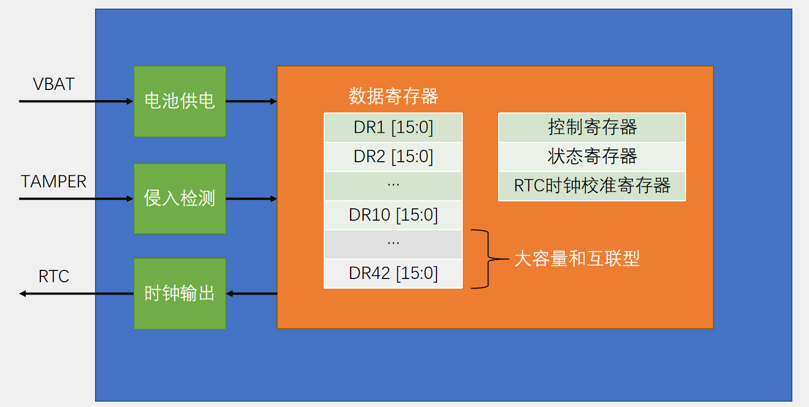
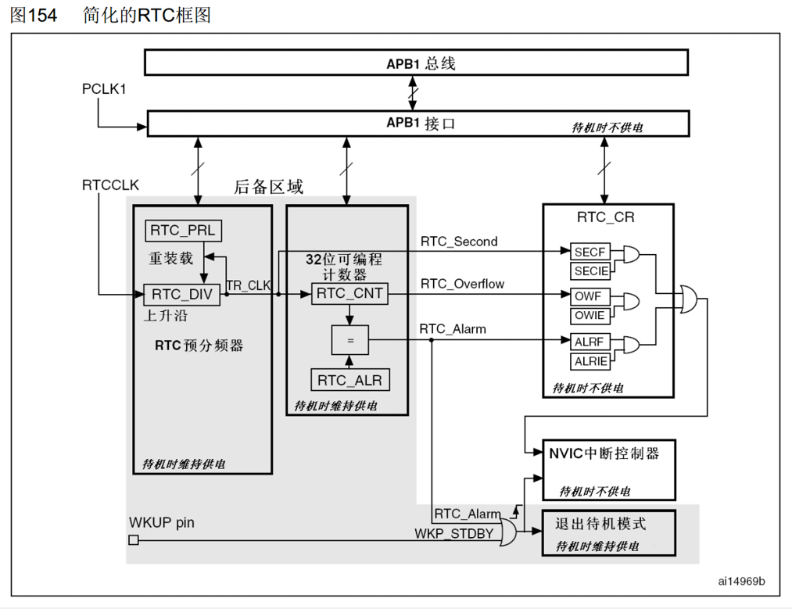
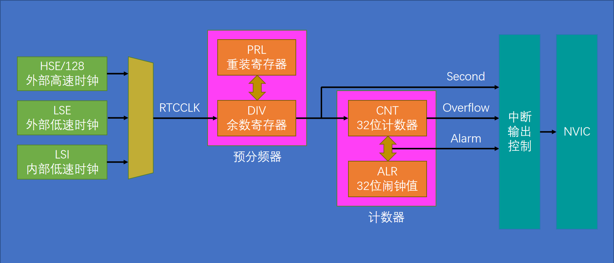
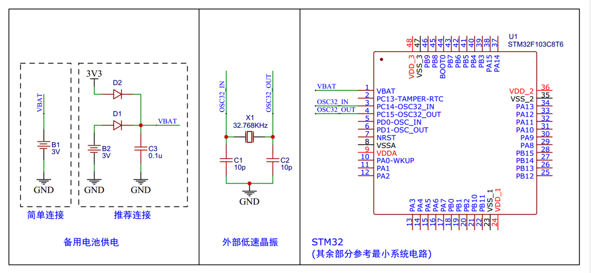

# 1.BKP（Backup Registers）备份寄存器
## 1.1.BKP简介
- BKP可用于存储用户应用程序数据。当VDD（2.0\~3.6V）电源被切断，他们仍然由VBAT（1.8~3.6V）维持供电。当系统在待机模式下被唤醒，或系统复位或电源复位时，他们也不会被复位
- TAMPER引脚产生的侵入事件将所有备份寄存器内容清除
- RTC引脚输出RTC校准时钟、RTC闹钟脉冲或者秒脉冲
- 存储RTC时钟校准寄存器
- 用户数据存储容量：  
    20字节（中容量和小容量）/ 84字节（大容量和互联型）

## 1.2.BKP基本结构


# 2.RTC（Real Time Clock）实时时钟
## 2.1.RTC简介
- RTC是一个独立的定时器，可为系统提供时钟和日历的功能
- RTC和时钟配置系统处于后备区域，系统复位时数据不清零，VDD（2.0 ~ 3.6V）断电后可借助VBAT（1.8 ~ 3.6V）供电继续走时
- 32位的可编程计数器，可对应Unix时间戳的秒计数器
- 20位的可编程预分频器，可适配不同频率的输入时钟
- 可选择三种RTC时钟源：  
	HSE时钟除以128（通常为8MHz/128）  
	LSE振荡器时钟（通常为32.768KHz）  
	LSI振荡器时钟（40KHz）  

## 2.2.RTC框图


>灰色区域表示处于后备区域，可以在主电源掉电后可以使用备用电池继续工作。

## 2.3.RTC基本结构


>- DIV余数寄存器为一个自减计数器，PRL重装计数器存储计数目标，当DIV余数寄存器从PRL值计数到0时，输出1Hz的秒脉冲信号，通向32位CNT计数器，一秒自增一次。  
>- 32位闹钟寄存器ALR可以设定闹钟，输出闹钟信号。当输出闹钟信号后，该值失效，如需再次产生闹钟信号，需要重新写该寄存器。  

## 2.4.RTC硬件电路
RTC模块还需一些外部电路：  


## 2.5.RTC操作注意事项
- 执行以下操作将使能对BKP和RTC的访问：  
    设置RCC_APB1ENR的PWREN和BKPEN，使能PWR和BKP时钟  
    设置PWR_CR的DBP，使能对BKP和RTC的访问  
- 若在读取RTC寄存器时，RTC的APB1接口曾经处于禁止状态，则软件首先必须等待RTC_CRL寄存器中的RSF位（寄存器同步标志）被硬件置1
    >即需要APB总线时钟和RTC时钟同步，否则读取数据会出错  
- 必须设置RTC_CRL寄存器中的CNF位，使RTC进入配置模式后，才能写入RTC_PRL、RTC_CNT、RTC_ALR寄存器
- 对RTC任何寄存器的写操作，都必须在前一次写操作结束后进行。可以通过查询RTC_CR寄存器中的RTOFF状态位，判断RTC寄存器是否处于更新中。仅当RTOFF状态位是1时，才可以写入RTC寄存器

# 3.读写备份寄存器代码
##  main.c
```cpp
#include "stm32f10x.h"                  // Device header
#include "Delay.h"
#include "OLED.h"
#include "Key.h"

uint8_t KeyNum;                    //定义用于接收按键键码的变量

uint16_t ArrayWrite[] = {0x1234, 0x5678};    //定义要写入数据的测试数组
uint16_t ArrayRead[2];                        //定义要读取数据的测试数组

int main(void)
{
    /*模块初始化*/
    OLED_Init();                //OLED初始化
    Key_Init();                    //按键初始化
    
    /*显示静态字符串*/
    OLED_ShowString(1, 1, "W:");
    OLED_ShowString(2, 1, "R:");
    
    /*开启时钟*/
    RCC_APB1PeriphClockCmd(RCC_APB1Periph_PWR, ENABLE);        //开启PWR的时钟
    RCC_APB1PeriphClockCmd(RCC_APB1Periph_BKP, ENABLE);        //开启BKP的时钟
    
    /*备份寄存器访问使能*/
    PWR_BackupAccessCmd(ENABLE);                            //使用PWR开启对备份寄存器的访问
    
    while (1)
    {
        KeyNum = Key_GetNum();        //获取按键键码
        
        if (KeyNum == 1)            //按键1按下
        {
            ArrayWrite[0] ++;        //测试数据自增
            ArrayWrite[1] ++;
            
            BKP_WriteBackupRegister(BKP_DR1, ArrayWrite[0]);    //写入测试数据到备份寄存器
            BKP_WriteBackupRegister(BKP_DR2, ArrayWrite[1]);
            
            OLED_ShowHexNum(1, 3, ArrayWrite[0], 4);        //显示写入的测试数据
            OLED_ShowHexNum(1, 8, ArrayWrite[1], 4);
        }
        
        ArrayRead[0] = BKP_ReadBackupRegister(BKP_DR1);        //读取备份寄存器的数据
        ArrayRead[1] = BKP_ReadBackupRegister(BKP_DR2);
        
        OLED_ShowHexNum(2, 3, ArrayRead[0], 4);                //显示读取的备份寄存器数据
        OLED_ShowHexNum(2, 8, ArrayRead[1], 4);
    }
}


```

# 4.实时时钟代码
## main.c
```cpp
#include "stm32f10x.h"                  // Device header
#include "Delay.h"
#include "OLED.h"
#include "MyRTC.h"

int main(void)
{
    /*模块初始化*/
    OLED_Init();        //OLED初始化
    MyRTC_Init();        //RTC初始化
    
    /*显示静态字符串*/
    OLED_ShowString(1, 1, "Date:XXXX-XX-XX");
    OLED_ShowString(2, 1, "Time:XX:XX:XX");
    OLED_ShowString(3, 1, "CNT :");
    OLED_ShowString(4, 1, "DIV :");
    
    while (1)
    {
        MyRTC_ReadTime();                            //RTC读取时间，最新的时间存储到MyRTC_Time数组中
        
        OLED_ShowNum(1, 6, MyRTC_Time[0], 4);        //显示MyRTC_Time数组中的时间值，年
        OLED_ShowNum(1, 11, MyRTC_Time[1], 2);        //月
        OLED_ShowNum(1, 14, MyRTC_Time[2], 2);        //日
        OLED_ShowNum(2, 6, MyRTC_Time[3], 2);        //时
        OLED_ShowNum(2, 9, MyRTC_Time[4], 2);        //分
        OLED_ShowNum(2, 12, MyRTC_Time[5], 2);        //秒
        
        OLED_ShowNum(3, 6, RTC_GetCounter(), 10);    //显示32位的秒计数器
        OLED_ShowNum(4, 6, RTC_GetDivider(), 10);    //显示余数寄存器
    }
}

```
## MyRTC.h
```cpp
#ifndef __MYRTC_H
#define __MYRTC_H

extern uint16_t MyRTC_Time[];

void MyRTC_Init(void);
void MyRTC_SetTime(void);
void MyRTC_ReadTime(void);

#endif

```
## MyRTC.c
```cpp
#include "stm32f10x.h"                  // Device header
#include <time.h>

uint16_t MyRTC_Time[] = {2023, 1, 1, 23, 59, 55};    //定义全局的时间数组，数组内容分别为年、月、日、时、分、秒

void MyRTC_SetTime(void);                //函数声明

/**
  * 函    数：RTC初始化
  * 参    数：无
  * 返 回 值：无
  */
void MyRTC_Init(void)
{
    /*开启时钟*/
    RCC_APB1PeriphClockCmd(RCC_APB1Periph_PWR, ENABLE);        //开启PWR的时钟
    RCC_APB1PeriphClockCmd(RCC_APB1Periph_BKP, ENABLE);        //开启BKP的时钟
    
    /*备份寄存器访问使能*/
    PWR_BackupAccessCmd(ENABLE);                            //使用PWR开启对备份寄存器的访问
    
    if (BKP_ReadBackupRegister(BKP_DR1) != 0xA5A5)            //通过写入备份寄存器的标志位，判断RTC是否是第一次配置
                                                            //if成立则执行第一次的RTC配置
    {
        RCC_LSEConfig(RCC_LSE_ON);                            //开启LSE时钟
        while (RCC_GetFlagStatus(RCC_FLAG_LSERDY) != SET);    //等待LSE准备就绪
        
        RCC_RTCCLKConfig(RCC_RTCCLKSource_LSE);                //选择RTCCLK来源为LSE
        RCC_RTCCLKCmd(ENABLE);                                //RTCCLK使能
        
        RTC_WaitForSynchro();                                //等待同步
        RTC_WaitForLastTask();                                //等待上一次操作完成
        
        RTC_SetPrescaler(32768 - 1);                        //设置RTC预分频器，预分频后的计数频率为1Hz
        RTC_WaitForLastTask();                                //等待上一次操作完成
        
        MyRTC_SetTime();                                    //设置时间，调用此函数，全局数组里时间值刷新到RTC硬件电路
        
        BKP_WriteBackupRegister(BKP_DR1, 0xA5A5);            //在备份寄存器写入自己规定的标志位，用于判断RTC是不是第一次执行配置
    }
    else                                                    //RTC不是第一次配置
    {
        RTC_WaitForSynchro();                                //等待同步
        RTC_WaitForLastTask();                                //等待上一次操作完成
    }
}

//如果LSE无法起振导致程序卡死在初始化函数中
//可将初始化函数替换为下述代码，使用LSI当作RTCCLK
//LSI无法由备用电源供电，故主电源掉电时，RTC走时会暂停
/* 
void MyRTC_Init(void)
{
    RCC_APB1PeriphClockCmd(RCC_APB1Periph_PWR, ENABLE);
    RCC_APB1PeriphClockCmd(RCC_APB1Periph_BKP, ENABLE);
    
    PWR_BackupAccessCmd(ENABLE);
    
    if (BKP_ReadBackupRegister(BKP_DR1) != 0xA5A5)
    {
        RCC_LSICmd(ENABLE);
        while (RCC_GetFlagStatus(RCC_FLAG_LSIRDY) != SET);
        
        RCC_RTCCLKConfig(RCC_RTCCLKSource_LSI);
        RCC_RTCCLKCmd(ENABLE);
        
        RTC_WaitForSynchro();
        RTC_WaitForLastTask();
        
        RTC_SetPrescaler(40000 - 1);
        RTC_WaitForLastTask();
        
        MyRTC_SetTime();
        
        BKP_WriteBackupRegister(BKP_DR1, 0xA5A5);
    }
    else
    {
        RCC_LSICmd(ENABLE);                //即使不是第一次配置，也需要再次开启LSI时钟
        while (RCC_GetFlagStatus(RCC_FLAG_LSIRDY) != SET);
        
        RCC_RTCCLKConfig(RCC_RTCCLKSource_LSI);
        RCC_RTCCLKCmd(ENABLE);
        
        RTC_WaitForSynchro();
        RTC_WaitForLastTask();
    }
}*/

/**
  * 函    数：RTC设置时间
  * 参    数：无
  * 返 回 值：无
  * 说    明：调用此函数后，全局数组里时间值将刷新到RTC硬件电路
  */
void MyRTC_SetTime(void)
{
    time_t time_cnt;        //定义秒计数器数据类型
    struct tm time_date;    //定义日期时间数据类型
    
    time_date.tm_year = MyRTC_Time[0] - 1900;        //将数组的时间赋值给日期时间结构体
    time_date.tm_mon = MyRTC_Time[1] - 1;
    time_date.tm_mday = MyRTC_Time[2];
    time_date.tm_hour = MyRTC_Time[3];
    time_date.tm_min = MyRTC_Time[4];
    time_date.tm_sec = MyRTC_Time[5];
    
    time_cnt = mktime(&time_date) - 8 * 60 * 60;    //调用mktime函数，将日期时间转换为秒计数器格式
                                                    //- 8 * 60 * 60为东八区的时区调整
    
    RTC_SetCounter(time_cnt);                        //将秒计数器写入到RTC的CNT中
    RTC_WaitForLastTask();                            //等待上一次操作完成
}

/**
  * 函    数：RTC读取时间
  * 参    数：无
  * 返 回 值：无
  * 说    明：调用此函数后，RTC硬件电路里时间值将刷新到全局数组
  */
void MyRTC_ReadTime(void)
{
    time_t time_cnt;        //定义秒计数器数据类型
    struct tm time_date;    //定义日期时间数据类型
    
    time_cnt = RTC_GetCounter() + 8 * 60 * 60;        //读取RTC的CNT，获取当前的秒计数器
                                                    //+ 8 * 60 * 60为东八区的时区调整
    
    time_date = *localtime(&time_cnt);                //使用localtime函数，将秒计数器转换为日期时间格式
    
    MyRTC_Time[0] = time_date.tm_year + 1900;        //将日期时间结构体赋值给数组的时间
    MyRTC_Time[1] = time_date.tm_mon + 1;
    MyRTC_Time[2] = time_date.tm_mday;
    MyRTC_Time[3] = time_date.tm_hour;
    MyRTC_Time[4] = time_date.tm_min;
    MyRTC_Time[5] = time_date.tm_sec;
}

```
