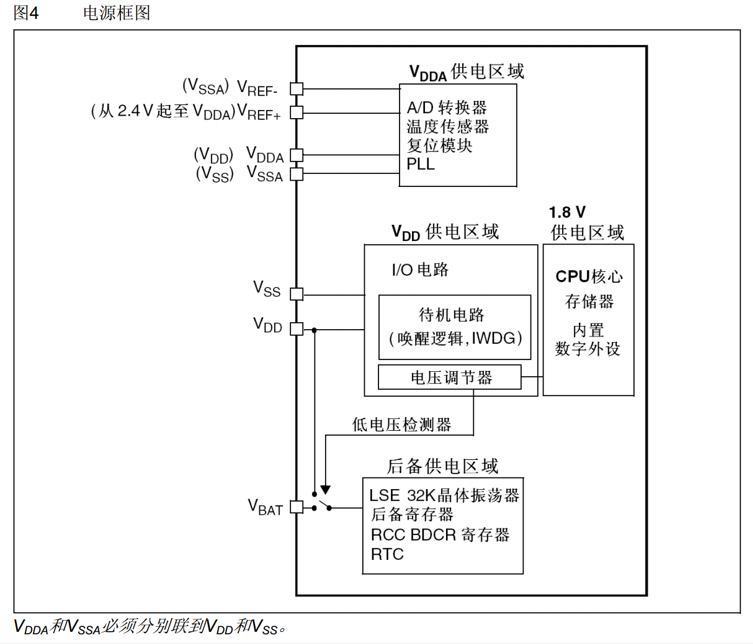
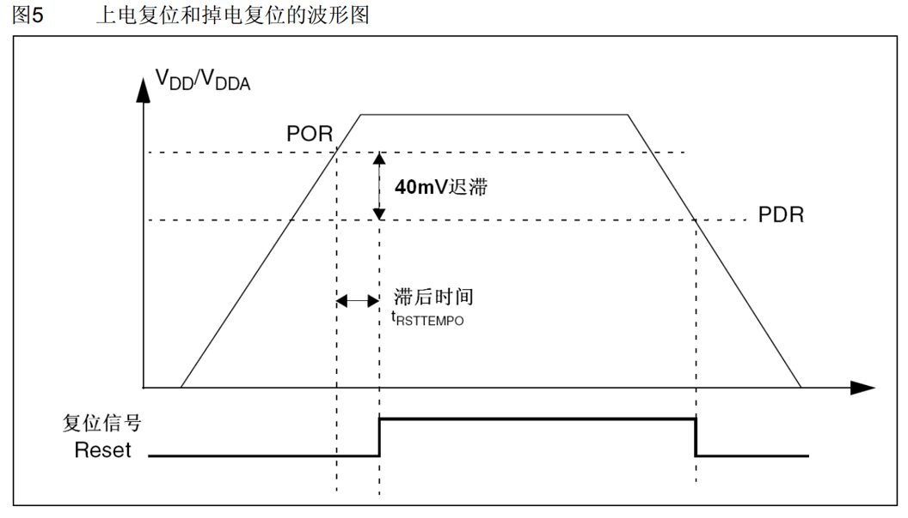
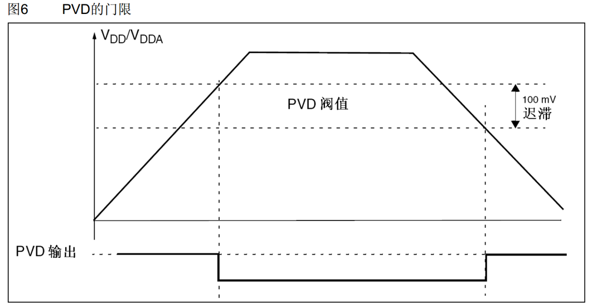
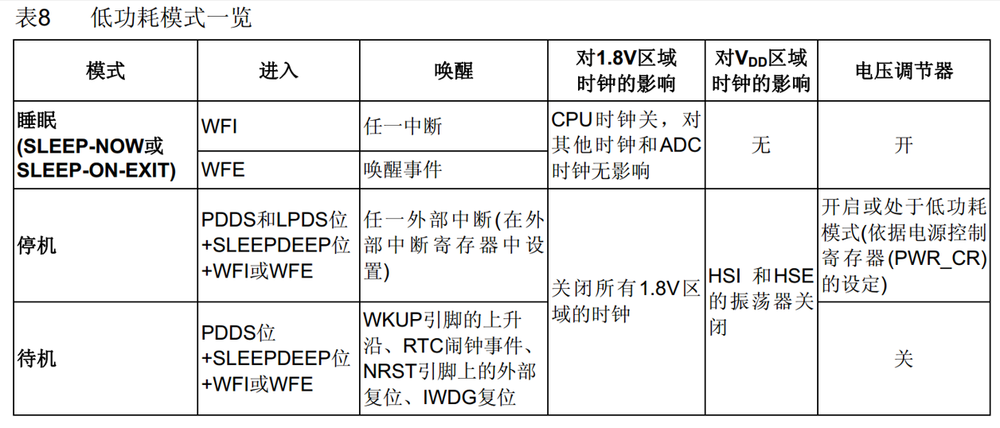
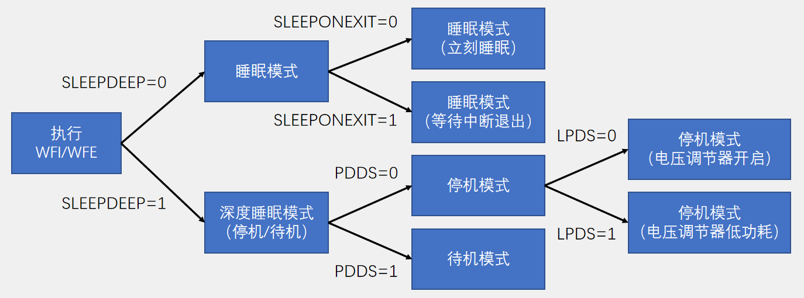

# 1. PWR 简介
- PWR（Power Control）电源控制
- PWR负责管理STM32内部的电源供电部分，可以实现可编程电压监测器和低功耗模式的功能
- 可编程电压监测器（PVD）可以监控 $V_ {DD}$ 电源电压，当 $V_ {DD}$ 下降到PVD阀值以下或上升到PVD阀值之上时，PVD会触发中断，用于执行紧急关闭任务
- 低功耗模式包括睡眠模式（Sleep）、停机模式（Stop）和待机模式（Standby），可在系统空闲时，降低STM32的功耗，延长设备使用时间

# 2. 电源框图



上图所示为stm32的供电部分，从上往下分别为**模拟供电区域、数字供电区域、后备供电区域**。

- 模拟供电区包括A/D转换器、温度传感器、复位模块、PLL锁相环等。其中A/D转换器还接有参考电压 $V_ {ref+}$ 和 $V_ {ref-}$ ，对于c8t6， $V_ {ref+}$ 和 $V_ {ref-}$ 已分别接至 $V_ {DDA}$ 和 $V_ {SSA}$ 。
- 数字供电区域包括两个部分，3.3V供电区：I/O电路、待机电路（唤醒逻辑、IWDG独立看门狗）和1.8V供电区：CPU核心、存储器、内置数字外设。1.8V供电区域的电源由3.3V电压经电压调节器降压而来。
- 后背供电区域包括LSE 32K晶体振荡器、后备寄存器、RCC BDCR寄存器、RTC实时时钟。低电压检测器可控制后备供电区域的电源输入，当 $V_ {DD}$ 有电时（芯片上电）由 $V_ {DD}$ 供电，当 $V_ {DD}$ 没电时由 $V_ {bat}$ 供电。

# 3. 上电复位和掉电复位(了解)



上图所示为上电复位和掉电复位示例图，复位信号低电平有效， $V_ {DD}$ / $V_ {DDA}$ 电压小于PDR阈值复位，大于POR阈值且等待滞后时间 $t_ {RSTTEMPO}$ 不复位。具体值参考stm32数据手册。

# 4. 可编程电压监测器



当检测到 $V_ {DD}$ / $V_ {DDA}$ 电压低于PVD阈值电压（该电压可编程，参考数据手册）低值时，PVD信号输出1，该信号可产生中断，属于外部中断。

# 5. 低功耗模式
## 5.1. 低功耗模式一览


- WFI：wait for interrupt，即“等待中断”。

  - **进入**：当内核执行WFI指令后，它会立即进入睡眠状态
  - **唤醒条件**：任何使能的中断（NVIC中断）的发生都可以唤醒它。这包括外部中断、定时器中断、串口中断等。
  - **唤醒后的行为**：处理器被唤醒后，会先执行对应的中断服务程序。中断服务程序执行完毕后，再返回到WFI指令之后的下一条代码继续执行。

- WFE：wait for event，即“等待事件”。

  - **进入**：当内核执行WFE指令后，它不会立即睡眠，而是先检查一个叫做事件寄存器的内部标志。如果该标志为 0，则内核进入睡眠；如果该标志为 1，则内核不会睡眠，而是清除该标志（置0）后，直接继续执行后面的指令。
  - **唤醒条件**：
  
    - **外设事件**：如EXTI配置为事件模式、定时器更新事件等。这些事件不一定会产生中断。
    - **多核系统中的SEV指令**：一个核心可以发送事件（SEV指令）唤醒另一个正在WFE睡眠的核心。
    - **调试事件**。
    - **使能的中断**：与WFI类似，一个使能的中断也可以唤醒WFE睡眠。
  - **唤醒后的行为**：
  
    - 如果被事件唤醒，处理器会直接继续执行WFE之后的下一条指令，不会进入任何中断服务程序。
    - 如果被中断唤醒，行为则和WFI一样，会先去执行中断服务程序。

- 停机模式：PDDS = 0，SLEEPDEEP = 1。LPDS = 0，电压调节器开启；LPDS = 1，电压调节器处于低功耗模式。
- 待机模式：PDDS = 1，SLEEPDEEP = 1。

## 5.2. 模式选择

执行WFI（Wait For Interrupt）或者WFE（Wait For Event）指令后，STM32进入低功耗模式。配置其他寄存器要在执行该命令之前。


## 5.3. 睡眠模式

- 执行完WFI/WFE指令后，STM32进入睡眠模式，程序暂停运行，唤醒后程序从暂停的地方继续运行
- SLEEPONEXIT位决定STM32执行完WFI或WFE后，是立刻进入睡眠，还是等STM32从最低优先级的中断处理程序中退出时进入睡眠
- 在睡眠模式下，所有的I/O引脚都保持它们在运行模式时的状态
- WFI指令进入睡眠模式，可被任意一个NVIC响应的中断唤醒
- WFE指令进入睡眠模式，可被唤醒事件唤醒

## 5.4. 停止模式

- 执行完WFI/WFE指令后，STM32进入停止模式，程序暂停运行，唤醒后程序从暂停的地方继续运行
- 1.8V供电区域的所有时钟都被停止，PLL、HSI和HSE被禁止，SRAM和寄存器内容被保留下来
- 在停止模式下，所有的I/O引脚都保持它们在运行模式时的状态
- 当一个中断或唤醒事件导致退出停止模式时，HSI被选为系统时钟
- 当电压调节器处于低功耗模式下，系统从停止模式退出时，会有一段额外的启动延时
- WFI指令进入停止模式，可被任意一个EXTI中断唤醒
- WFE指令进入停止模式，可被任意一个EXTI事件唤醒

## 5.5. 待机模式

- 执行完WFI/WFE指令后，STM32进入待机模式，唤醒后程序从头开始运行
- 整个1.8V供电区域被断电，PLL、HSI和HSE也被断电，SRAM和寄存器内容丢失，只有备份的寄存器和待机电路维持供电
- 在待机模式下，所有的I/O引脚变为高阻态（浮空输入）
- WKUP引脚的上升沿、RTC闹钟事件的上升沿、NRST引脚上外部复位、IWDG复位退出待机模式

# 6. 代码示例
## 6.1. 修改主频
通过使能**system_stm32f10x.c**中相应的宏来修改主频。
```cpp
#if defined (STM32F10X_LD_VL) || (defined STM32F10X_MD_VL) || (defined STM32F10X_HD_VL)
/* #define SYSCLK_FREQ_HSE    HSE_VALUE */
 #define SYSCLK_FREQ_24MHz  24000000
#else
/* #define SYSCLK_FREQ_HSE    HSE_VALUE */
/* #define SYSCLK_FREQ_24MHz  24000000 */ 
#define SYSCLK_FREQ_36MHz  36000000
/* #define SYSCLK_FREQ_48MHz  48000000 */
/* #define SYSCLK_FREQ_56MHz  56000000 */
/* #define SYSCLK_FREQ_72MHz  72000000 */
#endif
```
**main.c**
```cpp
#include "stm32f10x.h"                  // Device header
#include "Delay.h"
#include "OLED.h"

int main(void)
{
    OLED_Init();                            //OLED初始化
    
    OLED_ShowString(1, 1, "SYSCLK:");        //显示静态字符串
    OLED_ShowNum(1, 8, SystemCoreClock, 8);    //显示SystemCoreClock变量
                                            //SystemCoreClock的值表示当前的系统主频频率
    
    while (1)
    {
        OLED_ShowString(2, 1, "Running");    //闪烁Running，指示当前主循环运行的快慢
        Delay_ms(500);
        OLED_ShowString(2, 1, "       ");
        Delay_ms(500);
    }
}
```

## 6.2. 睡眠模式+串口发送+接收

**main.c**
```cpp
#include "stm32f10x.h"                  // Device header
#include "Delay.h"
#include "OLED.h"
#include "Serial.h"

uint8_t RxData;            //定义用于接收串口数据的变量

int main(void)
{
    OLED_Init();        //OLED初始化
    OLED_ShowString(1, 1, "RxData:");    //显示静态字符串
    
    Serial_Init();        //串口初始化
    
    while (1)
    {
        if (Serial_GetRxFlag() == 1)            //检查串口接收数据的标志位
        {
            RxData = Serial_GetRxData();        //获取串口接收的数据
            Serial_SendByte(RxData);            //串口将收到的数据回传回去，用于测试
            OLED_ShowHexNum(1, 8, RxData, 2);    //显示串口接收的数据
        }
        
        OLED_ShowString(2, 1, "Running");        //OLED闪烁Running，指示当前主循环正在运行
        Delay_ms(100);
        OLED_ShowString(2, 1, "       ");
        Delay_ms(100);
        
        __WFI();                                //执行WFI指令，CPU睡眠，并等待中断唤醒
    }
}

```

## 6.3. 停止模式+对射式红外传感器计次

**main.c**
```cpp
#include "stm32f10x.h"                  // Device header
#include "Delay.h"
#include "OLED.h"
#include "CountSensor.h"

int main(void)
{
    /*模块初始化*/
    OLED_Init();            //OLED初始化
    CountSensor_Init();        //计数传感器初始化
    
    /*开启时钟*/
    RCC_APB1PeriphClockCmd(RCC_APB1Periph_PWR, ENABLE);        //开启PWR的时钟
                                                            //停止模式和待机模式一定要记得开启
    
    /*显示静态字符串*/
    OLED_ShowString(1, 1, "Count:");
    
    while (1)
    {
        OLED_ShowNum(1, 7, CountSensor_Get(), 5);            //OLED不断刷新显示CountSensor_Get的返回值
        
        OLED_ShowString(2, 1, "Running");                    //OLED闪烁Running，指示当前主循环正在运行
        Delay_ms(100);
        OLED_ShowString(2, 1, "       ");
        Delay_ms(100);
        
        PWR_EnterSTOPMode(PWR_Regulator_ON, PWR_STOPEntry_WFI);    //STM32进入停止模式，并等待中断唤醒
        SystemInit();                                        //唤醒后，要重新配置时钟
    }
}

```

## 6.4. 待机模式+实时时钟

**main.c**
```cpp
#include "stm32f10x.h"                  // Device header
#include "Delay.h"
#include "OLED.h"
#include "MyRTC.h"

int main(void)
{
    /*模块初始化*/
    OLED_Init();        //OLED初始化
    MyRTC_Init();        //RTC初始化
    
    /*开启时钟*/
    RCC_APB1PeriphClockCmd(RCC_APB1Periph_PWR, ENABLE);        //开启PWR的时钟
                                                            //停止模式和待机模式一定要记得开启
    
    /*显示静态字符串*/
    OLED_ShowString(1, 1, "CNT :");
    OLED_ShowString(2, 1, "ALR :");
    OLED_ShowString(3, 1, "ALRF:");
    
    /*使能WKUP引脚*/
    PWR_WakeUpPinCmd(ENABLE);                        //使能位于PA0的WKUP引脚，WKUP引脚上升沿唤醒待机模式
    
    /*设定闹钟*/
    uint32_t Alarm = RTC_GetCounter() + 10;            //闹钟为唤醒后当前时间的后10s
    RTC_SetAlarm(Alarm);                            //写入闹钟值到RTC的ALR寄存器
    OLED_ShowNum(2, 6, Alarm, 10);                    //显示闹钟值
    
    while (1)
    {
        OLED_ShowNum(1, 6, RTC_GetCounter(), 10);    //显示32位的秒计数器
        OLED_ShowNum(3, 6, RTC_GetFlagStatus(RTC_FLAG_ALR), 1);        //显示闹钟标志位
        
        OLED_ShowString(4, 1, "Running");            //OLED闪烁Running，指示当前主循环正在运行
        Delay_ms(100);
        OLED_ShowString(4, 1, "       ");
        Delay_ms(100);
        
        OLED_ShowString(4, 9, "STANDBY");            //OLED闪烁STANDBY，指示即将进入待机模式
        Delay_ms(1000);
        OLED_ShowString(4, 9, "       ");
        Delay_ms(100);
        
        OLED_Clear();                                //OLED清屏，模拟关闭外部所有的耗电设备，以达到极度省电
        
        PWR_EnterSTANDBYMode();                        //STM32进入停止模式，并等待指定的唤醒事件（WKUP上升沿或RTC闹钟）
        /*待机模式唤醒后，程序会重头开始运行*/
    }
}

```