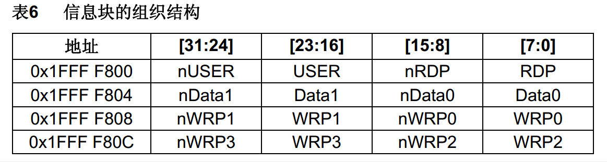

# 1.FLASH简介
- STM32F1系列的FLASH包含程序存储器、系统存储器和选项字节三个部分，通过闪存存储器接口（外设）可以对程序存储器和选项字节进行擦除和编程
- 读写FLASH的用途：
  - 利用程序存储器的剩余空间来保存掉电不丢失的用户数据
  - 通过在程序中编程（IAP），实现程序的自我更新
- 在线编程（In-Circuit Programming – ICP）用于更新程序存储器的全部内容，它通过JTAG、SWD协议或系统加载程序（Bootloader）下载程序
- 在程序中编程（In-Application Programming – IAP）可以使用微控制器支持的任一种通信接口下载程序
- 读写FLASH会中断CPU的执行
# 2.内存模块组织


# 3.FLASH基本结构


# 4.FLASH解锁
- FPEC共有三个键值：  
    RDPRT键 = 0x000000A5  
  KEY1 = 0x45670123  
    KEY2 = 0xCDEF89AB  

- 解锁：  
    复位后，FPEC被保护，不能写入FLASH_CR  
    在FLASH_KEYR先写入KEY1，再写入KEY2，解锁  
    错误的操作序列会在下次复位前锁死FPEC和FLASH_CR  

- 加锁：  
    设置FLASH_CR中的LOCK位锁住FPEC和FLASH_CR  

# 5.程序存储器擦除和编程
# 5.1 使用指针访问存储器
- 使用指针读指定地址下的存储器：  
    ``uint16_t Data = *((__IO uint16_t *)(0x08000000));``  

- 使用指针写指定地址下的存储器：  
    ``*((__IO uint16_t *)(0x08000000)) = 0x1234;``  

- 其中：  
    ``#define    __IO    volatile``

# 5.2.程序存储器全擦除


# 5.3.程序存储器页擦除


# 5.4.程序存储器编程
  

>注意：在编程之前要先执行擦除，否则stm32不会执行写入，除非写入的数据为全0。  
>注意：如果要写入8位数据，可以将整页数据读入SRAM,更新后再整页写入FLASH。

# 6.选项字节编程和擦除
## 6.1 选项字节
  

- RDP：写入RDPRT键（0x000000A5）后解除读保护  
- USER：配置硬件看门狗和进入停机/待机模式是否产生复位  
- Data0/1：用户可自定义使用  
- WRP0/1/2/3：配置写保护，每一个位对应保护4个存储页（中容量）

>注意：USER和nUSER为反码关系。其他类似。  

## 6.2 选项字节擦除流程
1. 检查FLASH_SR的BSY位，以确认没有其他正在进行的闪存操作  
2. 解锁FLASH_CR的OPTWRE位（选项字节的锁）  
3. 设置FLASH_CR的OPTER位为1（擦除命令）  
4. 设置FLASH_CR的STRT位为1  
5. 等待BSY位变为0  
6. 读出被擦除的选择字节并做验证  

## 6.2 选项字节写入流程
1. 检查FLASH_SR的BSY位，以确认没有其他正在进行的编程操作  
2. 解锁FLASH_CR的OPTWRE位（选项字节的锁）  
3. 设置FLASH_CR的OPTPG位为1（写入命令）  
4. 写入要编程的半字到指定的地址  
5. 等待BSY位变为0  
6. 读出写入的地址并验证数据  

# 7.电子签名
电子签名存放在闪存存储器模块的系统存储区域，包含的芯片识别信息在出厂时编写，不可更改，使用指针读指定地址下的存储器可获取电子签名

- 闪存容量寄存器：  
    基地址：0x1FFF F7E0  
    大小：16位  

- 产品唯一身份标识寄存器：  
    基地址： 0x1FFF F7E8  
    大小：96位  
>使用ID号可限制程序在指定设备上运行，防止程序被盗。  

# 8.读写内部FLASH代码
## 8.1 main.c
```cpp
#include "stm32f10x.h"                  // Device header
#include "Delay.h"
#include "OLED.h"
#include "Store.h"
#include "Key.h"

uint8_t KeyNum;                    //定义用于接收按键键码的变量

int main(void)
{
    /*模块初始化*/
    OLED_Init();                //OLED初始化
    Key_Init();                    //按键初始化
    Store_Init();                //参数存储模块初始化，在上电的时候将闪存的数据加载回Store_Data，实现掉电不丢失
    
    /*显示静态字符串*/
    OLED_ShowString(1, 1, "Flag:");
    OLED_ShowString(2, 1, "Data:");
    
    while (1)
    {
        KeyNum = Key_GetNum();        //获取按键键码
        
        if (KeyNum == 1)            //按键1按下
        {
            Store_Data[1] ++;        //变换测试数据
            Store_Data[2] += 2;
            Store_Data[3] += 3;
            Store_Data[4] += 4;
            Store_Save();            //将Store_Data的数据备份保存到闪存，实现掉电不丢失
        }
        
        if (KeyNum == 2)            //按键2按下
        {
            Store_Clear();            //将Store_Data的数据全部清0
        }
        
        OLED_ShowHexNum(1, 6, Store_Data[0], 4);    //显示Store_Data的第一位标志位
        OLED_ShowHexNum(3, 1, Store_Data[1], 4);    //显示Store_Data的有效存储数据
        OLED_ShowHexNum(3, 6, Store_Data[2], 4);
        OLED_ShowHexNum(4, 1, Store_Data[3], 4);
        OLED_ShowHexNum(4, 6, Store_Data[4], 4);
    }
}

```
## 8.2 MyFLASH.h
```cpp
#ifndef __MYFLASH_H
#define __MYFLASH_H

uint32_t MyFLASH_ReadWord(uint32_t Address);
uint16_t MyFLASH_ReadHalfWord(uint32_t Address);
uint8_t MyFLASH_ReadByte(uint32_t Address);

void MyFLASH_EraseAllPages(void);
void MyFLASH_ErasePage(uint32_t PageAddress);

void MyFLASH_ProgramWord(uint32_t Address, uint32_t Data);
void MyFLASH_ProgramHalfWord(uint32_t Address, uint16_t Data);

#endif

```
## 8.3 MyFLASH.c
```cpp
#include "stm32f10x.h"                  // Device header

/**
  * 函    数：FLASH读取一个32位的字
  * 参    数：Address 要读取数据的字地址
  * 返 回 值：指定地址下的数据
  */
uint32_t MyFLASH_ReadWord(uint32_t Address)
{
    return *((__IO uint32_t *)(Address));    //使用指针访问指定地址下的数据并返回
}

/**
  * 函    数：FLASH读取一个16位的半字
  * 参    数：Address 要读取数据的半字地址
  * 返 回 值：指定地址下的数据
  */
uint16_t MyFLASH_ReadHalfWord(uint32_t Address)
{
    return *((__IO uint16_t *)(Address));    //使用指针访问指定地址下的数据并返回
}

/**
  * 函    数：FLASH读取一个8位的字节
  * 参    数：Address 要读取数据的字节地址
  * 返 回 值：指定地址下的数据
  */
uint8_t MyFLASH_ReadByte(uint32_t Address)
{
    return *((__IO uint8_t *)(Address));    //使用指针访问指定地址下的数据并返回
}

/**
  * 函    数：FLASH全擦除
  * 参    数：无
  * 返 回 值：无
  * 说    明：调用此函数后，FLASH的所有页都会被擦除，包括程序文件本身，擦除后，程序将不复存在
  */
void MyFLASH_EraseAllPages(void)
{
    FLASH_Unlock();                    //解锁
    FLASH_EraseAllPages();            //全擦除
    FLASH_Lock();                    //加锁
}

/**
  * 函    数：FLASH页擦除
  * 参    数：PageAddress 要擦除页的页地址
  * 返 回 值：无
  */
void MyFLASH_ErasePage(uint32_t PageAddress)
{
    FLASH_Unlock();                    //解锁
    FLASH_ErasePage(PageAddress);    //页擦除
    FLASH_Lock();                    //加锁
}

/**
  * 函    数：FLASH编程字
  * 参    数：Address 要写入数据的字地址
  * 参    数：Data 要写入的32位数据
  * 返 回 值：无
  */
void MyFLASH_ProgramWord(uint32_t Address, uint32_t Data)
{
    FLASH_Unlock();                            //解锁
    FLASH_ProgramWord(Address, Data);        //编程字
    FLASH_Lock();                            //加锁
}

/**
  * 函    数：FLASH编程半字
  * 参    数：Address 要写入数据的半字地址
  * 参    数：Data 要写入的16位数据
  * 返 回 值：无
  */
void MyFLASH_ProgramHalfWord(uint32_t Address, uint16_t Data)
{
    FLASH_Unlock();                            //解锁
    FLASH_ProgramHalfWord(Address, Data);    //编程半字
    FLASH_Lock();                            //加锁
}

```
## 8.4 Store.h
```cpp
#ifndef __STORE_H
#define __STORE_H

extern uint16_t Store_Data[];

void Store_Init(void);
void Store_Save(void);
void Store_Clear(void);

#endif

```
## 8.5 Store.c
```cpp
#include "stm32f10x.h"                  // Device header
#include "MyFLASH.h"

#define STORE_START_ADDRESS        0x0800FC00        //存储的起始地址
#define STORE_COUNT                512                //存储数据的个数

uint16_t Store_Data[STORE_COUNT];                //定义SRAM数组

/**
  * 函    数：参数存储模块初始化
  * 参    数：无
  * 返 回 值：无
  */
void Store_Init(void)
{
    /*判断是不是第一次使用*/
    if (MyFLASH_ReadHalfWord(STORE_START_ADDRESS) != 0xA5A5)    //读取第一个半字的标志位，if成立，则执行第一次使用的初始化
    {
        MyFLASH_ErasePage(STORE_START_ADDRESS);                    //擦除指定页
        MyFLASH_ProgramHalfWord(STORE_START_ADDRESS, 0xA5A5);    //在第一个半字写入自己规定的标志位，用于判断是不是第一次使用
        for (uint16_t i = 1; i < STORE_COUNT; i ++)                //循环STORE_COUNT次，除了第一个标志位
        {
            MyFLASH_ProgramHalfWord(STORE_START_ADDRESS + i * 2, 0x0000);        //除了标志位的有效数据全部清0
        }
    }
    
    /*上电时，将闪存数据加载回SRAM数组，实现SRAM数组的掉电不丢失*/
    for (uint16_t i = 0; i < STORE_COUNT; i ++)                    //循环STORE_COUNT次，包括第一个标志位
    {
        Store_Data[i] = MyFLASH_ReadHalfWord(STORE_START_ADDRESS + i * 2);        //将闪存的数据加载回SRAM数组
    }
}

/**
  * 函    数：参数存储模块保存数据到闪存
  * 参    数：无
  * 返 回 值：无
  */
void Store_Save(void)
{
    MyFLASH_ErasePage(STORE_START_ADDRESS);                //擦除指定页
    for (uint16_t i = 0; i < STORE_COUNT; i ++)            //循环STORE_COUNT次，包括第一个标志位
    {
        MyFLASH_ProgramHalfWord(STORE_START_ADDRESS + i * 2, Store_Data[i]);    //将SRAM数组的数据备份保存到闪存
    }
}

/**
  * 函    数：参数存储模块将所有有效数据清0
  * 参    数：无
  * 返 回 值：无
  */
void Store_Clear(void)
{
    for (uint16_t i = 1; i < STORE_COUNT; i ++)            //循环STORE_COUNT次，除了第一个标志位
    {
        Store_Data[i] = 0x0000;                            //SRAM数组有效数据清0
    }
    Store_Save();                                        //保存数据到闪存
}

```

# 9.读取芯片ID
## 9.1 main.c
```cpp
#include "stm32f10x.h"                  // Device header
#include "Delay.h"
#include "OLED.h"

int main(void)
{
    OLED_Init();                        //OLED初始化
    
    OLED_ShowString(1, 1, "F_SIZE:");    //显示静态字符串
    OLED_ShowHexNum(1, 8, *((__IO uint16_t *)(0x1FFFF7E0)), 4);        //使用指针读取指定地址下的闪存容量寄存器
    
    OLED_ShowString(2, 1, "U_ID:");        //显示静态字符串
    OLED_ShowHexNum(2, 6, *((__IO uint16_t *)(0x1FFFF7E8)), 4);        //使用指针读取指定地址下的产品唯一身份标识寄存器
    OLED_ShowHexNum(2, 11, *((__IO uint16_t *)(0x1FFFF7E8 + 0x02)), 4);
    OLED_ShowHexNum(3, 1, *((__IO uint32_t *)(0x1FFFF7E8 + 0x04)), 8);
    OLED_ShowHexNum(4, 1, *((__IO uint32_t *)(0x1FFFF7E8 + 0x08)), 8);
    
    while (1)
    {
        
    }
}

```
