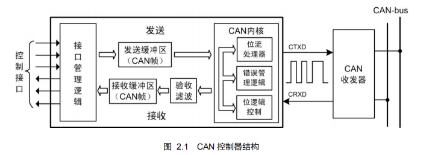

# 1. CANopen是干什么的？

由于CAN（Controller Area Network）现场总线仅仅定义了物理层和数据链路层。因此，基本每个行业的 CAN 应用，都需要一个高层协议来定义 CAN 报文中的 11/29位标识符、8 字节数据的使用。但在 CAN 总线的工业自动化应用中，由于设备的互通互联的需求越来越多，所以需要一个开放的、标准化的高层协议：这个协议支持各种 CAN 厂商设备的互用性、互换性，能够实现在 CAN 网络中提供标准的、统一的系统通讯模式，提供设备功能描述方式，执行网络管理功能。其中包括：
- **应用层**(Application layer)：为网络中每一个有效设备都能够提供一组有用的服务与协议。
- **通讯描述**(Communication profile)：提供配置设备、通讯数据的含义，定义数据通讯方式。
- **设备描述**(Device proflile)：为设备（类）增加符合规范的行为。

**CAN控制器结构如下**

**总结**
> ${\color{red}CANopen是一种基于CAN通信的应用层协议。}$ 

# 2.CANopen的诞生和发展

CANopen 协议是在 20 世纪 90 年代末，由总部位于德国纽伦堡的 CiA 组织——CAN-in-Automation，在 CAL（CAN Application Layer）的基础上发展而来。

经过对 CANopen 协议规范文本的多次修改，使得 CANopen 协议的稳定性、实时性、抗干扰性都得到了进一步的提高。并且 CiA 在 CANopen 基础协议——CiA 301 之上，对各个行业不断推出设备子协议，使 CANopen 协议在各个行业得到更快的发展与推广。所谓的**子协议，就是针对不同行业的应用对象，对 CANopen 内部的数据含义进行重新定义，或者添加新的控制逻辑。**
 
下图所示为 CANopen 设备结构。CANopen 协议通常分为**用户应用层**、**对象字典**以及**通信**三个部分。  
其中最为核心的是**对象字典**，描述了**应用对象**和 **CANopen 报文**之间的关系。  
**CANopen 通信**是本文关键部分，其定义了 **CANopen 协议通信规则**以及与 **CAN 控制器驱动**之间对应关系，熟悉这部分对全面掌握 CANopen 协议至关重要。

