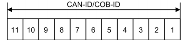
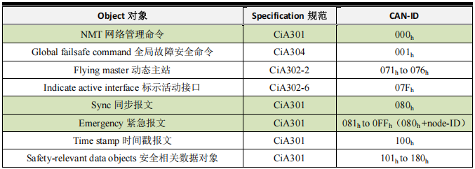
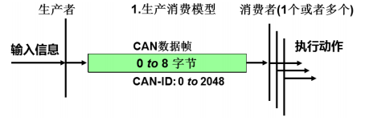
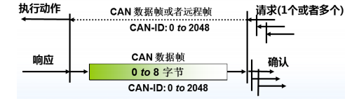
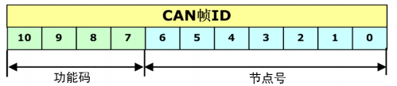
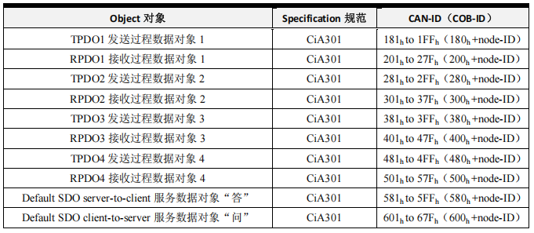

在 CANopen 创立之初，即使在 CAN 总线应用最广泛的汽车电子行业，网络中的 CAN节点数量和需要通讯的信息都是比较少的。
人们用CAN 取代 RS485，主要是看重其可以突发发送的实时性优势，而在多节点、长距离应用中，CAN 总线和 RS485 比起来并无优势，
比如同样的波特率下，CAN 的通信距离只能达到 RS485 的 0.6-0.8 倍，而多节点通信 CAN
无法进行任意的突发发送，不得不遵循 RS485 那样的轮询通信机制，否则会导致拥堵。

CANopen 的创始人是非常了解 CAN 总线这个特征，所以在设计 CANopen 时，对其定义为**小网络**、**控制信号**的**实时通讯**：  
- 报文传输采用 **CAN 标准帧格式**。即 11bit 的 ID 域，以尽量减小传输时间；

- 网络控制报文均采用数据最小字节数。比如心跳报文，只有 1 个字节数据；
- 实时更新的**过程数据无需接收方报文应答**(即PDO)。即采用生产消费模型，降低总线负载；
- 需要接收方确认的配置参数一般都是采用快速单字传输。即 1 个报文最多传送 1 个 32 字节的参数变量，避免了分帧引起的实时性降低。

以上这些定义都是为了节约时间开销，最大限度保证实时性。同时为了减小简单网络的
组态工作量，CANopen 定义了强制性的缺省标识符（CAN 帧 ID）分配表，以减少使用者与
维护者的学习时间，快速上手。

## 2.1 网络管理（NMT）与特殊协议（Special protocols）报文 ID 分类

虽然 CANopen 的通讯发挥了 CAN 的特色，所有节点通信地位平等，运行时允许自行
发送报文，但 CANopen 网络为了**稳定可靠可控**，都需要设置一个**网络管理主机** NMT-Master
（Network Management-Master），就像一个交响乐团的指挥家，所有节点的启动、停止都是
有他进行指挥。  

**NMT 主机**一般是 CANopen 网络中 **具备监控的 PLC 或者 PC（当然也可以是一般的功能节点）**，所以也称为**CANopen主站**。相对应的其他 CANopen节点就是 **NMT从机**(NMT-slaves)。

NMT 主机和 NMT 从机之间通讯的报文就称为 **NMT 网络管理报文**。管理报文负责**层管理**、**网络管理**和 **ID 分配服务**。
例如，初始化、配置和网络管理（其中包括节点保护）。网络管理中，同一个网络中只允许有一个主节点、一个或多个从节点，并遵循主从模式。

另外，为了协调各个节点的**同步**、**心跳**、**时间**、**错误提示**等通讯控制，CANopen 还定
义了一系列**特殊协议**（Special protocols）报文。如下表所示，为 CANopen 预定义报文
（Pre-defined CAN-IDs）的 NMT 报文和特殊协议报文。

 

CAN-ID 就是这类报文的 COB-ID，其中**读者必须需要记住的是绿色底纹的这些常用的CAN-ID 含义**，
在研发和应用 CANopen 中，这三类是最为常用的 NMT 与特殊协议报文。  

## 2.2 过程数据对象（PDO）和服务数据对象（SDO）的报文 ID 分类

用户应用 CANopen 时，需要传递的配置信息和应用信息都是放在过程数据对象 **PDO（Process Data Object）** 和 **服务数据对象 SDO（Service Data Object）** 里面。这些对象就像市场上卖水果的箩筐，大小规格统一，只是装载的内容（应用数据）不同。这就是 CiA301 协议规定的基础协议——"箩筐"架构，而 CiA4xx 子协议或用户自定义对象则是"箩筐"里装载的"水果"。

PDO 和 SDO 的通讯区别在于，**PDO 属于过程数据，即单向传输，无需接收节点回应
CAN 报文来确认，从通讯术语上来说是属于“生产消费”模型**。如下图所示。  
  

**而 SDO 属于服务数据，有指定被接收节点的地址（Node-ID），并且需要指定的接收节
点回应 CAN 报文来确认已经接收，如果超时没有确认，则发送节点将会重新发送原报文。
这种通讯方式属于常见的“服务器客户端”的通信模型**，即我们通常所说的轮询式。如下图所示。  
  

对于 PDO 和 SDO 的报文 ID 分配，为了减少网络的组态工作量，CANopen 预定义了强
制性的缺省标识符（CAN-ID）分配表，该分配表是基于 11 位 CAN-ID 的标准帧格式。
**将其划分为 4 位的功能码（Function-ID）和 7 位的节点号（Node-ID）**。如下图所示。  

  

deepseek关于“减少网络的组态工作量”的解释

# CANopen中“减少网络的组态工作量”的含义

在CANopen协议中，“减少网络的组态工作量”指的是通过预定义**强制性的缺省标识符（CAN-ID）分配规则**，简化了网络配置的复杂度，具体体现在以下几个方面：

---

## 1. 标准化分配规则，避免手动配置冲突
- **功能码（Function-ID）**  
  4位功能码固定定义了报文类型（如PDO、SDO、NMT等），例如：
  - `0x1` 用于发送PDO1（过程数据对象），`0x2` 用于接收PDO1。
  - `0x3` 用于发送SDO（服务数据对象请求），`0x4` 用于接收SDO响应。

- **节点号（Node-ID）**  
  7位节点号（`0~127`）唯一标识网络中的每个设备。

- **自动生成CAN-ID**  
  通过公式 `CAN-ID = (Function-ID << 7) + Node-ID`，直接生成唯一的报文ID，无需人工分配。

  **效果**  
  工程师无需手动为每个节点分配CAN-ID，只需指定节点号，系统自动生成合法的ID，避免了因手动分配导致的ID冲突或配置错误。

---

## 2. 即插即用（Plug-and-Play）支持
- **预定义通信模式**  
  例如，节点号为5的设备，其发送PDO1的CAN-ID自动为 `0x185`（功能码 `0x1` + 节点号 `0x05`）。

- **快速网络扩展**  
  新增设备时，只需分配一个未使用的节点号（如6），其所有相关报文ID（PDO、SDO等）即可自动生成，无需重新设计网络拓扑。

  **场景**  
  在工业自动化中，若需增加一个传感器（节点号6），其PDO/SDO的CAN-ID会直接按规则生成，无需人工干预。

---

## 3. 降低协议栈开发复杂度
- **统一通信逻辑**  
  所有CANopen设备遵循相同的ID分配规则，通信协议栈（如对象字典、PDO映射）可直接基于预定义规则实现，减少定制化开发。

- **工具链兼容性**  
  配置工具（如CANopen Master配置软件）能自动识别预定义ID，简化网络组态流程。

  **示例**  
  使用工具（如CANopen Magic）配置网络时，只需输入节点号，工具自动填充所有关联的CAN-ID，大幅缩短配置时间。

---

## 4. 避免动态协商的开销
- **无动态分配协议**  
  不同于某些需要主节点动态分配ID的协议（如某些基于TCP/IP的协议），CANopen通过静态预定义规则，省去了复杂的协商过程。

- **实时性保障**  
  预定义ID的确定性避免了动态分配带来的延迟，适合实时控制场景（如电机控制、机器人）。

---

## 总结
通过强制性的缺省CAN-ID分配表，CANopen实现了：
- ✅ **零手动配置冲突**：基于节点号自动生成唯一ID。
- ✅ **快速部署**：即插即用，支持大规模节点扩展。
- ✅ **协议一致性**：所有设备遵循相同规则，降低开发维护成本。

这种设计尤其适用于工业控制、汽车电子等对可靠性和实时性要求高的领域。
---
---

 

在 CANopen 里也通常把 CAN-ID 称为 COB-ID（通信对象编号）。所以我们可以分清楚两个易于混淆的名称：  
- **COB-ID**：Communication Object Identifier,即 CANopen 中对某种通讯对象的报文帧
ID，即 CAN 报文的 11 位 ID。代表了一种通讯含义。  
- **Node-ID**：节点 ID 号，即 CANopen 网络中的节点地址，CANopen 规定了逻辑上最
大 128 个节点，所以 Node-ID 最大为 128（7 位）。

COB-ID 和 Node-ID 无必然联系，但在过程数据对象（PDO）和服务数据对象（SDO）
中，COB-ID 中包含了 Node-ID。

由于需要区分每个 CANopen 节点的输入和输出，所以 PDO 分为 **TPDO（发送 PDO）**
和**RPDO(接收 PDO)**，**发送和接收是以 CANopen 从站节点为参考**（如果 CAN 主站就相反）。**TPDO
和 RPDO 分别有 4 个数据对象，每种数据对象就是 1 条 CAN 报文封装**，如下表所示，
这些都是数据收发的容器，**水果箩筐**为使用者准备好，就看使用者在里面
放什么**水果**了。  

  

而 SDO 就相对比较简单固定，**发起通讯的“问”SDO 的 CAN 帧 ID 就是 600h +node-ID，
这里的 Node-ID 是被问的节点地址，而被问的节点应“答”SDO 的 CAN 帧 ID 就是 580h 
+node-ID**。一般在 CANopen 网络中，**只有 NMT 主机能发起 SDO 通讯**，进行节点参数配置
或者关键性参数的传递。当然从节点也可以对其他从节点发起 SDO 通讯。