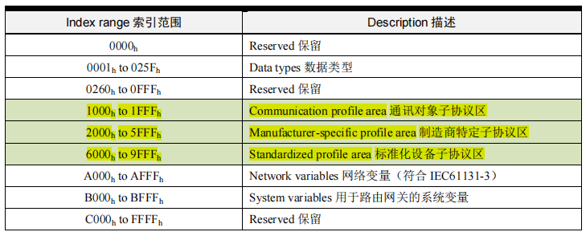
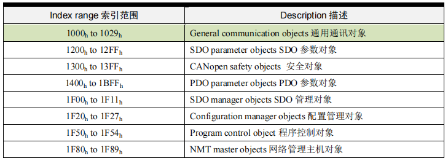
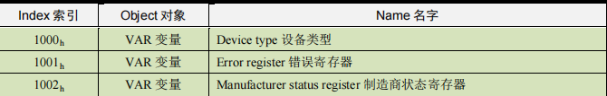
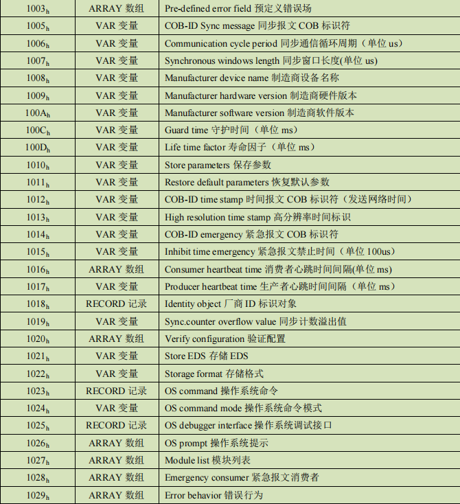
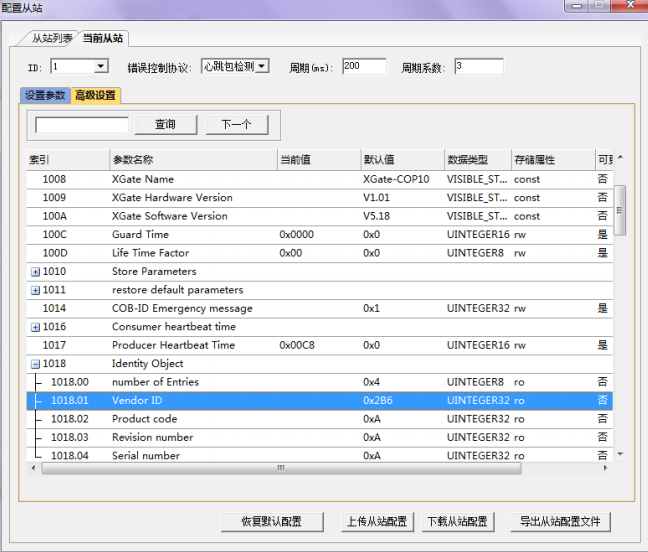

CANopen 对象字典（OD: Object Dictionary）是 CANopen 协议最为核心的概念。所谓的
对象字典就是一个**有序的对象组**，描述了**对应 CANopen 节点的所有参数**，包括通讯数据的存放位置也列入其索引，这个表变成可以传递形式就叫做 EDS 文件（电子数据文档
Electronic Data Sheet）。对象字典，就像体检表，具备这个人每个功能的参数，便于用人
单位（主站）进行合理分配工作。  

每个对象采用一个 16 位的索引值来寻址，这个索引值通常被称为**索引，其范围在 0x0000
到 0xFFFF 之间。为了避免数据大量时无索引可分配，所以在某些索引下也定义了一个 8 位
的索引值，这个索引值通常被称为子索引，其范围是 0x00 到 0xFF 之间。**  

**每个索引内具体的参数，最大用 32 位的变量来表示，即 Unsigned32，四个字节。**  

每个 CANopen 设备都有一个对象字典，使用电子数据文档（EDS 文件）来记录这些参
数，而不需要把这些参数记录在纸上。对于 CANopen 网络中的主节点来说，不需要对
CANopen 从节点的每个对象字典项都访问。  

**CANopen 对象字典中的项由一系列子协议来描述。** 子协议为对象字典中的每个对象都
描述了它的功能、名字、索引、子索引、数据类型，以及这个对象是否必需、读写属性等等，
这样可保证不同厂商的同类型设备兼容。  

CANopen 协议的核心描述子协议是 DS301，其包括了 CANopen 协议应用层及通信结构
描述，其它的协议子协议都是对 DS301 协议描述文本的补充与扩展。在不同的应用行业都
会起草一份 CANopen 设备子协议，子协议编号一般是 DS4xx 。

## 3.1 对象字典概述

下表描述了对象字典索引区域定义，其中标绿色底纹的**通讯对象子协议区**和**制
造商特定子协议区**是用户需要关注的区域。  

## 3.2 通讯对象子协议区

通讯对象子协议区（Communication profile area）定义了所有和通信有关的对象参数，
如下表所示，**标绿色底纹的索引范围 1000h to 1029h为通用通讯对象**，**所有 CANopen 节点都必须具备这些索引，否则将无法加入 CANopen 网络**。其他索引根据实际情况进行分配
与定义。

## 3.3 通用通讯对象

**由于通用通讯对象十分重要，NMT 主站（CANopen 主站）在启动时，通常都全部或
者部分读取所有从站中通用通讯对象中的索引，所以所有的通用通讯对象都必须在
CANopen从站中实现，使用者也必须熟知这些索引地址与其含义。** 如下表所示。

## 3.4 制造商特定子协议
对象字典索引 2000h to 5FFFh为制造商特定子协议，**通常是存放所应用子协议的应用数据**。
而上文所描述的通讯对象子协议区（Communication profile area）是存放这些应用数据
的通信参数。比如广州致远电子的 XGate-COP10 从站模块规定了：
- RPDO 的通讯参数存放在 1400h to 15FFh 映射参数存放在 1600h to 17FFh 数据存放为
2000h 之后厂商自定义区；
- TPDO 的通讯参数存放在 1800h to 19FFh 映射参数存放在 1A00h to 1BFFh 数据存放为
2000h 之后厂商自定义区。

对于在设备子协议中未定义的特殊功能，制造商也可以在此区域根据需求定义对象字典
对象。因此这个区域对于不同的厂商来说，相同的对象字典项其定义不一定相同。

## 3.5 标准化设备子协议
标准化设备子协议，为各种行业不同类型的标准设备定义对象字典中的对象。目前已有
十几种为不同类型的设备定义的子协议，例如 DS401、DS402、DS406 等，其索引值范围
为 0x6000～0x9FFF。同样，这个区域对于不同的标准化设备子协议来说，相同的对象字典
项其定义不一定相同。

## 3.6 对象字典和 EDS 文件实例
对于对象字典和 EDS 文件的实现，需要使用专用的 EDS 生成工具，并且能通过 CiA 的
EDS 测试工具进行一致性测试。  

我们可以通过广州致远电子的CANopen从站协议栈模块XGate-COP10模块的对象字典
和 EDS 文件，来真实感受一下。  

如下图所示，为 XGate-COP10 的 EDS 文件导入到 USBCAN-E-P 主站卡管理软件
CANManager for CANopen 中。配置从站框中可以观察到 XGate-COP10 的对象字典内容，
1008h的索引是这个设备的名称 XGate-COP10，1009h是硬件版本，100Ah是软件版本，1018h
的索引为标示对象，其下有若干个子索引，其中 1008.01h 的子索引为厂商代码 0x2B6，这
是广州致远电子股份有限公司在 CiA 协会申请的厂商代码，任何一个生产 CANopen 的厂家
虽然不强制加入 CiA 协会，但必须申请唯一的厂商代码。

