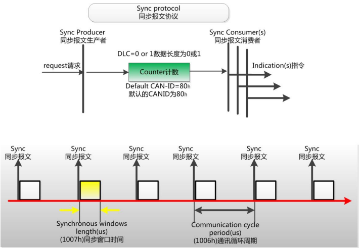
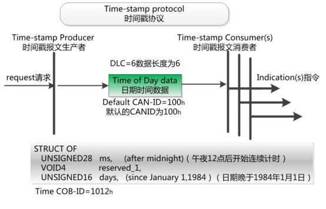
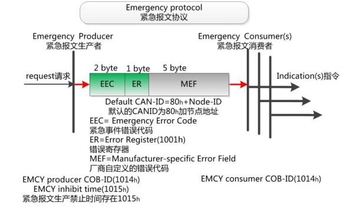
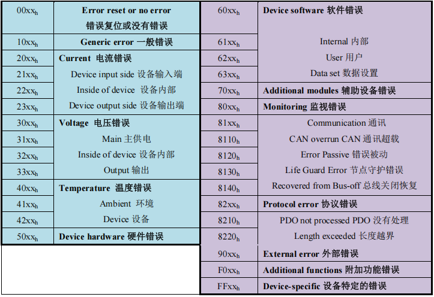

为了方便 CANopen 主站对从站管理。在 CANopen 协议中，已经为特殊的功能预定义
了 COB-ID，其主要有以下几种特殊报文。

## 7.1 同步协议（Sync protocol）

同步（SYNC），**该报文对象主要实现整个网络的同步传输**，就像阅兵
分列式上的方阵，所有士兵迈着整齐的步伐行进。

每个节点都以该同步报文作为 PDO 触发参数，因此该同步报文的 COB-ID 具有比较高
的优先级以及最短的传输时间。 **一般选用 80h作为同步报文的 CAN-ID**，如下图所示。

<div></div>

一般同步报文由 NMT 主机发出，CAN 报文的数据为 0 字节。但如果一个网络内有 2
个同步机制，就需要设置不同的同步节拍，比如某些节点按 1 个同步帧发送 1 次 PDO，其
他的节点收到2个同步帧才发送1此PDO，所以这里PDO参数中的同步起始值就起了作用。
在同步协议中，有 2 个约束条件：

- **同步窗口时间**：索引 1007h约束了同步帧发送后，从节点发送 PDO 的时效，即在
这个时间内发送的 PDO 才有效，超过时间的 PDO 将被丢弃；
- **通讯循环周期**：索引 1006h规定了同步帧的循环周期。

## 7.2 时间戳协议（Time-stamp protocol）

时间标记对象（Time Stamp），NMT 主机发送自身的时钟，为网络各个节点提供公共
的时间参考，即网络对时。这在故障诊断中非常需要，比如列车中火灾报
警，检修人员需要准确获知报警的时刻，然后关联查看其它设备在这个时刻的工作状态。

时间戳协议采用广播方式，无需节点应答，**CAN-ID 为 100h，数据长度为 6，数据为当
前时刻与 1984 年 1 月 1 日 0 时的时间差**。如下图所示。节点将此时间存储在对象字典 1012h的索引中。

<div></div>

<br/>

由于时间换算起来非常费劲，这里特地准备好了换算函数，方便读者使用。

```cpp
void DataTime(void)
{
    uint32 n,i,da;
    canopen_data;//定义网络的日期；
    canopen_msecond;//定义网络的时间（ms）

    /*计算年*/
    n= (canopen_data+671)/1461;//求有多少个 2 月 29 日
    Year=(canopen_data-n)/365+1984;//得到年
    if((canopen_data-n)%365==0){
        Year=Year-1;
    }

    /*计算月日*/
    if((Year%400==0)||(Year%4==0&&Year%100!=0))//判断闰年
    {
        m[2]=29;
    }else{
        m[2]=28;
    }
    da=canopen_data-((canopen_data-n)/365)*365-n;//减去该年前的前天，得到改年的第几天
    for(i=0;i<12;i++)
    {
        if(da>m[i])
        {
            da=da-m[i];//让天数减去每个月的天数
        }
        if(da==0)
        {
            Month=i+1;
            Day=m[i+1];
        }
        if(da<=m[i+1]&&da!=0)//如果得到小于或等于该月的天数，则可以确定为哪一天
        {
            Month=i+1;
            Day=da;
            break;
        }
    } 
    /*计算时分秒*/
    canopen_msecond=canopen_msecond/1000;//把毫秒转换为秒
    Hour=canopen_msecond%(3600*24)/3600;
    Minute=canopen_msecond%3600/60;
    Second=canopen_msecond%60;
}
```

## 7.3 紧急报文协议（Emergency protocol）

紧急事件对象（Emergency），是**当设备内部发生错误，触发该对象，发送设备内部错误
代码，提示 NMT 主站**。紧急报文属于诊断性报文，一般不会影响 CANopen 通讯，其 **CAN-ID存储在 1014h的索引中，一般会定义为 080h +node-ID，数据包含 8 个字节**，
如下图所示。

<div></div>

<br/>

其中包括 EEC：紧急时间错误代码，ER：错误寄存器，MEF：厂商自定义的错误代码。
当然这些都需要查表才能获知，进行诊断。

<div></div>

<br/>

与 PDO 的生产禁止时间类似，紧急报文也有生产禁止时间，存储在对象字典的 1015h
中，为了限制节点不断发送紧急报文，导致总线负载过大。