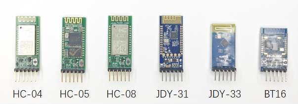
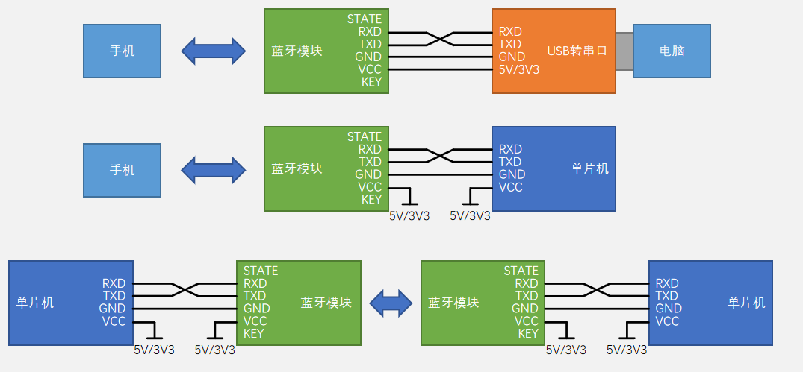
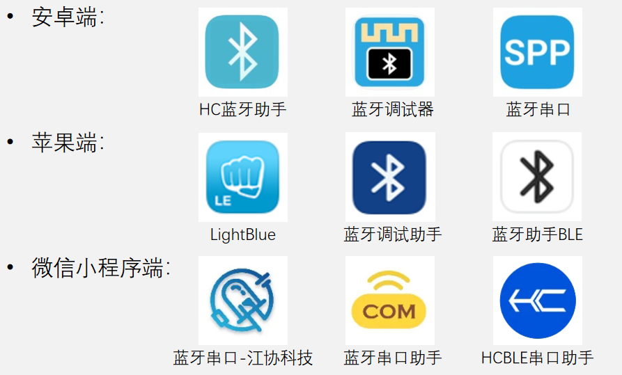

## 蓝牙模块简介
蓝牙模块可以将有线串口数据流转换为无线蓝牙数据流，实现无线串口功能

|  蓝牙类别  |        标志      |                          特性                          |
|-----------|------------------|-------------------------------------------------------|
|经典蓝牙    |SPP，蓝牙3.0及以下 |功耗高，速率较快，先配对后连接                            |
|低功耗蓝牙  |BLE，蓝牙4.0及以上 |功耗低，速率较慢，快速连接 增加组网、广播、定位等新功能 |
|双模蓝牙    |SPP + BLE         |同时集成经典蓝牙和低功耗蓝牙，兼容性更强                   |

|主从类别 |                             特性                       |
|--------|--------------------------------------------------------|
|单从机   |仅能被动等待主设备连接，无法主动发起连接请求                |
|主从一体 |可切换角色为主设备或从设备，作为主设备时，可主动发起连接请求 |

## 硬件连接

## 蓝牙模块配置（AT模式）

蓝牙未连接或者连接后按住KEY不放，可以使模块进入AT模式，此时通过串口发送AT指令，可对蓝牙模块进行配置

|AT指令      |            功能            |
|-----------|----------------------------|
|AT         |测试通讯                     |
|AT+BAUD    |查询和设置串口波特率          |
|AT+DEFAULT |参数恢复默认值                |
|AT+ROLE    |查询和设置角色（主设备/从设备）|
|AT+NAME    |查询和设置经典蓝牙名称        |
|AT+PIN     |查询和设置经典蓝牙配对密码     |
|AT+BNAME   |查询和设置BLE蓝牙名称         |

>注：以上仅以HC-04为例介绍AT模式，不同蓝牙模块的AT指令和进入AT模式的方法都可能不同，详细介绍请参考模块对应的手册

## 手机端软件

