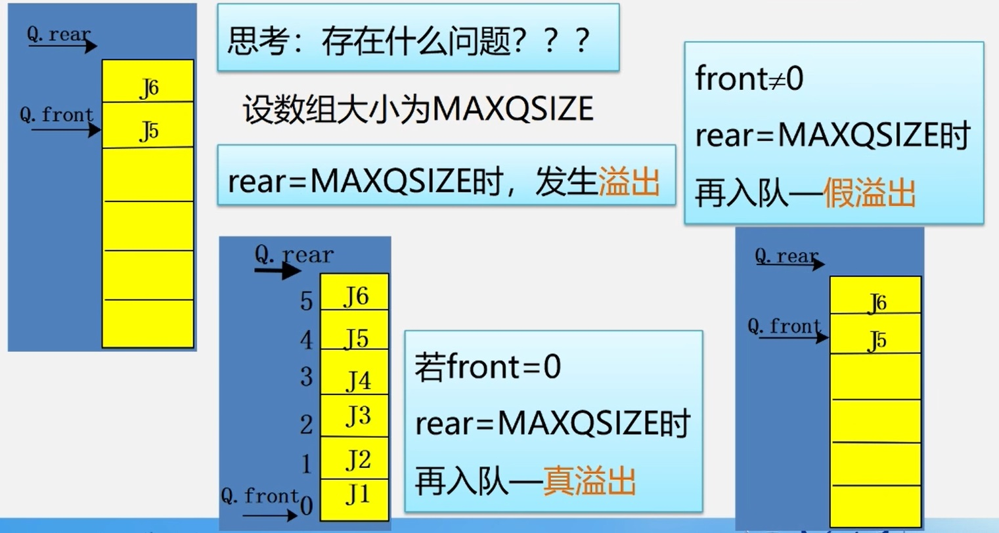

### 抽象数据类型定义  
>ADT Queue:  
>　　数据对象:  $D=$ { $a_i$ | ${a_i}\in{ElemSet}$ $,i=1,2,...,n,n≥0$ }  
>　　数据关系:  $R=$ { $\lt{a_{i-1}}$ ${a_i}\gt$ | ${a_{i-1}}$ , ${a_i}\in{D}$ $,i=1,2,...,n$ } 约定其中 $a_1$ 端为队列头, $a_n$ 端为队列尾。    
>　　基本操作:
>|基本操作|操作条件|操作结果|
>|--------|---------|---------|
>|InitQueue(&Q)|／|InitQueue(&Q)|
>|DestroyQueue(&Q)|队列Q已存在|队列Q被销毁|
>|ClearQueue(&Q)|队列Q已存在|将Q清空|
>|QueueLength(Q)|队列Q已存在|返回Q的元素个数，即队长|
>|GetHead(Q, &e)|Q为非空队列|用e返回Q的队头元素|
>|EnQueue(&Q,e)|队列Q已存在|插入元素e为Q的队尾元素|
>|DeQueue(&Q,&e)|Q为非空队列|删除Q的队头元素，用e返回值|

>还有将队列置空、遍历队列等操作

**队列数据结构：**  
```cpp
//顺序队列存储结构
#define MAXQSIZE 100//最大队列长度
typedef struct {
    QElemType *base;  //初始化的动态分配存储空间,base指向数组首地址
    int front;        //头指针
    int rear;        //尾指针
}SqQueue;
```
**顺序队列假溢出及解决办法：**  
　　如果对一个顺序队列仅仅实现其功能，而不做其他操作，当操作该队列时，经过多次入队出队，``front``和``rear``指针就会接近设定的数组上界，而无法再入队元素。显然这是不应该的，因为数组的前面部分可能还有空间。所以当``rear``指针到达数组上界时，又重新从数组首地址分配新入队的元素。这样队列看起来像循环一样，称为循环队列。  
如下所示：
<div> </img></div>  
<div> </img></div>  

**循环队列分辨队空队满：**  
循环队列会存在队空和队满时均有``front == rear``，如下图所示：  
<div> </img></div>  
解决方法如下：
<div> </img></div>  

### 队列的实现  
**1.初始化队列**  
```cpp
Status InitQueue(SqQueue &Q){
    Q.base = new QElemType[MAXQSIZE];//分配数组空间
    //Q.base = (QElemType*)malloc(MAXQSIZE*sizeof(QElemType))
    if(!Q.base) exit(OVERFLOW);//存储分配失败
    Q.front = Q.rear = 0;//头指针尾指针置为0，队列为空
    return OK;
}
```
**2.求队列长度**  
```cpp
int QueueLength(SqQueue Q){
    return(Q.rear - Q.front + MAXQSIZE)% MAXQSIZE;
}
```
**3.循环队列入队**  
```cpp
Status EnQueue(SqQueue &Q, QElemType e){
    if((Q.rear + 1) % MAXQSIZE == Q.front) return ERROR; //队满
    Q.base[Q.rear] = e;    //新元素加入队尾
    Q.rear = (Q.rear+1)%MAXQSIZE;    //队尾指针+1
    return Ok;
}
```
**4.循环队列出队**  
```cpp
Status DeQueue(SqQueue &Q,QElemType &e){
    if(Q.front == Q.rear) return ERROR;//队空
    e = Q.base[Q.front];    //保存队头元素
    Q.front = (Q.front+1) % MAXQSIZE;    //队头指针+1
    return OK;
}
```
**5.取队头元素**  
```cpp
SElemType GetHead(SqQuere Q){
    if(Q.front!=Q.rear)//队列不为空
    return Q.base[Q.front];//返回队头指针元素的值，队头指针不变
}
```
