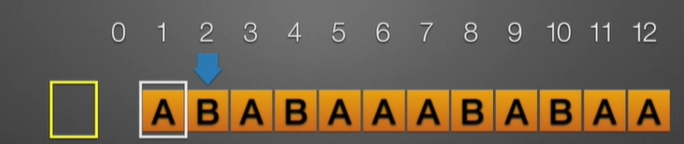
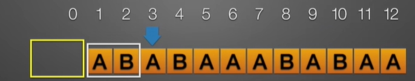
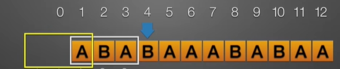

**算法目的:**  
　　确定主串中所含子串(模式串)第一次出现的位置(定位)。  
>注意下面的算法中，串的第一个位置不存储元素。

下面的算法中使用的串的存储结构为：  
```cpp
#define MAXLEN 255
typedef struct{
    char ch[MAXLEN+1];//存储串的一维数组
    int length; //串的当前长度长度
}SString;
```
## BF算法  
　　穷举法，从前往后依次比较。两层循环，第一层遍历模式串 $T$ 的第一个字符在目标串 $S$ 中出现的位置。第二层依次比较相应位置的字符是否匹配。  
>将主串的第pos个字符和模式串的第一个字符比较  
>　　若相等，继续逐个比较后续字符;  
>　　若不等，从主串的下一字符起，重新与模式串的第一个字符比较。

```cpp
int index_BF(SString S, SString T){
    int i = 1, j = 1;
    while (i <= S.length && j <= T.length){
        if(s.ch[i] == t.ch[j]){    //主串和子串依次匹配下一个字符
            ++i;
            ++j;
        }else{        //主串、子串指针回溯重新开始下一次匹配
            i = i - j + 2;
            j = 1;
        }
    }
    if (j >= T.length) return i - Tlength;//返回匹配的第一个字符的下标
    else return 0;//模式匹配不成功
}
```
**时间复杂度分析**  
>若n为主串长度，m为子串长度:  
>**最好情况：** 第一次匹配成功，比较m次。  
>**最坏情况：** 子串在主串的最后位置，比较(n-m+1)*m次。  
>若m<<n,则算法复杂度为O(n *m)。

## KMP算法  
　　BF算法每次比较失败，子串都相对于主串向后挪一个位置，然后重新开始比较每一位相应位置的元素，从而效率很慢。  
实际上子串可能可以向后挪更多的位置 **(i不是回溯到i-j+2)** ,也不一定要从子串的第一个元素又重新每一位地向后比较 **(j不是回溯到1)** ，这就是KMP的设计思想。  
以主串 $ABABCABCACBAB$ 和子串 $ABCAC$ 的匹配过程来解释KMP算法的匹配过程。 $\color{red}S.length = 13,T.length = 5$ 。  

**第一次匹配**
<table>
  <tbody>
    <tr>
      <td>S [ i ]</td><td>1</td><td>2</td><td>3</td><td>4</td><td>5</td><td>6</td><td>7</td><td>8</td><td>9</td><td>10</td><td>11</td><td>12</td><td>13</td>
    </tr>
    <tr>
      <td>S=</td><td>A</td><td>B</td><td>A</td><td>B</td><td>C</td><td>A</td><td>B</td><td>C</td><td>A</td><td>C</td><td>B</td><td>A</td><td>B</td>
    </tr>
    <tr>
      <td>T=</td><td>A</td><td>B</td><td>C</td><td>A</td><td>C</td><td></td><td></td><td></td><td></td><td></td><td></td><td></td><td></td>
    </tr>
    <tr>
      <td>T [ j ]</td><td>1</td><td>2</td><td>3</td><td>4</td><td>5</td><td></td><td></td><td></td><td></td><td></td><td></td><td></td><td></td>
    </tr>
  </tbody>
</table>

可以看出，第一次匹配在 **$i=3,j=3$** 时失败，现在往后挪到哪里呢？答案是 **子串 $T$ 应该往后挪两位(j-1)**。因为既然在 **$i=3,j=3$** 时匹配失败，  
那么说明 $\color{red}S[1] == T[1],S[2] == T[2],S[3] \neq T[3]$ 。而且 $\color{red}T[1] \neq T[2]$ ，所以 $\color{red}T[1] \neq S[2]$ 。  
所以下次匹配 $T[1]$ 应该和 $S[3]$ 开始匹配。  

**第二次匹配**  
<table>
  <tbody>
    <tr>
      <td>S [ i ]</td><td>1</td><td>2</td><td>3</td><td>4</td><td>5</td><td>6</td><td>7</td><td>8</td><td>9</td><td>10</td><td>11</td><td>12</td><td>13</td>
    </tr>
    <tr>
      <td>S=</td><td>A</td><td>B</td><td>A</td><td>B</td><td>C</td><td>A</td><td>B</td><td>C</td><td>A</td><td>C</td><td>B</td><td>A</td><td>B</td>
    </tr>
    <tr>
      <td>T=</td><td></td><td></td><td>A</td><td>B</td><td>C</td><td>A</td><td>C</td><td></td><td></td><td></td><td></td><td></td><td></td>
    </tr>
    <tr>
      <td>T [ j ]</td><td></td><td></td><td>1</td><td>2</td><td>3</td><td>4</td><td>5</td><td></td><td></td><td></td><td></td><td></td><td></td>
    </tr>
  </tbody>
</table>

此次匹配在 **$i=7,j=5$** 时失败，但下次匹配时子串不是往后挪 $\color{red}j-1$ 位，因为在前面匹配成功的子串部分，出现了**相等的部分**，即 $\color{red}T[1] == T[4]$ ,
而 $\color{red}T[4] == S[6]$ ,所以 $\color{red}T[1] == S[6]$ 。所以下次匹配从 $T[1]$ 和 $S[6]$ 开始匹配，往后挪了3位。  
3是怎么来的呢？ $\color{red}这里是T[1]和T[4]的下标差$ 。  
>上面表述的**相等的部分** 不一定要是单个字符，也可以是连续的子串。  
>这就引出了串的前缀和后缀的概念。比如对于字符串 $abcd$ :  
>前缀有： $a,ab,abc$  
>后缀有： $d,cd,bcd$  

**第三次匹配**  
<table>
  <tbody>
    <tr>
      <td>S [ i ]</td><td>1</td><td>2</td><td>3</td><td>4</td><td>5</td><td>6</td><td>7</td><td>8</td><td>9</td><td>10</td><td>11</td><td>12</td><td>13</td>
    </tr>
    <tr>
      <td>S=</td><td>A</td><td>B</td><td>A</td><td>B</td><td>C</td><td>A</td><td>B</td><td>C</td><td>A</td><td>C</td><td>B</td><td>A</td><td>B</td>
    </tr>
    <tr>
      <td>T=</td><td></td><td></td><td></td><td></td><td></td><td>A</td><td>B</td><td>C</td><td>A</td><td>C</td><td></td><td></td><td></td>
    </tr>
    <tr>
      <td>T [ j ]</td><td></td><td></td><td></td><td></td><td></td><td>1</td><td>2</td><td>3</td><td>4</td><td>5</td><td></td><td></td><td></td>
    </tr>
  </tbody>
</table>

第三次匹配成功，返回成功位置为 $S[6]$ 。  
三次匹配中，$i$ 和 4j$ 都是从那个位置开始的？  

>(1) i = 1, j = 1  
>(2) i = 3, j = 1  
>(3) i = 7, j = 2  

第三次匹配时 $j$ 为什么从 2 开始匹配？因为在第二次匹配中我们发现 $\color{red}T[1] == S[6]$ ，所以第三次匹配时可直接从 $T[2]$ 开始。  
我们发现，在匹配过程中 $i$ 甚至不用回溯！上次匹配失败时 $i$ 是多少，下次匹配时 $i$ 接着从该位置开始匹配。  
而 $j$ 需要回溯，但却不必回溯到 1 。具体回溯到哪里，和匹配失败的位置有关。本质上，是和子串本身的结构有关。  

下面是一种个人感觉更易懂的阐述 [天勤考研——KMP算法易懂版](https://www.bilibili.com/video/BV1jb411V78H/?spm_id_from=333.337.search-card.all.click&vd_source=118ad2466a5a4a8b06a7b6552954cba9)：  
第一位不匹配时,子串后移一位：  
<div></div>  
<div></div>  

>即子串1号位与主串下一位比较

第二位不匹配时,子串后移一位：  
<div></div>  
<div></div>  

>即子串1号位与主串当前位比较  

第四位不匹配时,子串后移二位：  
<div></div>  
<div></div>  

>即子串2号位与主串当前位比较  

第五位不匹配时,子串后移二位：  
<div></div>  
<div></div>  

>即子串3号位与主串当前位比较  

第六位不匹配时,子串后移二位：  
<div></div>  
<div></div>  

>即子串4号位与主串当前位比较  

**从上面的分析可以看到，每次匹配失败的位置即为下轮匹配时 $i$ 的起始位置。 $j$ 的起始位置则为 $\color{red}最长公共前后缀 + 1$ 。**  

记子串 $T$ 在 $j$ 位置匹配失败时下次的匹配起始位置为 $next[j]$ 。  
对于上面的子串, $next$ 数组为：  
<table>
  <tbody>
    <tr>
      <td>T [ j ]</td><td>1</td><td>2</td><td>3</td><td>4</td><td>5</td><td>6</td><td>7</td><td>8</td><td>9</td><td>10</td><td>11</td><td>12</td>
    </tr>
    <tr>
      <td>T =</td><td>A</td><td>B</td><td>A</td><td>B</td><td>A</td><td>A</td><td>A</td><td>B</td><td>A</td><td>B</td><td>A</td><td>A</td>
    </tr>
    <tr>
      <td>next[j]</td><td>0</td><td>1</td><td>1</td><td>2</td><td>3</td><td>4</td><td>2</td><td>2</td><td>3</td><td>4</td><td>5</td><td>6</td>
    </tr>
  </tbody>
</table>

另一个例子 $ABCAABBCABCAABDAB$：  
<table>
  <tbody>
    <tr>
      <td>T[i]</td><td>1</td><td>2</td><td>3</td><td>4</td><td>5</td><td>6</td><td>7</td><td>8</td><td>9</td><td>10</td><td>11</td><td>12</td><td>13</td>
      <td>14</td><td>15</td><td>16</td><td>17</td>
    </tr>
    <tr>
      <td>T =</td><td>A</td><td>B</td><td>C</td><td>A</td><td>A</td><td>B</td><td>B</td><td>C</td><td>A</td><td>B</td><td>C</td><td>A</td><td>A</td><td>B</td>
      <td>D</td><td>A</td><td>B</td>
    </tr>
    <tr>
      <td>next[j]</td><td>0</td><td>1</td><td>1</td><td>1</td><td>2</td><td>2</td><td>3</td><td>1</td><td>1</td><td>2</td><td>3</td><td>4</td><td>5</td><td>6</td>
      <td>7</td><td>1</td><td>3</td>
    </tr>
  </tbody>
</table>

## KMP算法实现
**KMP算法**  
```cpp
int index_KMP(SString S, SString T ){
    int i = 1, j = 1;
    while (i <= S.length && j <= T.length){
        if(S.ch[i] == T.ch[j]){    //主串和子串依次匹配下一个字符
            ++i;
            ++j;
        }else{        //主串、子串指针回溯重新开始下一次匹配
            j = next[j];
        }
    }
    if (j >= T.length) return i - T.length;//返回匹配的第一个字符的下标
    else return 0;//模式匹配不成功
}
```
>不同于BF算法的地方仅仅是匹配失败时 $i$ 和 $j$ 的回溯。

**next[j]求法**  
```cpp
void get_next(SString T, int &next[]){
    i = 1;
    next[1] = 0;
    j = 0;
    while(i < T.length){
        if(j == 0 || T.ch[i] == T.ch[j]){
            ++i;
            ++j;
            next[i] = j;
        }else{
            j = next[j];
        }
    }
}
```
