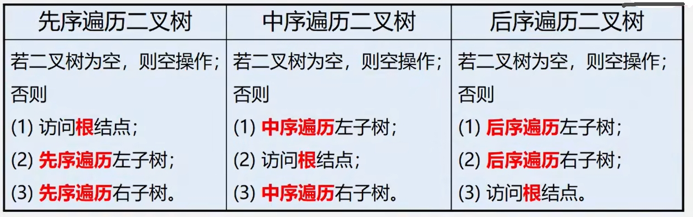
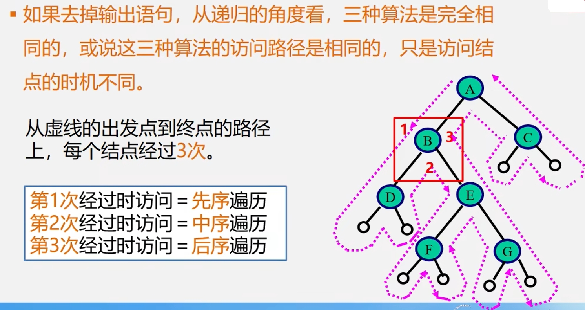

**二叉树的三种遍历方式：**  
　<div> </img></div>
 
>已知一颗二叉树的**先序和中序遍历**或**后序和中序遍历**，可以唯一地确定一棵二叉树。
## 递归实现的遍历算法
**先序遍历：**
```cpp
Status PreOrderTraverse(BiTree T){
    if(T == NULL) return OK; //空二叉树
    else{
        visit(T); //访问根结点
        PreOrderTraverse(T->lchild);//递归遍历左子树
        PreOrderTraverse(T->rchild);//递归遍历右子树
    }
}
```
**中序遍历：**
```cpp
Status InOrderTraverse(BiTree T){
    if(T == NULL) return OK; //空二叉树
    else{
        InOrderTraverse(T->lchild);//递归遍历左子树
        visit(T); //访问根结点
        InOrderTraverse(T->rchild);//递归遍历右子树
    }
}
```
**后序遍历：**
```cpp
Status PostOrderTraverse(BiTree T){
    if(T==NULL) return OK; //空二叉树
    else{
        PostOrderTraverse(T->lchild);//递归遍历左子树
        PostOrderTraverse(T->rchild);//递归遍历右子树
        visit(T);//访问根结点
    }
}
```
<div> </img></div>  

>三种算法else块中递归调用的顺序都是一样的(先左子树，再右子树)，所以访问的路径是一样的，只是visit(T)的时机不同。  

## 非递归实现的遍历算法(中序遍历)
 基本思想:  
　(1)建立一个栈。  
　(2)从根结点开始，若不为空，则进栈，然后遍历左子树。  
　(3)当左子树为空时，根结点出栈，输出根结点，遍历右子树。  
```cpp
Status lnOrderTraverse (BiTree T){
    BiTree p;
    InitStack(S);
    p = T;
    while(p || !StackEmpty(S)){
        if(p){                    //当前结点存在时存储当前结点(压栈)
            Push(S,p);            //将p指向结点压栈
            p = p->lchild;        //访问左子树
        }else{                    //左子树为空时访问栈顶元素(根)
            Pop(S,q);             //弹出栈顶元素用q保存
            printf( "%c"，q->data);
            p = q->rchild;        //访问右子树
        }
    }//while
    return OK;
}
```
## 二叉树的层次遍历
　对于一颗二叉树，从根结点开始，按从上到下、从左到右的顺序访问每一个结点。  
　每一个结点仅仅访问一次。  

 实现思路：  
　(1)使用一个队列,将根结点进队;  
　(2)队不空时循环:从队列中出列一个结点*p，访问它，同时：  
　　若它有左孩子结点，将左孩子结点进队;  
　　若它有右孩子结点，将右孩子结点进队。  
 ```cpp
void LevelOrder(BTNode *b){
    BTNode *p;
    SqQueue *qu;//初始化队列
    InitQueue(qu);//根结点指针进入队列
    enQueue(qu, b);
    while (!QueueEmpty(qu)){//队不为空，则循环
        deQueue(qu, p);//出队结点p
        printf("%c",p->data);//访问结点p
        if (p->lchild != NULL) enQueue(qu, p->lchild);//有左孩子时将其进队
        if (p->rchild != NULL) enQueue(qu, p->rchild);//有右孩子时将其进队
    }
}
 ```
>层次遍历也可以用栈实现
