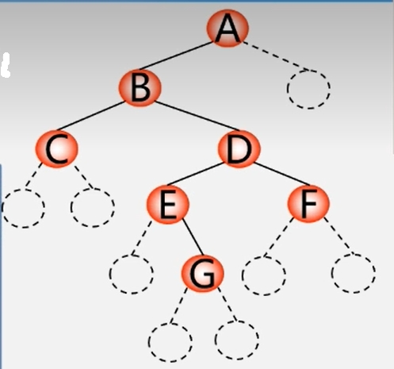

**1.构造二叉树：**  
  　如下图所示的二叉树，按下列顺序输入字符：  
  　 $\color{blue}{ABC}$ ## $\color{blue}{DE}$ # $\color{blue}{G}$ ## $\color{blue}{F}$ ###
  <div> </img></div>  
  
```cpp  
Status CreateBiTree(BiTree &T){
  scanf(&ch); //cin>>ch;
  if(ch==“#”) T=NULL;
  else {
    if (!(T =(BiTNode *)malloc(sizeof(BiTNode)))) //内存申请失败
      exit(OVERFLOW);//T=new BiTNode
    T->data = ch;  // 生成根结点
    CreateBiTree(T->lchild);//构造左子树
    CreateBiTree(T->rchild);//构造右子树
  }
  return Ok;
} // CreateBiTree
```

**2.复制二叉树：**  
　如果是空树，递归结束  
　否则，申请新结点空间，复制根结点:  
　　递归复制左子树  
　　递归复制右子树
```cpp
int Copy(BiTree T, BiTree &NewT){
    if(T == NULL){ //如果是空树返回0
        New T=NULL;
        return 0;
    else{
        NewT = new BiTNode;
        NewT->data = T->data;
        Copy(T->lChild,NewT->lchild);
        Copy(T->rChild,NewT->rchild);
    }
}
```

**3.计算二叉树深度：**  
　如果是空树，则深度为0;  
　否则，递归计算左子树的深度记为m，递归计算右子树的深度记为n，二又树的深度则为m与n的较大者加1。  
```cpp
int Depth(BiTree T){
    if(T==NULL) return 0;//如果是空树返回0
    else{
        m = Depth(T->IChild);
        n = Depth(T->rChild);
        if(m > n) return(m+1);
        else return(n+1);
    }
}
```

**4.计算二叉树结点数：**  
　如果是空树，则结点个数为0;  
　否则，结点个数为左子树的结点个数+右子树的结点个数再+1。  
```cpp
int NodeCount(BiTree T){
    if(T == NULL)
        return 0;
    else
        return NodeCount(T->lchild) + NodeCount(T->rchild)+1;
```

**5.计算二叉树叶子结点数：**  
　如果是空树，则叶子结点个数为0;  
　否则，为左子树的叶子结点个数+右子树的叶子结点个数。  
 ```cpp
int LeadCount(BiTree T){//如果是空树返回0
    if(T==NULL) return 0;
    if(T->lchild == NULL && T->rchild == NULL)//如果是叶子结点返回1
        return 1;
    else
        return LeafCount(T->lchild) + LeafCount(T->rchild);
```
