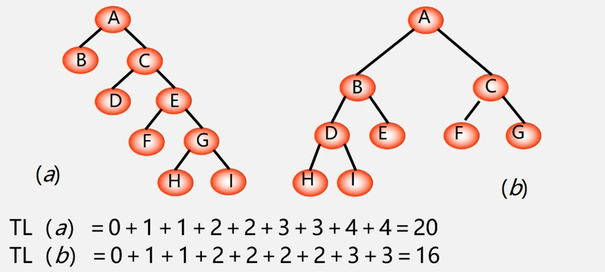
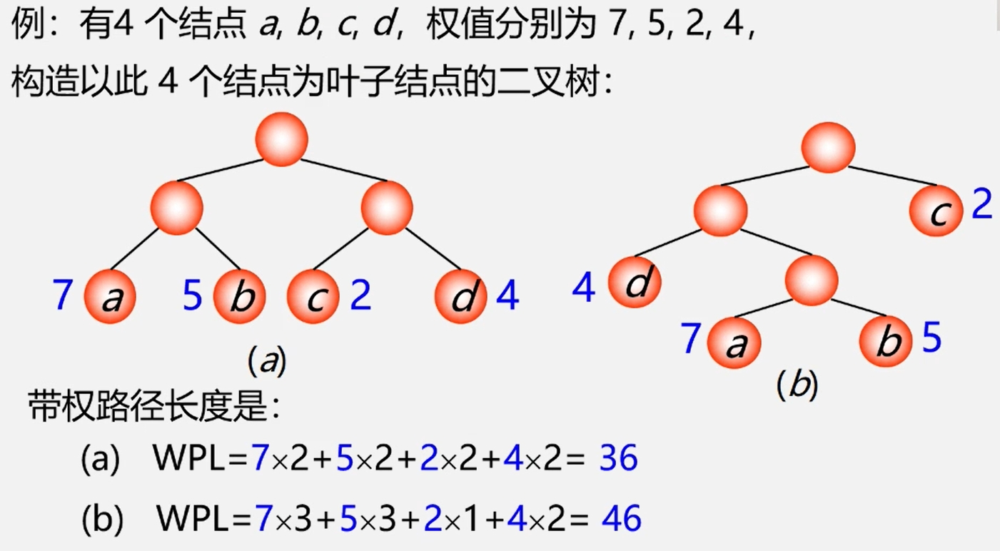
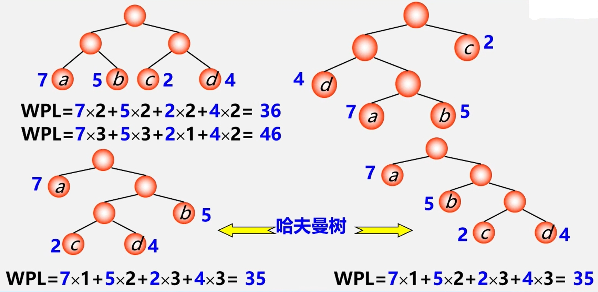
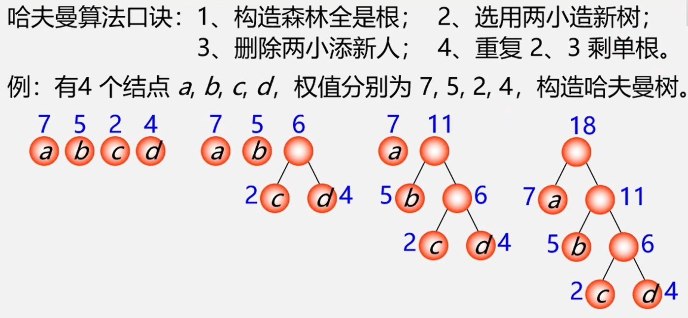
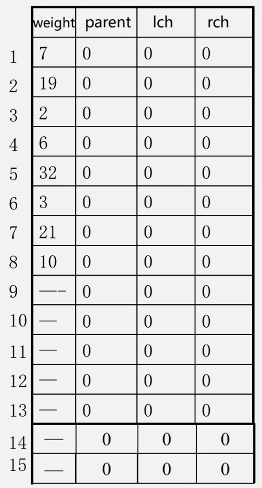
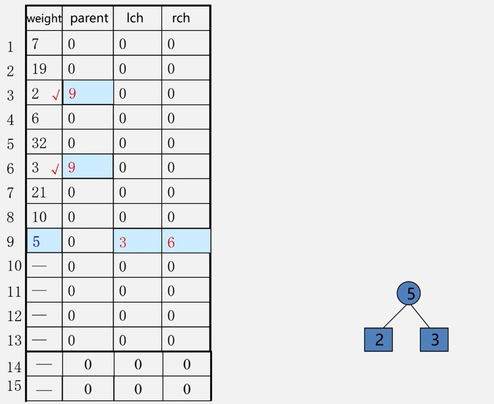
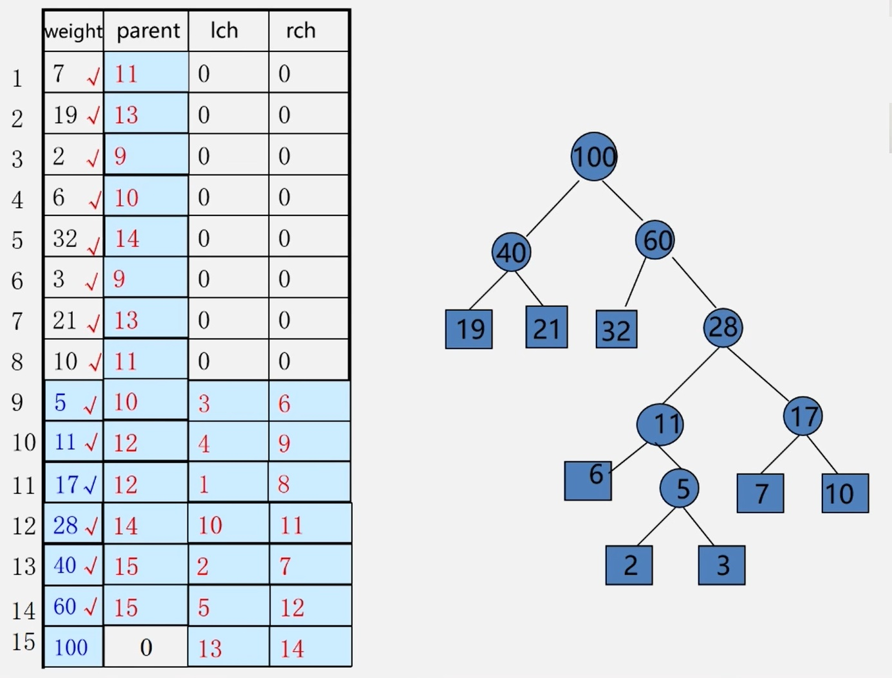
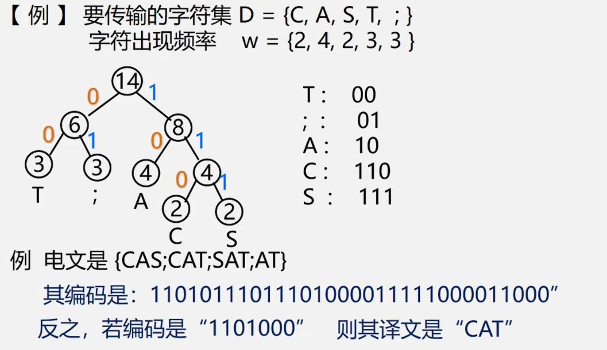

<span id = "top"></span>  
[1.基本概念](#part1)  
[2.哈夫曼树的构造算法](#part2)  
[3.哈夫曼构造算法的实现](#part3)  

<span id = "part1"></span>  
## 1.基本概念  
$\color{#2e81f7}{路径}$  
　从树中 $\color{orange}{一个结点}$ 到 $\color{orange}{另一个结点}$ 之间的 $\color{orange}{分支}$ 构成这两个结点间的路径。  
$\color{#2e81f7}{结点的路径长度}$:  
　两结点间路径上的 $\color{orange}{分支数}$ 。  
 $\color{#2e81f7}{树的路径长度}$:  
　从 $\color{orange}{树根}$ 到每一个结点的路径长度之和。记作 $TL$ 。  
> 树的路径长度示例：
> <div> </img></div>  
>
>结点数目相同的二叉树中， $\color{orange}{完全二叉树}$ 是 $\color{orange}{路径长度最短的二叉树}$ (仅为充分条件)。  

$\color{#2e81f7}{权(weight):}$  
　将树中结点赋给一个有着某种含义的数值，则这个数值称为该 $\color{orange}{结点的权}$ 。  
$\color{#2e81f7}{结点的带权路径长度}$  
　从 $\color{orange}{根结点}$ 到该结点之间的 $\color{orange}{路径长度}$ 与该结点的 $\color{orange}{权}$ 的 $\color{orange}{乘积}$ 。    
$\color{#2e81f7}{树的带权路径长度:}$  
　树中所有 $\color{orange}{叶子结点}$ 的 $\color{orange}{带权路径长度之和}$ 。记作:  $$WPL=\sum_{k=1}^{n}{w_k}{l_k}$$
>Weighted Path Length, $w_k$ 为叶子结点的权值， $l_k$ 为结点到根的路径长度

带权路径长度示例：
<div> </img></div>  

$\color{red}{哈夫曼树}$  
　带权路径长度( $WPL$ )最短的树。  
>"带权路径长度最短" 是在 "度相同" 的树中比较而得的结果，因此有最优二叉树、最优三叉树之称等等。  
>这里的 "哈夫曼树" 指带权路径长度( $WPL$ )最短的二叉树。或称 "最优二叉树"。
<div> </img></div>  

<span id = "part2"></span>  
## 2.哈夫曼树的构造算法  [:arrow_up:](#top)
　可以看出，哈夫曼树中权值越大的叶子离根越近。因此构造哈夫曼树时首先选择权值小的叶子结点(贪心算法)。  
 
 **哈夫曼算法(构造哈夫曼树的方法)：**    
　　(1)根据 $n$ 个给定的权值 &#123; $w_1,w_2,…,w_n$ &#125; 构成 $n$ 棵二叉树的森林 $F=$ &#123; $T_1,T_2,…,T_n$ &#125; ,
       其中 $T_i$ 只有一个带权为 $w_i$ 的根结点。  
　　(2)在 $F$ 中选取两棵根结点的权值最小的树作为左右子树，构造一棵新的二叉树，且设置新的二叉树的根结点的权值为  
 　　　其左右子树上根结点的权值之和。  
　　(3)在 $F$ 中删除这两棵树，同时将新得到的二叉树加入森林中。  
　　(4)重复(2)和(3)，直到森林中只有一棵树为止，这棵树即为哈夫曼树。  

  **示例：**  
  <div> </img></div>  

>包含 $n$ 个叶子结点的哈夫曼树中共有 $2n-1$ 个结点( $n-1$ 个为构造产生的)。  

>哈夫曼树的结点的度数为 0 ( $\color{red}{要构造的结点}$ ) 或 2 ( $\color{red}{构造产生的结点}$ )，没有度为 1 的结点。

<span id = "part3"></span>  
## 3.哈夫曼构造算法的实现  [:arrow_up:](#top)
　采用一维结构数组实现，结点结构如下： 
|  weight  | parent |  lch    | rch |
| -------- | -------| ------- | --- |
```cpp
typedef struct{
  int weight;
  int parent, lch, rch;
}HTNode,*HuffmanTree
```
**示例：**  
　有 $n=8$ ,权值 $W=$ &#123; 7,19,2,6,32,3,21,10 &#125; 的八个结点，构造哈夫曼树。  
>共需 $2n-1$ 个结点，使用大小为 $2n$ 的数组，从下标为1开始使用。  
>构造结点时，从第 $n+1$ 个数组元素开始，其权值为最小两个权值之和， $lch$ 和 $rch$ 为这两个结点下标，同时赋值这两个结点的 $parent$ 。
<table border="0" margin-left: auto margin-right: auto>
  <tr>
      <td style="text-align: center;">构造哈夫曼树初始化</td>
      <td style="text-align: center;">哈夫曼树构造一个结点</td>
      <td style="text-align: center;">构造哈夫曼树最终结果</td>
  </tr>
  <tr>
     <td> </img></td>
     <td> </img></td>
     <td> </img></td>
  </tr>
</table>

**算法实现：**  
```cpp
void CreatHuffmanTree(HuffmanTree HT, int n){ //构造哈夫曼树--哈夫曼算法
    if(n <= 1) return;
    m = 2*n-1;//数组共2n-1个元素
    HT = new HTNode[m+1]; //0号单元未用，HT[m]表示根结点
    for(i=1;i<=m;++i){ //将2n-1个元素的lch、rch、parent置为0
        HT[il.lch = 0;
        HT[i].rch = 0;
        HT[i].parent = 0;
    }
    for(i=1;i<=n;++i) cin>>HT[i].weight; //输入前n个元素的weight值
//初始化结束，下面开始建立哈夫曼树
    for(i=n+1;i<=m;i++){  //合并产生n-1个结点--构造Huffman树
        Select(HT,i-1,s1,s2); //在HT[k](1≤k≤i-1)中选择两个其双亲域为0
                              //且权值最小的结点,并返回它们在HT中的序号s1和s2
        HT[s1].parent = i;  HT[s2].parent = i;  //表示从F中删除s1,s2
        HT[i].lch = s1;     HT[i].rch = s2 ;    //s1,s2分别作为i的左右孩子
        HT[i].weight = HT[s1].weight + HT[s2].weight; //i的权值为左右孩子权值之和
    }
}
```
## 哈夫曼编码  
　编码时，不等长的编码方式要比等长编码方式更节省空间。同时还要保证短码不是某个长码的前缀。哈夫曼编码满足这种要求，具体操作如下：
>1、统计字符集中每个字符在电文中出现的平均概率(概率越大,要求编码越短)  
>2、利用哈夫曼树的特点:权越大的叶子离根越近;将每个字符的概率值作为权值，构造哈夫曼树。则概率越大的结点，路径越短。  
>3、在哈夫曼树的每个分支上标上0或1:  
>　　结点的左分支标0，右分支标1，把从根到每个叶子的路径上的标号连接起来，作为该叶子代表的字符的编码。

**示例：**  
<div> </img></div>  

>1.为什么哈夫曼编码能够保证是前缀编码?  
>　　因为没有一片树叶是另一片树叶的祖先，所以每个叶结点的编码就不可能是其它叶结点编码的前缀。  
>2.为什么哈夫曼编码能够保证字符编码总长最短?  
>　　因为哈夫曼树的带权路径长度最短，故字符编码的总长最短。

**可得：**  
>  $\color{red}{性质1:哈夫曼编码是前缀码}$  
>  $\color{red}{性质2:哈夫曼编码是最优前缀码}$

**算法实现：**  
```cpp
void CreatHuffmanCode(HuffmanTree HT, HuffmanCode &HC, int n){
//从叶子到根逆向求每个字符的哈夫曼编码，存储在编码表HC中
    HC = new char* [n+1];    //分配n个字符编码的头指针矢量
    cd = new char [n];       //分配临时存放编码的动态数组空间
    cd[n-1] = '\0';          //编码结束符
    for(i=1; i<=n; ++i){     //逐个字符求哈夫曼编码
        start = n-1; c = i; f = HT[i].parent;
        while(f != 0){    //从叶子结点开始向上回溯，直到根结点
            --start;      //回溯一次start向前指一个位置
            if(HT[f].lchild == c) cd[start] = '0';    //结点c是f的左孩子，则生成代码0
            else                  cd[start] = '1';    //结点c是f的右孩子，则生成代码1
            c = f; f = HT[f].parent;    //继续向上回溯
        }                               //求出第i个字符的编码
        HC[i] = new char [n-start];     // 为第i 个字符串编码分配空间
        strcpy(HC[i], &cd[start]);      //将求得的编码从临时空间cd复制到HC的当前行中
        delete cd;    //释放临时空间
}// CreatHuffanCode
```
[:arrow_up:](#top)
