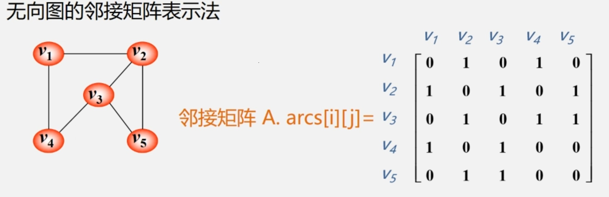
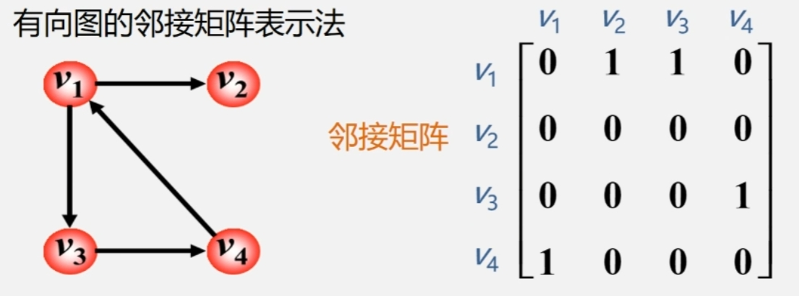
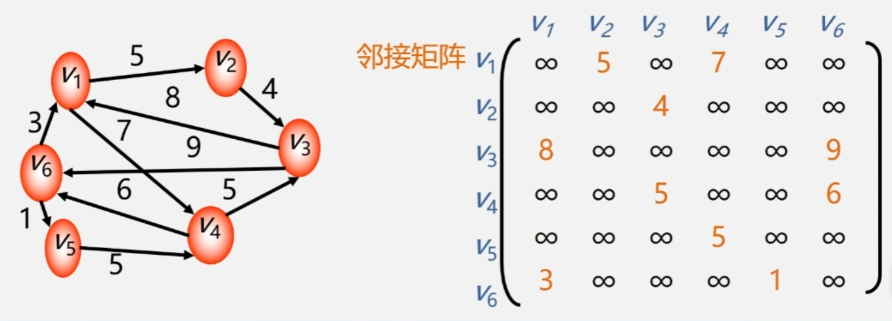

## 1 图的临接矩阵表示法
1. 创建一个顶点表 $Vex[n]$ ,记录顶点信息  
2. 创建一个临接矩阵 $arcs[n][n]$ , 记录各个顶点之间的关系, $Vex[i]$ 和 $Vex[j]$ 之间有边则 $arcs[i][j]$ 为1，否则为0。

### 1.1 无向图临接矩阵示例
<div></div>

>- 对角线值为0  
>- 矩阵是对称的(因为是无向图)  
>- 顶点i的度是第i行(列)中 1 的个数

### 1.2 有向图临接矩阵示例
<div></div>

>- 第 i 行含义:以结点 $v_i$ 为尾的弧(即出度边)  
>- 第 i 列含义:以结点 $v_i$ 为头的弧(即入度边)  
>- 顶点的出度 = 第 i 行 1 的个数  
>- 顶点的入度 = 第 j 列 1 的个数  
>- 顶点的度 = 第 i 行 1 的个数 + 第 i 列 1 的个数

### 1.3 网(有权图)的临接矩阵表示
 若顶点 $Vex[i]$ 和 $Vex[j]$ 之间有边，则 $arcs[n][n]$ 记录该边权值，否则记为 $\infty$ 。  
 <div></div>

## 2 临接矩阵的存储表示
### 2.1 数据类型表示 
```cpp
#define MaxInt 32767    //表示极大值，即∞
#define MVNum 100        //最大顶点数
typedef char VerTexType;    //设顶点的数据类型为字符型
typedef int ArcType;        //假设边的权值类型为整型

typedef struct{
    VerTexType vexs[MVNum];        //顶点表
    ArcType arcs[MVNum][MVNum];    //邻接矩阵
    int vexnum, arcnum;            //图的当前点数和边数
}AMGraph; // Adjacency Matrix Graph
```
### 2.2 创建无向网
```cpp
Status CreateUDN(AMGraph &G)    //采用邻接矩阵表示法，创建无向网G
{
    cin >> G.vexnum >> G.arcnum;     //输入总顶点数，总边数

    for(i = 0 ; i < G.vexnum ; ++i)    //依次输入点的信息
        cin >> G.vexs[i];

    for(i = 0 ; i < G.vexnum ; ++i)    //初始化邻接矩阵
    {
        for(j = 0; j < G.vexnum ; ++j)
        {
            G.arcs[i][j]= MaxInt;     //边的权值均置为极大值
        }
    }

    for(k = 0 ; k < G.arcnum ; ++k)    //构造邻接矩阵
    {
        cin >> v1 >> v2 >> W;    //输入一条边所依附的顶点及边的权值
        i = LocateVex(G, v1);
        j = LocateVex(G,v2);    //确定v1和v2在G中的位置(即顶点的下标)
        G.arcs[i][j] = w;        //边<v1,v2>的权值置为w
        G.arcs[j][i]= G.arcs[i][j]; //置<v1,v2>的对称边<v2,v1>的权值为w
    }//for

    return OK;
}//CreateUDN

int LocateVex(AMGraph G, VertexType u)
{
    int i;
    for(i = 0 ; i < G.vexnum ; ++i)    //图G中查找顶点u，存在则返回顶点表中的下标;否则返回-1
        if(u == G.vexs[i]) return i;
    return -1;
}
```
### 2.3 创建其他类型的图
1. 无向图  
>- 初始化临接矩阵时，w均为0
>- 构造临接矩阵时，w为1

2. 有向网  
>- 仅需为 G.arcs[i][j]赋值，无需为 G.arcs[j][i]赋值

3. 有向图  
>- 初始化临接矩阵时，w均为0  
>- 构造临接矩阵时，w为1  
>- 仅需为 G.arcs[i][j]赋值，无需为 G.arcs[j][i]赋值

## 3 临接矩阵优缺点
### 3.1 优点
>直观、简单、好理解  
>方便检查任意一对顶点间是否存在边  
>方便找任一顶点的所有**邻接点**(有边直接相连的顶点)  
>方便计算任一顶点的**度**(从该点发出的边数为**出度**，指向该点的边数为**入度**)  
>>无向图:对应行(或列)非0元素的个数  
>>有向图:对应行非0元素的个数是**出度** ; 对应列非0元素的个数是**入度**

### 3.2 缺点
>不便于增加和删除顶点  
>浪费空间--存稀疏图(点很多而边很少)有大量无效元素, 对稠密图(特别是完全图)还是很合算的  
>浪费时间--统计稀疏图中一共有多少条边  
