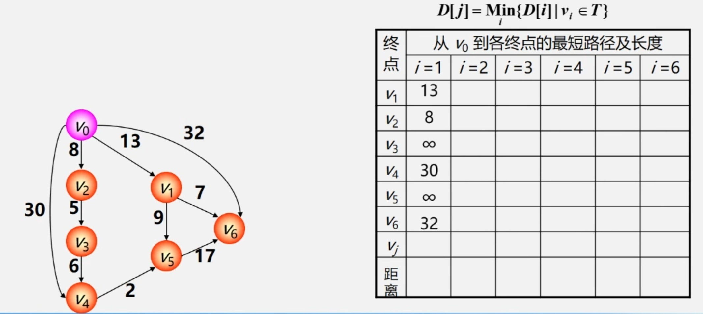
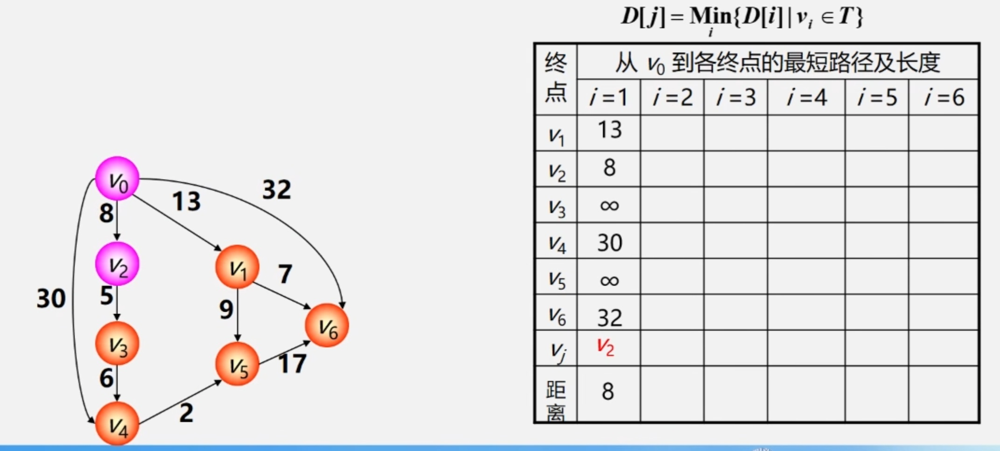
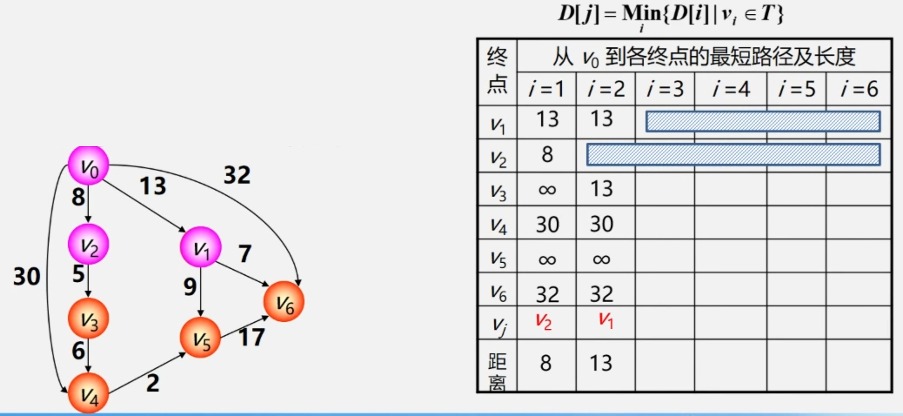
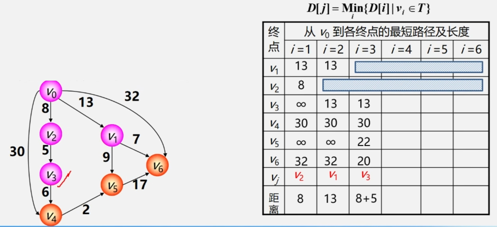
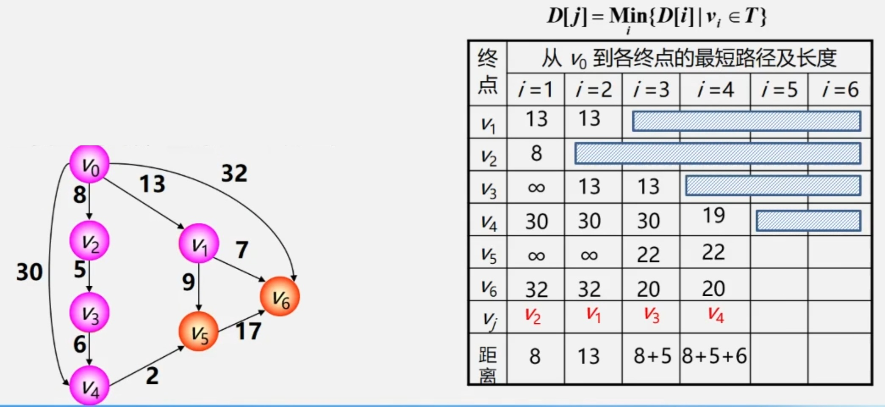
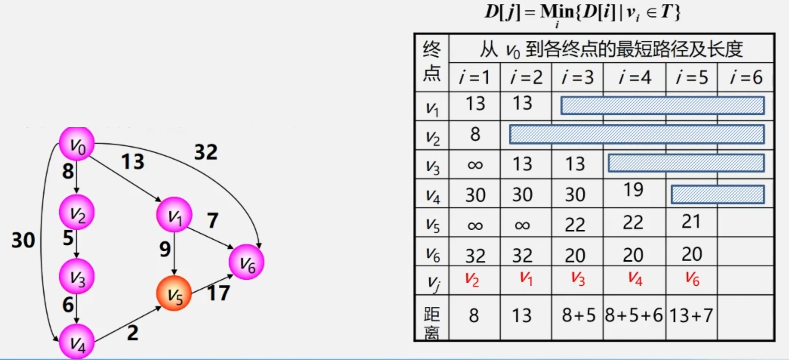
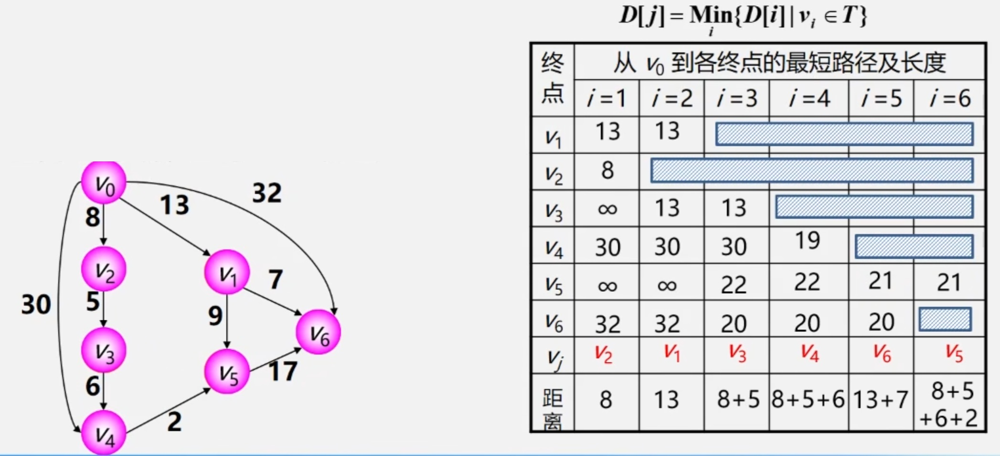

## 7.1 迪杰斯特拉(Dijkstra)算法
### 7.1.1 算法思想
1. 初始化：先找出从源点 $\color{orange}{v_0}$ 到各终点 $\color{orange}{v_k}$ 的直达路径 $\color{orange}{(v_0, v_k)}$ ，即通过一条弧到达的路径。
2. 选择：从这些路径中找出一条长度最短的路径 $\color{orange}{(v_0, u)}$ 。
3. 更新：若在图中存在弧 $\color{orange}{(u, v_k)}$ ，且 $\color{orange}{(v_0, u) + (u, v_k) < (v_0, v_k)}$ , 则以路径 $\color{orange}{(v_0, u, v_k)}$ 代替 $\color{orange}{(v_0, v_k)}$ 。
4. 在调整后的各条路径中，再找长度最短的路径，依此类推。

### 7.1.2 算法步骤
1. 初始时令 $S =$ { ${v}_{0}$ } , $T =$ {其余顶点} 。
2. $T$ 中顶点对应的距离值用辅助数组 $D$ 存放。 $D[i]$ 初值：若 $<{v}_ {0},{v}_ {i}>$ 存在，则为其权值；否则为 $\infty$ 。
3. 从 $T$ 中选取一个其距离值最小的顶点 $v_j$ ，加入 $S$ 。
4. 对 $T$ 中顶点的距离值进行修改：若加进 $v_j$ 作中间顶点，从 $v_0$ 到 $v_i$ 的距离值比不加 $v_j$ 的路径要短，则修改此距离值。
5. 重复上述步骤，直到 $S = V$ 为止。

### 7.1.3 算法示例

**初始化**  

<table border="0" margin-left: auto margin-right: auto>
  <tr>
     <td> </img></td>
     <td> </img></td>
  </tr>
  <tr>
     <td> </img></td>
     <td> </img></td>
  </tr>
  <tr>
     <td> </img></td>
     <td> </img></td>
  </tr>
</table>

## 7.2 弗洛伊德(Floyd)算法
逐个顶点试探，从 $v_i$ 到 $v_j$ 的所有可能存在的路径中选出一条长度最短的路径。 

**示例**  
