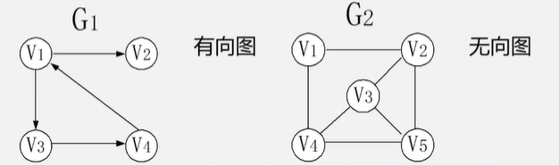
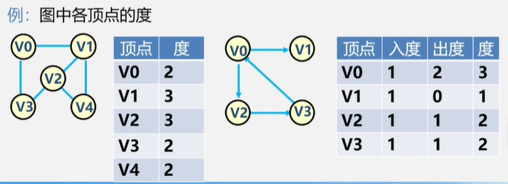
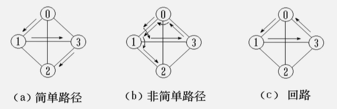
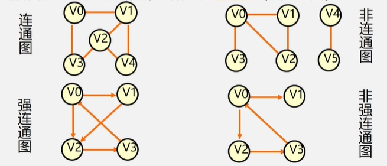
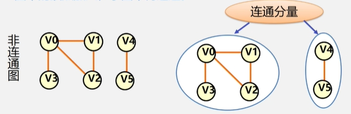
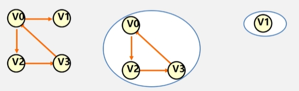
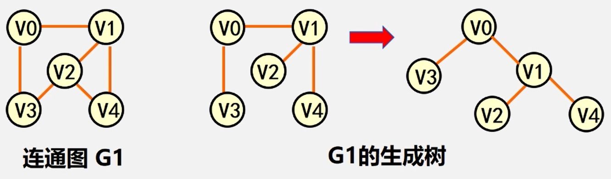

  
## 图的定义  
图是一种多对多的数据结构。定义：图可以看做顶点和边的集合 $Graph=(Vertex, Edge)$ ,记为 $G=(V,E)。$   
>V:顶点(数据元素)的有穷非空集合。  
>E:边的有穷集合。

又可分为两类：  
>有向图：每条边都是有方向的。  
>无向图：每条边都是无方向的。  

 </img>
  

## 图的一些概念  
$\color{#2e81f7}{完全图}$  
　任意两个点都有一条边相连。  
$\color{#2e81f7}{稀疏图}$  
　有很少边或弧的图 $(e < nlogn)$ 。( $e$ ,边数; $n$ ,顶点数)  
$\color{#2e81f7}{稠密图}$  
　有很多边或弧的图。  
$\color{#2e81f7}{网}$  
　边或者弧带权的图。  
$\color{#2e81f7}{邻接}$  
　有边/弧相连的两个顶点之间的关系。  
>无向图：存在 $(V_i,V_j)$ , 则称 $V_i$ 和 $V_j$ 互为邻接点;  
>有向图：存在 $&#60; V_i,V_j &#62;$ , 则称 $V_i$ 邻接到 $V_j$ , $V_j$ 邻接于 $V_i$  

$\color{#2e81f7}{关联(依附)}$    
　边/弧与顶点之间的关系。  
>存在 $(V_i,V_j)$ / $&#60; V_i,V_j &#62;$ , 则称该边/弧关联于 $V_i$ 和 $V_j$  

$\color{#2e81f7}{顶点的度}$  
　与该顶点相关联的边的数目，记为 $TD(V)$  
 >在有向图中,顶点的度等于该顶点的 $\color{orange}{入度}$ 与 $\color{orange}{出度}$ 之和。  
 >顶点 $V$ 的入度是以 $V$ 为终点的有向边的条数,记作 $ID(V)$  
 >顶点 $V$ 的出度是以 $V$ 为始点的有向边的条数,记作 $OD(V)$

顶点的度示例:

 </img>
  

$\color{#2e81f7}{路径}$  
　接续的边构成的 $\color{orange}{顶点序列}$ 。    
$\color{#2e81f7}{路径长度}$  
　路径上边或弧的数目/权值之和。  
$\color{#2e81f7}{回路(环)}$  
　第一个顶点和最后一个顶点相同的路径。  
$\color{#2e81f7}{简单路径}$  
　除路径起点和终点可以相同外，其余顶点均不相同的路径。  
$\color{#2e81f7}{简单回路(简单环)}$  
　除路径起点和终点相同外，其余顶点均不相同的路径。  
路径示例：  

 </img>
  

$\color{#2e81f7}{连通图(强连通图)}$  
　在无(有)向图 $G=(V,$ &#123; $E$ &#125; $)$ 中，若对任何两个顶点 $v$ 、 $u$ 都存在从 $v$ 到 $u$ 的路径，则称 $G$ 是连通图(强连通图)。  
连通图示例：  

 </img>
  

$\color{#2e81f7}{权与网}$  
　图中边或弧所具有的相关数称为权。表明从一个顶点到另一个顶点的距离或耗费。  
　带权的图称为网。  
$\color{#2e81f7}{子图}$  
　设有两个图 $G=(V,$ &#123; $E$ &#125; $)$ 、 $G_1=(V_1,$ &#123; $E_1$ &#125; $)$ ，若 ${V_1}\subseteq{V}$ ， ${E_1}\subseteq{E}$
, 则称 $G_1$ 是 $G$ 的子图。  
$\color{#2e81f7}{连通分量(强连通分量)}$  
　无向图 $G$ 的 $\color{orange}{极大连通子图}$ 称为 $G$ 的 $\color{orange}{连通分量}$ 。  
 连通分量和强连通分量:  
 <table border="0" margin-left: auto margin-right: auto>
  <tr>
     <td> </img></td>
     <td> </img></td>
  </tr>
</table>

>从任意一个顶点出发，能到达任意一个顶点，则该图连通。  
>极大连通子图意思是:该子图是 $G$ 连通子图，将 $G$ 的任何不在该子图中的顶点加入，子图不再连通。  

$\color{#2e81f7}{极小连通子图}$  
　该子图是 $G$ 的连通子图，在该子图中删除任何一条边，子图不再连通。  
$\color{#2e81f7}{生成树}$  
　包含无向图 $G$ 所有顶点的极小连通子图。  
$\color{#2e81f7}{生成森林}$  
　对非连通图，由各个连通分量的生成树的集合。  
 生成树示例：  
 
 </img>
  
 
[:arrow_up:](#top)
