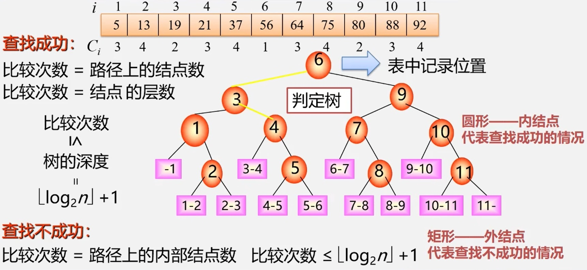
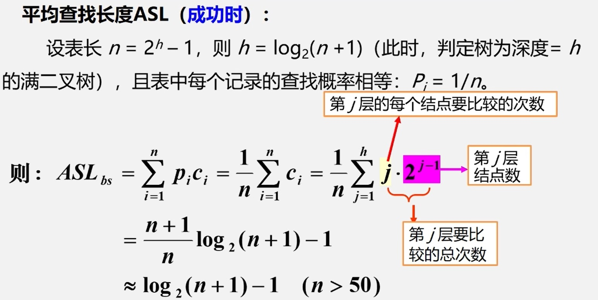

<span id = "top"></sapn>
[1.顺序查找](#part1)  
[2.折半查找](#part2)  
[3.分块查找](#part3)  
**数据域定义：**  
```cpp
typedef struct {
    KeyType key;  //关键字域
    ......        //其他域
} ElemType;
```
**顺序表定义：**
```cpp
typedef struct {//顺序表结构类型定义
    ElemType *R; //表基址
    int length;  //表长
}SSTable; //Sequential Search Table
SSTable ST;    //定义顺序表ST
```
构建该顺序表时，从1号位置开始存放元素。 
<span id = "part1"></span>  
## 1.顺序查找  
---  
**[7.1]在顺序表ST中查找关键字key:**  
```cpp
int Search Seq( ssTable ST , KeyType key ){
    for(i = STlength; i >= 1;--i)
        if( STR[i].key==key ) return i;
    return 0;
}
```
**另一种形式：**
```cpp
int Search Seq(SSTable ST, KeyType key) {
    for (i= STlength ; ST.R[i].key != key;--i)
        if(i<= 0) break;
    //for (i= STlength ; ST.R[i].key != key && i>0;--i);
    if (i > 0) return i;
    else return 0 ;
}
```
>上面的查找算法每次都要比较两次(1.是否找到　2.是否越界),能否只比较一次呢？  
>可以。将要查找的元素放入0号位置，如此便可省略越界的判断。  

**[7.2]设置监视哨的查找算法:**
```cpp
int Search Seq(SSTable ST, KeyType key) {
    ST.R[0].key = key;
    for (i= STlength ; ST.R[i].key != key;--i);
    return i;
}
```
**算法7.2时间效率分析**  
　　显然，查找次数和关键字key所处的位置有关。位置[ $0,1,..., ST.length-2, ST.length-1$ ]的查找次数分别为  
( $ST.length, ST.length-1,...,2,1$ )。  
　　平均查找次数为： ${ASL}_{s}(n)=(1+2+...+n)/n=(n+1)/2$ 。  
>提高查找效率  
>1、记录的査找概率不相等时如何提高査找效率?  
>　　查找表存储记录原则————按查找概率高低存储:  
>　　1)查找概率越高，比较次数越少  
>　　2)查找概率越低，比较次数较多  
2、记录的查找概率无法测定时如何提高查找效率?  
>　　方法————按查找概率动态调整记录顺序  
>　　1)在每个记录中设一个访问频度域;  
>　　2)始终保持记录按非递增有序的次序排列  
>　　3)每次查找后均将刚查到的记录直接移至表头

<span id = "part2"></span>  
## 2.折半查找  [:arrow_up:](#top)
　　对于一排好序的查找表，可使用折半查找，每次查找可将范围缩小一半。  
**[7.3]折半查找**  
```cpp
int Search Bin ( sSTable ST, KeyType key ){
    low = 1;high = ST.length ;// 置区间初值
    while (low <= high) {
        mid = (low + high)/2;
        if (ST.R[mid].key == key)
            return mid; // 找到待查元素
        else if (key < ST.R[mid].key) //缩小查找区间
            high = mid - 1;//继续在前半区间进行查找
        else low = mid + 1; // 继续在后半区间进行査找
    }
    return 0 ;// 顺序表中不存在待查元素
}// Search Bin
```
**算法7.3的递归写法**  
```cpp
int Search_Bin(SSTable ST, keyType key, int low, int high){
    if(low > high) return 0;//查找不到时返回0
    mid = (low + high)/2;
    if(key == ST.R[mid].key) return mid;
    else if(key < ST.R[mid].key)
        Search_Bin(ST, key, low, mid-1);    //递归,在前半区间进行查找
    else
        Search_Bin(ST, key, mid+1, high);    //递归,在后半区间进行查找
}
```
**算法7.3的时间效率分析**  
<div> </img></div>  
<div> </img></div>  

<span id = "part3"></span>  
## 3.分块查找  [:arrow_up:](#top)
　顺序查找算法简单，可适用于不同存储结构，但查找效率慢。 ${ASL}_{bs}={L}_{b}+{L}_{w}$   
　折半查找效率高，但只适用于有序表，且限于顺序存储结构(对线性链表无效)。  
　分块查找效率介于两者之间，且插入、删除元素可达 $O(1)$ 的时间复杂度。  
分块查找思想：  
<div> </img></div>  

**分块查找时间效率分析**  
 ${ASL}_ {bs}={L}_ {b}+{L}_ {w}$ ,其中 ${L}_ {b}$ 为查找索引表的 $ASL$ , ${L}_ {w}$ 为块内查找的 $ASL$ 。  
 ${ASL}_ {bs}\approx {log}_ {2}(\frac {n} {s}+1)+\frac {s} {2}$ , $s$ 为每块内部的记录个数， $n/s$ 即块的数目。  
分块查找时间复杂度介于折半查找和顺序查找之间，即 $({log}_ {2}n\leq {ASL}_ {bs}\leq \frac {n+1} {2})$ ,且更靠近 ${log}_ {2}n$ 。  
>例如:当n=9,s=3时， ${ASL}_ {bs}$ =3.5，而折半法为3.1，顺序法为5。

**三种查找算法比较**  
|            |**顺序查找**|**折半查找**|**分块查找**|
|:----------:|:----------:|:----------:|:----------:|
|   **ASL**  |    最大     |    最小    |    中间    |
| **表结构** |有序表、无序表|有序表      |分块有序    |
|**存储结构**|顺序表、线性链表|顺序表    |顺序表、线性链表|

[:arrow_up:](#top)
