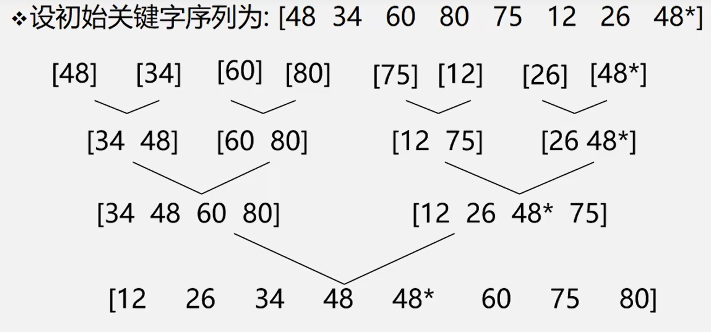
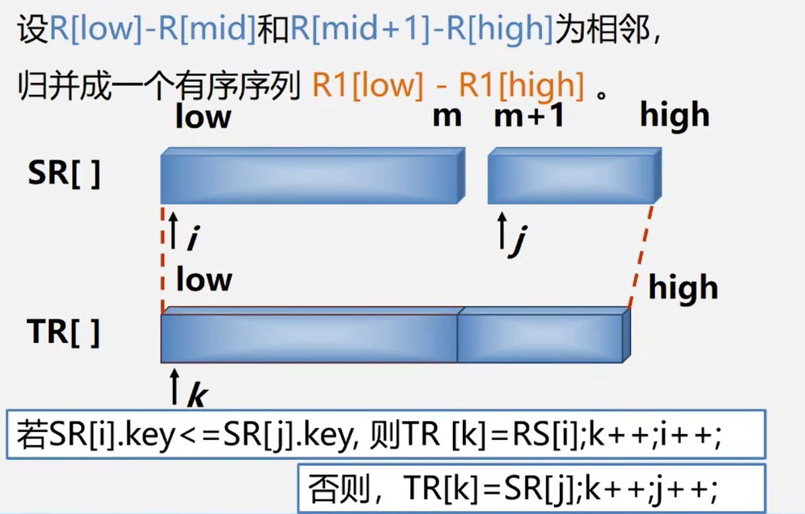

**基本思想:** 将两个或两个以上的有序子序列 $\color{orange}{归并}$ 为一个有序序列。  
在内部排序中，通常采用的是2-路归并排序。即:  
将两个位置相邻的有序子序列 $R[l...m]$ 和 $R[m+1...n]$ 归并为一个有序序列 $R[1...n]$   

**归并排序示例：**  

**问题：如何将两个有序序列合并成一个有序序列？**  
>假设现在有两个有序序列 $a_1,....,a_n$ 和 $b_1,....,b_n$ 。令指针**a_p**指向 $a_1$ ,指针**b_p**指向 $b_1$ , 比较 $a_1$ 和 $b_1$ 大小，  
>小者放入序列 $c_1$ 位置，然后指针后移，再次比较.......直至 $a_n$ 和 $b_n$ 均为空。

**如下所示：**  

